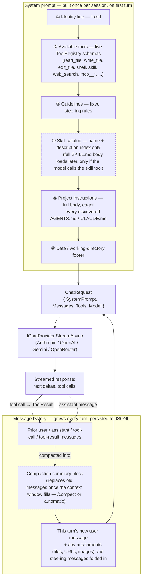

# Litos AI Agent

A minimal, transparent AI coding agent written in pure .NET. Multi-provider (Anthropic,
OpenAI, Google Gemini, OpenRouter), multi-face (console, desktop GUI, and an HTTP/API host with
web UI), with tool use (file edit, shell, web search) and MCP client support.

Built to learn how a coding agent actually works, from the inside, in C#/.NET — the stack I've
worked in for 23+ years — rather than treating one as a black box. This project proved to me that
.NET and C# can be used to build a real AI coding agent.

Primarily inspired by Mario Zechner's [pi](https://pi.dev), particularly its session-as-working-
directory model, and secondarily by [alejandro-ao](https://github.com/alejandro-ao)'s
[Tau](https://github.com/alejandro-ao/tau) and its "separate the brain, the environment, and the
face" architecture.

## Status

Two faces are working end to end today:

- **`Litos.Gui`** — the Avalonia desktop app. Verified working on **Windows**; it has **not been
  tested on macOS** yet. Avalonia is cross-platform, so it should run there too, but treat macOS
  as unconfirmed until someone's tried it.
- **`Litos.Api`** — the HTTP/API host with web UI, Docker support, and a working **Telegram**
  bridge (chat with the agent remotely through a Telegram bot).

Everything else in this repo — `Litos.Console` and the WhatsApp/Rocket.Chat/email channel
bridges — is a **work in progress**. Those three channel bridges currently exist only as design
docs (linked below) with no implementation in the source tree; treat those docs as proposals, not
shipped features. `Litos.Tools.Mcp` (MCP client support) does have real implementation, but hasn't
been called out above as one of the two confirmed-working faces since it's a supporting library,
not a face on its own — verify by exercising it yourself before relying on it. **MCP is currently
wired up in `Litos.Api` only** (see [MCP servers](#mcp-servers-litosapi-only) below); integration
into `Litos.Gui` and `Litos.Console` is still pending.

Of the four LLM providers `Litos.Agent` is built to support, only **OpenAI** and **OpenRouter**
have been explicitly checked/exercised end-to-end by the maintainer. Anthropic and Google Gemini
adapters exist in the code but haven't been verified the same way — they should work, but treat
them as unconfirmed until you've tried them yourself.

## Architecture

- **The brain** (`Litos.Agent`) — the harness: messages, tool-call state machine, transcript,
  context accounting. Knows nothing about the console, the filesystem, or any specific LLM
  vendor.
- **The environment** (`Litos.Tools`, `Litos.Providers.*`) — concrete capabilities: file I/O,
  shell execution, attachment conversion, and the LLM API calls themselves.
- **The face** (`Litos.Console`, `Litos.Gui`, `Litos.Api`) — thin UI shells. Every face drives
  the same `AgentLoop` through `Litos.Host` and implements the same tool-approval seam in
  whatever way fits its medium.

See [ReadMe_AgentDesign.md](ReadMe_AgentDesign.md) for the full design document, and
[ReadMe_Extensibility.md](ReadMe_Extensibility.md) for how to add a new provider, tool, or face.

### How context comes together for a turn

Every turn sends one `ChatRequest` (system prompt + full message history + tool schemas) to the
provider. The system prompt itself is built once per session, not re-built per turn; the message
history grows every turn and is periodically compacted to keep it inside the model's context
window.



- **System prompt** — assembled once by `LitosSystemPromptProvider.BuildAsync` when the session's
  `AgentLoop` starts; editing a `SKILL.md` or `AGENTS.md`/`CLAUDE.md` file requires a new session
  (`/new`) to take effect, not just a saved file. Skills are *progressive disclosure* (index now,
  full body only on demand); project instructions are the opposite — eager, full-body, every turn
  — since standing rules only steer the model if they're always present.
- **Message history** — every user/assistant/tool message is appended to an in-memory `Transcript`
  and persisted to `%USERPROFILE%\.litos\sessions\{owner}\{sessionId}.jsonl` as it happens.
  Compaction (`Compactor`) runs at the start of a turn, before the system prompt is rebuilt:
  once the transcript crosses a token threshold (or the user runs `/compact`), older messages are
  summarized by a plain call to the same provider/model and replaced with one summary block —
  everything after the cut point is kept verbatim.
- **`ChatRequest`** — `ContextAccountant.BuildRequest` assembles the two into one request per
  turn: `transcript.Messages` (full history plus this turn's new user content), `ToolRegistry`'s
  current tool schemas, the model name, and the system prompt string.

## Projects

| Project | What it is |
|---|---|
| `Litos.Agent` | Provider-neutral, UI-neutral agent core |
| `Litos.Tools` | File, shell, and web-search tools |
| `Litos.Tools.Mcp` | Model Context Protocol client integration — currently wired up in `Litos.Api` only; `Litos.Gui`/`Litos.Console` integration is pending |
| `Litos.Providers.Anthropic` / `.Gemini` / `.OpenAI` / `.OpenRouter` | LLM provider adapters |
| `Litos.Persistence` | JSONL transcript storage |
| `Litos.Host` | Shared composition root (DI, provider factory, tool wiring) for all faces |
| `Litos.Console` | Terminal UI face (Terminal.Gui v2) — work in progress |
| `Litos.Gui` | Desktop UI face (Avalonia) — **working** |
| `Litos.Api` | HTTP API + web UI host, with Docker support and a working Telegram bridge — **working**. WhatsApp/Rocket.Chat/email bridges are design docs only (no implementation yet) |

## Getting started

Requires the [.NET 10 SDK](https://dotnet.microsoft.com/download).

```bash
git clone https://github.com/nitinmms/LitosAiAgent1.0.git
cd LitosAiAgent1.0
dotnet build
```

Run the desktop GUI face:

```bash
dotnet run --project src/Litos.Gui
```

Run the API host (see [ReadMe_HeadlessServiceTool.md](ReadMe_HeadlessServiceTool.md) for the
full Docker/deployment walkthrough):

```bash
cp src/Litos.Api/.env.example src/Litos.Api/.env   # fill in your provider API key(s)
dotnet run --project src/Litos.Api
```

## Environment variables

At least one LLM provider API key is required. Configure these via the `.env` file (`Litos.Api`,
copied from [src/Litos.Api/.env.example](src/Litos.Api/.env.example)) or the Settings screen
(`Litos.Gui`). An env var always wins over any value stored in `Litos.Api`'s mounted config file.

| Variable | Purpose | Verified? |
|---|---|---|
| `ANTHROPIC_API_KEY` | Anthropic (Claude) provider | Not explicitly checked yet |
| `OPENAI_API_KEY` | OpenAI provider | **Checked** |
| `GEMINI_API_KEY` (or `GOOGLE_API_KEY` as fallback) | Google Gemini provider | Not explicitly checked yet |
| `OPENROUTER_API_KEY` | OpenRouter provider | **Checked** |
| `TAVILY_API_KEY` | Web search tool (optional — not a chat provider) | **Checked** |
| `ADMIN_TOKEN` | Login password for `Litos.Api`'s admin UI (Bearer/cookie) | — |
| `TELEGRAM_BOT_TOKEN` | Bot token from [@BotFather](https://t.me/BotFather); enables the Telegram bridge (also settable from the `/telegram` admin page, but the env var always wins). The bridge still starts **off** by default — toggle it on explicitly after setting the token. | — |

Only **OpenAI** and **OpenRouter** have been explicitly exercised end-to-end with this agent so
far. Anthropic and Gemini are implemented (`Litos.Providers.Anthropic`, `Litos.Providers.Gemini`)
but not yet verified in the same way — if you try one, treat it as unconfirmed until it's worked
for you.

## Docker + Telegram

`Litos.Api` is the only face with Telegram support, and it's built to run as a long-lived
container. Build and run it from the repository root:

```bash
docker build -f src/Litos.Api/Dockerfile -t litos-api .

docker run --env-file src/Litos.Api/.env -p 127.0.0.1:8080:8080 \
  -v ~/litos-workspace:/workspace -v ~/.litos-docker:/data litos-api:dev
```

- `-v ...:/workspace` — the directory the agent's file/shell tools operate against.
- `-v ...:/data` — persisted config, sessions, and pending approvals; keep this separate from
  `/workspace` so agent output can never overwrite its own session history.
- `-p 127.0.0.1:8080:8080` — loopback-only by default. The container's Kestrel listener binds to
  `0.0.0.0` internally (required for `-p` to work at all), so a bare `-p 8080:8080` exposes the
  admin UI to your whole LAN, not just the host. Only widen this deliberately, e.g. behind a
  reverse proxy.

Once the container is up:

1. Open `http://127.0.0.1:8080`, sign in with `ADMIN_TOKEN`.
2. Go to the Telegram setup page, paste your bot token from `@BotFather` (or rely on
   `TELEGRAM_BOT_TOKEN` in `.env`), and turn the bridge on — it's off by default even when a token
   is configured.
3. Scan the QR code / open the deep link it shows from your phone's Telegram app to link a chat.
4. A newly-linked chat starts **read-only** (chat, search, read files); an admin must explicitly
   elevate it from the Approvals page before it gets shell/file-write access.

See [ReadMe_TelegramIntegrationTool.md](ReadMe_TelegramIntegrationTool.md) and
[ReadMe_HeadlessServiceTool.md](ReadMe_HeadlessServiceTool.md) for the full design and operational
detail.

## Slash commands

### `Litos.Gui`

Type `/` in the input box (or use the `+`/command menu) for these:

| Command | What it does |
|---|---|
| `/new` | Starts a new session |
| `/resume` | Opens a picker over previous sessions and loads the one you pick |
| `/attach` | Attach a file, folder, or URL to the next message |
| `/provider` | Switch the active chat provider (Anthropic/OpenAI/Gemini/OpenRouter) |
| `/model` | Switch the active model for the current provider |
| `/skills` | Browse available skills (see below) |
| `/skill` | Load a specific skill by name |
| `/branch` | Rewind the current session to an earlier message and fork from there |
| `/compact` | Force-summarize and compact the conversation to free up context |

### Telegram chat (via `Litos.Api`)

Once a chat is linked (see above), these work as literal `/`-prefixed chat messages. Photos,
documents, and voice messages are attached automatically — there's no `/attach` command over
Telegram because it's implicit.

| Command | What it does |
|---|---|
| `/new` | Starts a fresh session for this chat (old session stays on disk, just no longer current) |
| `/resume` | Replies with tappable buttons, one per recent session for this chat — tap one to resume it |
| `/branch <messageIndex>` | Branches the current session, keeping only the first N transcript entries |
| `/skills` | Replies with a plain-text list of available skills |
| `/skill <name>` | Loads the named skill; it's applied to your *next* message |
| `/compact` | Forces context compaction for this chat's session |

`/provider`, `/model`, and transcript export are deliberately **not** exposed as Telegram
commands — they change config shared across every caller, or touch the server's own filesystem, so
they live in the `Litos.Api` admin UI instead. Any other `/command` gets a plain "Unknown command"
reply.

## Skills

A skill is a folder containing a `SKILL.md` with `name`/`description` YAML frontmatter plus body
instructions the agent loads on demand — the same shape as Claude Code's own skills.

```
some-skill/
└── SKILL.md
    ---
    name: some-skill
    description: One line explaining what this skill is for and when to use it.
    ---
    Full instructions the agent reads once it loads this skill.
```

Discovery walks several roots, later ones winning on a name collision:

1. `~/.litos/skills/` — user-global, checked first.
2. `~/.claude/skills/` — Claude Code's own skill folders are picked up for free (global only, no
   per-project `.claude/skills/` walk).
3. `<project>/.litos/skills/` — walked upward from the current/workspace directory like
   `.gitignore` resolution, so every ancestor's `.litos/skills/` counts, closest directory wins.

Both `Litos.Gui` and `Litos.Api` (including Telegram) share this same discovery logic — drop a
skill in one of the roots above and it's available everywhere:

- In `Litos.Gui`, use `/skills` to browse, or `/skill <name>` to load one directly.
- Over Telegram, `/skills` lists them as plain text; `/skill <name>` loads one for your next
  message.
- The model itself can also call the `skill` tool directly mid-conversation once it sees a skill's
  name/description in its available-skills catalog — you don't always have to invoke it by hand.

## MCP servers (`Litos.Api` only)

`Litos.Api` can connect to external [Model Context Protocol](https://modelcontextprotocol.io)
servers and expose their tools to the agent alongside its built-in ones — `Litos.Gui`/`Litos.Console`
don't support this yet. Configuration is global (one set of servers shared by every session on that
`Litos.Api` instance), managed from the `/mcp` admin page.

1. Open `/mcp` in the admin UI (sign in with `ADMIN_TOKEN` first).
2. Add a server, choosing a transport:
   - **stdio** (local child process) — set `Command` (e.g. `npx`) and `Args` (e.g.
     `["-y", "@modelcontextprotocol/server-everything"]`), plus optional `Env` vars for the child
     process. The Docker image ships Node.js/npm and `uv`/`uvx`, covering the two ways nearly every
     published reference MCP server is launched.
   - **HTTP** (remote Streamable HTTP/SSE) — set `Url` to the server's endpoint.
3. Set a default tool permission (`Deny`/`Ask`/`Full`) for the server, with optional per-tool
   overrides — the same approval seam every other tool call goes through. `Ask` shows up on the
   same Approvals page Telegram elevation requests use.
4. Save. Adding, editing, enabling, disabling, or removing a server takes effect **without a
   restart** — a background reconciler picks up the change and connects/disconnects accordingly.
   Changes apply starting with the *next* turn; a turn already in progress keeps the tool list it
   started with. Unreachable servers are retried in the background with exponential backoff
   (15s → 5min cap).

Each server's tools are registered under an `mcp__{ServerName}__{ToolName}` prefix, so server names
must be unique and can't contain `__`. See
[ReadMe_LitosApi_Mcp.md](ReadMe_LitosApi_Mcp.md) §10 for full implementation detail, including what
was verified against a real running server.

## Videos

- [Built an AI Coding Agent in Pure C#/.NET (No Python!) — Watch It Build a WinForms 15-Puzzle Game](https://www.youtube.com/watch?v=em8w0SwgT5Q)

## Further documentation

Implemented and working:

- [ReadMe_AgentDesign.md](ReadMe_AgentDesign.md) — full architecture and design rationale
- [ReadMe_Extensibility.md](ReadMe_Extensibility.md) — adding providers, tools, and faces
- [ReadMe_HeadlessServiceTool.md](ReadMe_HeadlessServiceTool.md) — running `Litos.Api` as a headless/Docker service, admin UI
- [ReadMe_TelegramIntegrationTool.md](ReadMe_TelegramIntegrationTool.md) — Telegram bridge (`Litos.Api`)
- [ReadMe_LitosApi_Mcp.md](ReadMe_LitosApi_Mcp.md) — MCP server integration (`Litos.Tools.Mcp`)
- [ReadMe_DeployToAWS.md](ReadMe_DeployToAWS.md) — AWS deployment guide

Design docs only — **no implementation exists yet**, read as proposals:

- [ReadMe_WhatsAppIntegrationTool.md](ReadMe_WhatsAppIntegrationTool.md) — WhatsApp bridge
- [ReadMe_RocketChatTool.md](ReadMe_RocketChatTool.md) — Rocket.Chat bridge
- [ReadMe_EmailIntegrationTool.md](ReadMe_EmailIntegrationTool.md) — Email integration

## Tests

```bash
dotnet test
```

## License

Apache License 2.0 — see [LICENSE.txt](LICENSE.txt). Third-party dependency licenses are listed
in [NOTICE](NOTICE).
