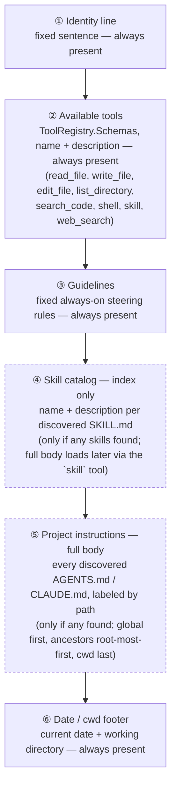

# LitosAiAgent — Design Document

A minimal, transparent AI coding agent for the console, written in pure .NET.
Inspired by [Tau](https://twotimespi.dev/) (an educational Python coding agent), reimplemented idiomatically in C#/.NET 10.

## 1. Goals

- **Minimal but real**: a working coding agent (read/edit files, run shell commands, talk to an LLM), not a toy.
- **Transparent architecture**: three cleanly separated layers, each independently understandable and testable — Tau's core lesson, "separate the brain, the environment, and the face."
- **Multi-provider**: native support for Anthropic, OpenAI, Google Gemini, and OpenRouter, selected at runtime.
- **Attachments as first-class input**: any file, image, or URL can be dropped into the conversation and is converted to markdown via `ManagedCode.MarkItDown` before reaching the model.
- **Nice console UX**: streaming tokens, syntax-highlighted diffs, tool-call panels, and confirmation prompts, with a fixed bottom input box and scrolling transcript above it — implemented today via Terminal.Gui v2 (§7.3–7.6), after Spectre.Console's hand-rolled cursor arithmetic and a rejected RazorConsole spike (§7.3.1).
- **Multiple faces over one shared brain**: the console isn't the only UI — a desktop GUI face (`Litos.Gui`, Avalonia, §7.7) was evaluated and adopted alongside it, both driving the same unchanged `AgentLoop` through `Litos.Host`.
- **Durable, inspectable sessions**: JSONL transcripts under the user profile, resumable and exportable.
- **Skills**: reusable, model-invoked instruction bundles (`SKILL.md`, Claude Code's Agent Skills convention) discovered from project and user directories, listed to the model as short descriptions, and loaded in full only when the model chooses to use one.
- **Project/global instructions**: always-on standing guidance (`AGENTS.md`/`CLAUDE.md`, the emerging cross-tool convention also used by pi.dev, Cursor, and Claude Code) discovered from `~/.litos` and every ancestor directory from the filesystem root down to the working directory, concatenated into the system prompt unconditionally — unlike skills, there's no model-invoked loading step, since this content is meant to be in context on every turn.

## 2. Design philosophy (from Tau, ported)

> "Separate the brain, the environment, and the face."

- **The brain** (`Litos.Agent`): the harness — messages, tool-call state machine, transcript, context accounting. Knows nothing about the console, the filesystem, or any specific LLM vendor.
- **The environment** (`Litos.Tools`, `Litos.Providers.*`): the concrete capabilities the brain can invoke — file I/O, shell execution, attachment conversion, and the actual LLM API calls. These implement interfaces defined by the brain; the brain never references them directly.
- **The face** (`Litos.Console`, and later e.g. `Litos.Web`): a thin UI shell — rendering, prompts, and the process entry point. Every face consumes the *same* `AgentEvent` stream out of `AgentLoop.RunTurnAsync` and implements the *same* `IToolApprovalGate` seam in whatever way fits its medium (console prompt vs. a browser dialog awaited over a WebSocket). Nothing in `Litos.Agent` or `Litos.Tools` depends on which face is attached.

The dependency arrow only ever points inward: `Console/Web → Host → Tools/Providers → Agent`. `Litos.Agent` has zero project references other than the BCL and `System.Text.Json`.

Composition (DI registrations, provider factory, tool wiring) is itself factored out of any one face into `Litos.Host`, so swapping or adding a UI is purely additive — a new thin project that references `Litos.Host` and implements rendering + approval, with no changes to the brain, the environment, or the existing face. See §9.

## 3. Solution / project layout

```
LitosAiAgent/
├── LitosAiAgent.sln
├── ReadMe_AgentDesign.md
├── src/
│   ├── Litos.Agent/                    # THE BRAIN — provider-neutral, UI-neutral, tool-neutral
│   │   ├── Messages/
│   │   │   ├── ChatMessage.cs           # role, content blocks (text/image/tool-use/tool-result)
│   │   │   ├── ContentBlock.cs          # abstract; TextBlock, ImageBlock, ToolUseBlock, ToolResultBlock
│   │   │   └── Role.cs
│   │   ├── Streaming/
│   │   │   ├── AgentEvent.cs            # abstract event; TextDelta, ToolCallStarted, ToolCallArgsDelta,
│   │   │   │                            #   ToolCallCompleted, MessageCompleted, UsageReported, ErrorOccurred
│   │   │   └── IModelStream.cs          # IAsyncEnumerable<AgentEvent> surface a provider must implement
│   │   ├── Tools/
│   │   │   ├── ITool.cs                 # Name, Description, JsonSchema, InvokeAsync(args, ct)
│   │   │   ├── ToolCall.cs / ToolResult.cs
│   │   │   └── ToolRegistry.cs          # name -> ITool lookup, builds provider-agnostic tool schema list
│   │   ├── Providers/
│   │   │   └── IChatProvider.cs         # StreamAsync(ChatRequest) -> IAsyncEnumerable<AgentEvent>
│   │   ├── Session/
│   │   │   ├── Transcript.cs            # ordered list of ChatMessage + metadata, append-only
│   │   │   ├── ITranscriptStore.cs      # persistence boundary (brain defines it, doesn't implement it)
│   │   │   └── ContextAccountant.cs     # token counting / trimming policy
│   │   └── AgentLoop.cs                 # the core loop (see §5)
│   │
│   ├── Litos.Providers.Anthropic/       # THE ENVIRONMENT (LLM side)
│   │   └── AnthropicChatProvider.cs      # wraps Anthropic.SDK, implements IChatProvider
│   ├── Litos.Providers.OpenAI/
│   │   └── OpenAiChatProvider.cs         # wraps official OpenAI .NET SDK
│   ├── Litos.Providers.Gemini/
│   │   └── GeminiChatProvider.cs         # wraps Google Gen AI SDK for .NET (or REST client)
│   ├── Litos.Providers.OpenRouter/
│   │   └── OpenRouterChatProvider.cs     # OpenAI-compatible REST client, model id passed through
│   │
│   ├── Litos.Tools/                     # THE ENVIRONMENT (local capabilities)
│   │   ├── FileSystem/
│   │   │   ├── ReadFileTool.cs
│   │   │   ├── WriteFileTool.cs
│   │   │   ├── EditFileTool.cs          # anchor-based find/replace, returns a unified diff
│   │   │   ├── ListDirectoryTool.cs
│   │   │   ├── GrepTool.cs              # regex content search across files, token-budgeted (see §4.3.1)
│   │   │   └── IgnoreFilter.cs          # .gitignore + built-in default ignores, shared by GrepTool
│   │   ├── Shell/
│   │   │   ├── ShellTool.cs             # ITool; delegates to IToolApprovalGate before executing
│   │   │   └── IToolApprovalGate.cs     # brain-visible seam the console implements (see §6)
│   │   ├── Attachments/
│   │   │   ├── IAttachmentConverter.cs  # ConvertAsync(path|stream|url) -> DocumentMarkdown
│   │   │   └── MarkItDownAttachmentConverter.cs  # wraps ManagedCode.MarkItDown 10.0.7
│   │   ├── Skills/
│   │   │   ├── SkillMetadata.cs         # name, description, directory path (parsed from frontmatter only)
│   │   │   ├── SkillDiscovery.cs        # scans .litos/skills/ + ~/.litos/skills/ + ~/.claude/skills/, parses SKILL.md frontmatter
│   │   │   └── SkillTool.cs             # ITool "skill"; InvokeAsync(name) -> full SKILL.md body + bundled file list
│   │   └── ProjectInstructions/
│   │       ├── ProjectInstructionsFile.cs        # (Path, Content) record — one discovered file
│   │       ├── IProjectInstructionsDiscovery.cs
│   │       └── ProjectInstructionsDiscovery.cs   # walks ~/.litos + CWD ancestors for AGENTS.md/CLAUDE.md
│   │
│   ├── Litos.Persistence/               # THE ENVIRONMENT (durable sessions)
│   │   └── JsonlTranscriptStore.cs      # implements ITranscriptStore; one *.jsonl per session
│   │
│   ├── Litos.Host/                      # SHARED COMPOSITION ROOT — referenced by every face
│   │   ├── LitosHostBuilder.cs          # AddLitosAgent(this IServiceCollection) extension: wires
│   │   │                                #   ToolRegistry, all ITool impls, all IChatProvider impls,
│   │   │                                #   IChatProviderFactory, IAttachmentConverter, ITranscriptStore,
│   │   │                                #   AgentLoop — everything in §9's ServiceCollection snippet
│   │   ├── LitosConfig.cs               # reads env vars + ~/.litos/config.json (provider keys, defaults)
│   │   └── IChatProviderFactory.cs      # resolves a keyed IChatProvider by provider name at runtime
│   │
│   └── Litos.Console/                   # THE FACE (console)
│       ├── Program.cs                   # thin entry point: services.AddLitosAgent(config); parses args; runs REPL
│       ├── Rendering/
│       │   ├── StreamingRenderer.cs     # consumes AgentEvent stream, live-updates via Spectre.Console.Live
│       │   ├── ToolCallPanel.cs         # renders pending/running/completed tool calls as panels
│       │   ├── DiffRenderer.cs          # unified diff -> Spectre.Console colored panel
│       │   └── MarkdownRenderer.cs      # model text -> Spectre.Console renderables
│       ├── Approval/
│       │   └── ConsoleApprovalGate.cs   # implements IToolApprovalGate via Spectre.Console.Prompt
│       ├── Commands/
│       │   ├── SlashCommand.cs          # /help, /new, /resume, /export, /provider, /model, /attach, /skills, /quit
│       │   └── SlashCommandRouter.cs
│       └── Session/
│           └── SessionPicker.cs         # lists ~/.litos/sessions for resume/branch
│
│   ├── Litos.Gui/                       # THE FACE (desktop GUI, Avalonia) — see §7.7
│   │   ├── Program.cs                   # AddLitosAgent(config); binds IToolApprovalGate; starts Avalonia
│   │   ├── App.axaml / App.axaml.cs     # FluentTheme, dark variant, markdown code-block style overrides
│   │   ├── MainWindow.axaml/.cs         # message-bubble transcript + pinned composer; consumes AgentEvent
│   │   └── GuiApprovalGate.cs           # implements IToolApprovalGate (spike: auto-approve stub)
│
└── tests/
    ├── Litos.Agent.Tests/               # pure unit tests against fakes (no network, no filesystem)
    ├── Litos.Tools.Tests/
    └── Litos.Providers.Tests/           # recorded-response tests per provider
```

**Project reference graph** (arrows = "depends on"):

```
Litos.Console  ─┐
Litos.Gui      ─┼─> Litos.Host ──> Litos.Tools          ──> Litos.Agent
Litos.Web*     ─┤                  Litos.Persistence     ──> Litos.Agent
(future faces) ─┘                  Litos.Providers.Anthropic  ──> Litos.Agent
                                    Litos.Providers.OpenAI     ──> Litos.Agent
                                    Litos.Providers.Gemini     ──> Litos.Agent
                                    Litos.Providers.OpenRouter ──> Litos.Agent
```

`Litos.Agent` never references Spectre.Console, MarkItDown, or any provider SDK. This is the enforceable version of "the harness must not depend on the terminal, file paths, or rendering" — checked trivially by looking at each `.csproj`'s `<ProjectReference>` list.

Every face (`Litos.Console` today, `Litos.Web` or others later) depends only on `Litos.Host` — never directly on `Litos.Tools`, `Litos.Persistence`, or any `Litos.Providers.*` project. A face's own project file stays tiny: one `ProjectReference` to `Litos.Host`, plus whatever UI framework it needs (Spectre.Console for the console face; ASP.NET Core/SignalR for a web face).

## 4. Key interfaces per layer

### 4.1 The brain (`Litos.Agent`)

```csharp
// Streaming/AgentEvent.cs
public abstract record AgentEvent;
public sealed record TextDelta(string Text) : AgentEvent;
public sealed record ToolCallStarted(string CallId, string ToolName) : AgentEvent;
public sealed record ToolCallArgsDelta(string CallId, string JsonFragment) : AgentEvent;
public sealed record ToolCallCompleted(string CallId, JsonElement Arguments) : AgentEvent;
public sealed record MessageCompleted(ChatMessage Message, UsageInfo Usage) : AgentEvent;
public sealed record ErrorOccurred(Exception Exception) : AgentEvent;

// Providers/IChatProvider.cs
public interface IChatProvider
{
    string ProviderName { get; }
    IAsyncEnumerable<AgentEvent> StreamAsync(
        ChatRequest request, CancellationToken ct);
}

public sealed record ChatRequest(
    IReadOnlyList<ChatMessage> Messages,
    IReadOnlyList<ToolSchema> Tools,
    string Model,
    double? Temperature = null,
    int? MaxOutputTokens = null);

// Tools/ITool.cs
public interface ITool
{
    string Name { get; }
    string Description { get; }
    JsonElement ParameterSchema { get; }             // JSON Schema, provider-agnostic
    Task<ToolResult> InvokeAsync(JsonElement arguments, CancellationToken ct);
}
```

Every provider — Anthropic tool-use blocks, OpenAI `tool_calls`, Gemini `functionCall`, OpenRouter's OpenAI-shaped payloads — normalizes into this same `AgentEvent`/`ToolSchema` vocabulary. The agent loop and every local tool are written once against these types and never touch a vendor SDK type.

### 4.2 The environment — providers

Each provider project is a thin adapter: vendor SDK/wire format in, `AgentEvent` stream out.

| Project | Wraps | Standard API key env var | Notes |
|---|---|---|---|
| `Litos.Providers.Anthropic` | `Anthropic.SDK` (or `Anthropic` official pkg) | `ANTHROPIC_API_KEY` | Native streaming + tool-use + extended thinking passthrough |
| `Litos.Providers.OpenAI` | Official `OpenAI` .NET SDK | `OPENAI_API_KEY` | Chat Completions or Responses API streaming |
| `Litos.Providers.Gemini` | `Google.Cloud.AspNetCore` / Gemini REST | `GEMINI_API_KEY` (also accepts `GOOGLE_API_KEY` as a fallback — both are used in the wild by Google's own SDKs) | `functionCall`/`functionResponse` mapped to tool events |
| `Litos.Providers.OpenRouter` | Plain `HttpClient`, OpenAI-compatible schema | `OPENROUTER_API_KEY` | Model id is a free-form string (`"anthropic/claude-..."`, `"openai/gpt-..."`), pass-through header for API key |

These are exactly the environment variable names each provider's own SDKs/CLIs already read elsewhere, so a user who already has `ANTHROPIC_API_KEY` etc. set up for other tools needs zero new configuration to use LitosAiAgent. `LitosConfig` (§9) reads them directly — no `LITOS_`-prefixed renames — and only falls back to `~/.litos/config.json` for a key if the corresponding env var is unset.

**Provider and model selection are two separate, sequential steps, and neither requires the user to type or remember an exact id.** First a *provider* is chosen — via a `SelectionPrompt` at first run, `--provider anthropic`, the `/provider` slash command, or `LitosConfig`'s configured default; only that provider's `IChatProvider` is resolved from DI (via `IChatProviderFactory`, keyed lookup) and only its API key needs to be present. Once a provider is active, its available *models* are listed and picked from — never hand-typed as the primary path:

```csharp
// Providers/IChatProviderFactory.cs
public interface IChatProviderFactory
{
    IChatProvider Resolve(string providerName);         // e.g. "anthropic" -> AnthropicChatProvider
}

// Providers/ModelInfo.cs
public sealed record ModelInfo(string Id, string DisplayName, bool IsDefault, string? Description = null);

// Providers/IChatProvider.cs (extended)
public interface IChatProvider
{
    string ProviderName { get; }
    Task<IReadOnlyList<ModelInfo>> ListModelsAsync(CancellationToken ct);   // see per-provider sourcing below
    IAsyncEnumerable<AgentEvent> StreamAsync(ChatRequest request, CancellationToken ct);
}
```

`ListModelsAsync` is implemented per provider, sourced from whatever that vendor exposes rather than a list LitosAiAgent has to hand-maintain and go stale:

| Provider | How `ListModelsAsync` gets its list |
|---|---|
| Anthropic | Calls the `GET /v1/models` endpoint (`Anthropic.SDK` exposes this) — live, always current, no hardcoding. |
| OpenAI | Calls `GET /v1/models`, filtered to chat-capable model families (the raw list also includes embeddings/audio/etc. that aren't relevant here). |
| Gemini | Calls `GET /v1beta/models` (`ListModels`) via the Gemini SDK/REST client. |
| OpenRouter | Calls `GET /api/v1/models` — its catalog spans every upstream provider and changes independently of LitosAiAgent releases, so this must be live. |

Each provider's `AddLitosAgent`-registered implementation caches its `ListModelsAsync` result in memory for the process lifetime (models don't change mid-session) so switching back and forth doesn't re-hit the network every time.

**UX**: both `/model` (no arguments) and first-run/`--provider`-without-`--model` startup show a Spectre.Console `SelectionPrompt<ModelInfo>` (§7) built from `ListModelsAsync`'s result, with `SearchEnabled = true` — the user types to filter the list live (e.g. typing "sonnet" narrows to matching Anthropic models) rather than arrowing through the full catalog, which matters most for OpenRouter's large model list. `DisplayName` is what's matched/rendered, with the current/default model pre-highlighted; Enter confirms. Same provider-selection picker for `/provider`. Power users who already know an id can still skip the picker with `--model <id>` or `/model <id>`, but that is the fast-path shortcut, not the only path; the search-filtered picker is what a new user sees and is the primary way models get selected. If `ListModelsAsync` fails (offline, transient API error), `Litos.Console` falls back to a short built-in default-model constant per provider and surfaces a warning, rather than blocking startup entirely.

Switching `/provider` does **not** carry the old model id over — the new provider's `ListModelsAsync` result is fetched and its `IsDefault` model becomes the active `ChatRequest.Model` (§4.1) until the user picks a different one from the new picker, since model ids aren't portable across providers (`claude-sonnet-5` means nothing to `OpenAiChatProvider`).

### 4.3 The environment — tools

```csharp
// Tools/Attachments/IAttachmentConverter.cs
public interface IAttachmentConverter
{
    Task<DocumentMarkdown> ConvertAsync(AttachmentSource source, CancellationToken ct);
}
public abstract record AttachmentSource;
public sealed record FilePathSource(string Path) : AttachmentSource;
public sealed record StreamSource(Stream Stream, string? Extension, string? MimeType) : AttachmentSource;
public sealed record UrlSource(Uri Url) : AttachmentSource;

public sealed record DocumentMarkdown(string Title, string Markdown, IReadOnlyList<string> Warnings);
```

```csharp
// Tools/Attachments/MarkItDownAttachmentConverter.cs
public sealed class MarkItDownAttachmentConverter(MarkItDownClient client) : IAttachmentConverter
{
    public async Task<DocumentMarkdown> ConvertAsync(AttachmentSource source, CancellationToken ct)
    {
        await using var result = source switch
        {
            FilePathSource f  => await client.ConvertAsync(f.Path, cancellationToken: ct),
            UrlSource u       => await client.ConvertFromUrlAsync(u.Url.ToString(), cancellationToken: ct),
            StreamSource s    => await client.ConvertAsync(
                                     s.Stream, new StreamInfo(s.Extension, s.MimeType), cancellationToken: ct),
            _ => throw new NotSupportedException()
        };
        return new DocumentMarkdown(result.Title ?? "attachment", result.Markdown, []);
    }
}
```

`ShellTool` and `EditFileTool`/`WriteFileTool` accept an `IToolApprovalGate`:

```csharp
// Tools/Shell/IToolApprovalGate.cs — brain-adjacent seam, implemented by the console
public interface IToolApprovalGate
{
    Task<ApprovalDecision> RequestAsync(ToolInvocationPreview preview, CancellationToken ct);
}
public enum ApprovalDecision { Approve, ApproveAlways, Deny }
public sealed record ToolInvocationPreview(string ToolName, string Summary, string? DiffOrCommand);
```

`ShellTool` always calls the gate before `Process.Start`; `WriteFileTool`/`EditFileTool` call it with a rendered unified diff as the preview. In `Litos.Console`, `ConsoleApprovalGate` renders `ToolInvocationPreview` as a Spectre.Console panel and prompts y/N/always. This satisfies "sandboxed with confirmation" without the tool layer knowing anything about consoles — a headless test harness just supplies an auto-approving fake gate.

#### 4.3.1 `GrepTool` — fast, token-budgeted content search

**The problem this fixes**: today the only way for the model to locate a symbol or string across a codebase is `ShellTool` shelling out to a platform-specific search command, or a manual `read_file`/`list_directory` crawl of every candidate file. Both are expensive in the currency that matters most for an agent loop — tokens: a raw `grep -rn` invocation returns unbounded, unfiltered output (build artifacts, `node_modules`, binary files) straight into the transcript, and a manual crawl burns one full `ToolResult` per file just to rule most of them out. `GrepTool` (`search_code` in the model-facing schema) is a first-class `ITool`, alongside `read_file`/`list_directory`, purpose-built to answer "where is X" in one call and as few tokens as possible — the same role `rg`/`grep` plays for [pi.dev](https://pi.dev)'s agent and Claude Code's own `Grep` tool.

**Engine — pure .NET, not a `ripgrep` shell-out.** Consistent with this document's goal #1 ("a working coding agent... written in pure .NET"), `GrepTool` is implemented directly against `System.Text.RegularExpressions` and `Directory.EnumerateFiles`/`FileStream`, not by invoking an external `rg`/`grep` binary through `ShellTool`'s process-launch path. This trades away ripgrep's raw throughput and its free `.gitignore`/glob/context-line handling, but keeps the tool working identically on any machine that can already run Litos — no external binary to detect, install, or bundle per-platform, and no silent capability gap on a box where `rg` isn't on `PATH`. The tradeoff is accepted deliberately: correctness and zero-install portability over maximum raw speed, matching how the rest of `Litos.Tools` is built (no other tool shells out to an external CLI for its core function; `ShellTool` itself is the escape hatch when a user explicitly wants that).

**Scope — content search only, not filename search.** `GrepTool` answers "which lines match this pattern," full stop; it does not also do glob-only filename discovery ("find all `*.spec.cs`" with no content pattern). `list_directory` already exists for structural browsing, and a dedicated filename-search tool is a natural but separate future addition (noted here, not built now) rather than an overloaded schema where `pattern` is sometimes optional and the tool's contract becomes two tools wearing one name.

**Schema:**

```csharp
// Tools/FileSystem/GrepTool.cs
public sealed class GrepTool : ITool
{
    public string Name => "search_code";

    public string Description =>
        "Search file contents for a regular expression across a directory tree. " +
        "Returns matching file:line locations with a short snippet, token-budgeted " +
        "and truncated with guidance if there are more matches than fit in one result. " +
        "Prefer this over reading files one by one to locate where something is defined or used.";

    public JsonElement ParameterSchema { get; } = JsonSerializer.SerializeToElement(new
    {
        type = "object",
        properties = new
        {
            pattern = new { type = "string", description = ".NET regular expression to search for." },
            path = new { type = "string", description = "Directory to search under. Defaults to the current working directory." },
            glob = new { type = "string", description = "Optional glob (e.g. '*.cs', 'src/**/*.ts') restricting which files are searched." },
            case_sensitive = new { type = "boolean", description = "Defaults to false." },
            context_lines = new { type = "integer", description = "Lines of context before/after each match. Defaults to 0." },
            max_matches = new { type = "integer", description = "Cap on returned matches. Defaults to 50, capped at 200." },
        },
        required = new[] { "pattern" },
    });

    public Task<ToolResult> InvokeAsync(JsonElement arguments, CancellationToken ct) { /* see below */ }
}
```

**Token budget — hard cap plus a truncation notice, not silent clipping.** Matches are collected up to `max_matches` (default 50, hard-capped at 200 regardless of what the model requests, so one call can't blow the context window). If the walk finds more matches than the cap, the result ends with an explicit note rather than just stopping:

```
src/Litos.Agent/AgentLoop.cs:412:            var request = accountant.BuildRequest(transcript, tools.Schemas);
src/Litos.Agent/Session/ContextAccountant.cs:8:    public ChatRequest BuildRequest(Transcript transcript, ...
... (48 more matches omitted)

[Truncated: showing 50 of 340+ matches. Narrow with `glob`, `path`, or a more specific `pattern`.]
```

This mirrors `SkillTool`/`SkillDiscovery`'s progressive-disclosure principle (§4.4) applied to search results instead of skill bodies: give the model just enough to act on — refine the query — rather than either flooding the transcript or failing outright. The scan itself stops as soon as the cap is reached (no wasted work counting the true total beyond confirming "more exist"), so a huge match set doesn't cost extra latency on top of extra tokens. Each result line is `path:lineNumber:trimmed-line-text`, the same `file:line` shape already used for error locations and the design most agent harnesses converge on, since it's directly clickable/greppable by a human reading the transcript and unambiguous for the model to feed into a follow-up `read_file` call.

**Default exclusions — `.gitignore` plus a small built-in list, not an unfiltered tree walk.** Without ripgrep's built-in `.gitignore` awareness, an unfiltered walk from a repo root would burn most of its match budget (and all of its latency) inside `bin/`, `obj/`, `node_modules/`, and `.git/` before ever reaching source. `IgnoreFilter` (`Tools/FileSystem/IgnoreFilter.cs`) closes that gap with two layers, applied to every directory/file the walk considers:

1. **A small hardcoded default list**, always skipped regardless of `.gitignore` contents: `.git/`, `bin/`, `obj/`, `node_modules/`, `.vs/`. This is a deliberately short, boring list of universally-noisy directories — not an attempt at full tooling parity — so a repo with a thin or missing `.gitignore` still gets a usable search.
2. **A best-effort `.gitignore` parser**: reads the `.gitignore` nearest the search `path` (walking up to the directory root, same "nearest wins" resolution `ISkillDiscovery` already uses for `.litos/skills/`, §4.4), matching simple glob patterns and directory rules. This is intentionally *not* a full git-semantics implementation (no `!`-negation precedence chains across nested `.gitignore` files, no `.git/info/exclude`) — it exists to keep obviously-ignored build output and dependency trees out of results, not to be a drop-in replacement for `git check-ignore`. If a pattern is too exotic to parse confidently, `IgnoreFilter` skips that line rather than guessing (a missed exclusion just means a few extra files get searched, which is recoverable; an incorrectly *applied* exclusion could hide a real match from the model, which is worse).

Binary files are skipped via a cheap heuristic (a NUL byte in the first 8 KB of the file, the same signal `git` itself uses) rather than attempting to regex-search compiled output or images.

**Where it fits in the loop**: registered as another `ITool` in `Litos.Host.AddLitosAgent` (§9) alongside the other filesystem tools, no approval-gate involvement (it's read-only, same as `read_file`/`list_directory`), and — per §7.1's per-tool file visibility — `ToolCallPanel` renders it as `▶ search_code  "pattern"  (glob)` while running and a `N matches in M files` summary on completion, the same treatment `read_file`'s line count already gets.

#### 4.3.2 `WebSearchTool` — provider-agnostic web search, not a per-provider server tool

**The problem this fixes**: none of the four `IChatProvider`s (§4.2) send provider-native/hosted web search to the model. Anthropic and OpenAI each offer one (`web_search_20250305`, and the Responses API's hosted `web_search` tool respectively), but both are *server-executed* — the provider resolves the search and returns results already embedded in the same streamed response, bypassing `Litos.Agent`'s normal tool-execution path (`ToolCallCompleted` → `IToolApprovalGate` → `ToolRegistry` → `ToolResultBlock` sent back next turn) entirely. Wiring either one in would mean every provider's `StreamAsync` grows a second, fundamentally different response shape to parse, and the feature would only exist when that one specific provider is active — silently absent on Gemini/OpenRouter sessions, or on Anthropic sessions once the user switches away.

**Verified against prior art before building**: this isn't a guess — both [pi.dev](https://pi.dev)'s coding agent and [OpenCode](https://github.com/sst/opencode) were checked directly against their public source before choosing this shape. Neither pi's harness (`packages/agent/src/harness/tools/`) nor OpenCode's default tool set implements a provider's hosted search tool as its primary web-search path. OpenCode is the clearest precedent: its real, default `websearch.ts` (`packages/opencode/src/tool/websearch.ts`) is a normal client-executed tool backed by a third-party search API (Exa or Parallel, chosen per-session), going through the same permission-gate path as every other tool. A provider-native adapter *does* exist in OpenCode, but only as a narrow, secondary integration scoped to one specific backend (`packages/core/src/github-copilot/responses/tool/web-search.ts`, wiring OpenAI's hosted tool through GitHub Copilot specifically) — not the tool OpenCode actually ships by default. `WebSearchTool` follows the primary pattern, not the secondary one.

**Backend — Tavily, not a provider's hosted tool.** `WebSearchTool` (`web_search` in the model-facing schema) calls Tavily's `/search` REST endpoint directly via an injected `HttpClient`, the same DI shape `OpenRouterChatProvider` already uses for its own `HttpClient`. This makes the tool behave identically regardless of which of the four `IChatProvider`s is active — same schema, same approval treatment, same transcript shape — rather than a feature that quietly works on one provider and not the others.

**Schema:**

```csharp
// Tools/Web/WebSearchTool.cs
public sealed class WebSearchTool(HttpClient httpClient, string? apiKey) : ITool
{
    public string Name => "web_search";

    public string Description =>
        "Search the web and return a list of results (title, URL, and a short excerpt) for a query. " +
        "Use this for current events, documentation, or anything not likely to be in the local repository.";

    public JsonElement ParameterSchema { get; } = JsonSerializer.SerializeToElement(new
    {
        type = "object",
        properties = new
        {
            query = new { type = "string", description = "The search query." },
            max_results = new { type = "integer", description = "Cap on returned results. Defaults to 5." },
        },
        required = new[] { "query" },
    });

    public Task<ToolResult> InvokeAsync(JsonElement arguments, CancellationToken ct) { /* see below */ }
}
```

**Configuration — same convention as the four chat providers, deliberately kept separate from them.** `TAVILY_API_KEY` follows the exact `LitosConfig` resolution order already used for `ANTHROPIC_API_KEY` et al. (§9): environment variable first, `~/.litos/config.json` as fallback. It is **not** added to §4.2's provider table or to `SetupWizardDialog`'s onboarding flow, because it isn't a chat provider — a session can run perfectly well with zero Tavily key configured, whereas it cannot run with zero chat-provider key. `LitosConfig.ChatProviderNames` exists specifically to keep this distinction real in code, not just in the doc: both `Litos.Console` and `Litos.Gui`'s `Program.cs` originally treated *every* key in `LitosConfig.ApiKeys` as an available chat provider, so adding Tavily's key into the same dictionary would have made a Tavily-only configuration (no LLM key at all) look like an available "provider" to pick from — `ChatProviderNames` filters `ApiKeys.Keys` down to the real four everywhere that assumption is made.

`WebSearchTool` is registered in `Litos.Host.AddLitosAgent` (§9) unconditionally, key present or not — mirroring how `AnthropicChatProvider` is always registered even without a key — so the tool still appears in `ToolRegistry.Schemas` either way; a missing key surfaces as an ordinary `ToolResult.Error` naming `TAVILY_API_KEY` at call time, not as the tool silently disappearing from what the model can see. Both faces additionally print `"Web search disabled: set TAVILY_API_KEY to enable."` once at startup when the key is absent, the same "tell the user the exact env var name" treatment the no-chat-provider-key path already used (§9).

**Where it fits in the loop**: no approval-gate involvement, same reasoning as `search_code` — read-only, network-only, nothing to approve. `ToolCallSummary` renders it as `Search web "query"` while running and `N results` on completion, the same treatment `search_code`'s match count gets.

### 4.4 The environment — skills

Skills follow the same convention as Claude Code's Agent Skills: a directory per skill containing a `SKILL.md` with YAML frontmatter plus instructions, optionally alongside bundled reference files or scripts.

```
.litos/skills/                      # project-local (checked into the repo)
  pdf-extraction/
    SKILL.md
    reference.pdf
  git-commit-style/
    SKILL.md

%USERPROFILE%\.litos\skills\        # user-global
  personal-shorthand/
    SKILL.md
```

```markdown
---
name: pdf-extraction
description: Extract tables and figures from PDF reports into structured markdown. Use when the user attaches or references a PDF and asks for data extraction rather than a summary.
---

<full instructions body — only loaded when the skill is actually invoked>
```

Discovery and invocation follow the same **progressive disclosure** principle Tau applies to context accounting generally (§4.5's `ContextAccountant`): don't put everything in context, only what's needed, when it's needed.

```csharp
// Tools/Skills/SkillMetadata.cs
public sealed record SkillMetadata(string Name, string Description, string DirectoryPath);

// Tools/Skills/SkillDiscovery.cs
public interface ISkillDiscovery
{
    // Scans .litos/skills/ (walking up from CWD, like a .gitignore search),
    // ~/.litos/skills/, and ~/.claude/skills/ (global-only, for interop with Claude
    // Code's own skill convention), parsing only the YAML frontmatter of each
    // SKILL.md (never the body) into SkillMetadata. On name collision: project-level
    // .litos wins, then global .litos, then global .claude last.
    Task<IReadOnlyList<SkillMetadata>> DiscoverAsync(CancellationToken ct);
}

// Tools/Skills/SkillTool.cs
public sealed class SkillTool(ISkillDiscovery discovery) : ITool
{
    public string Name => "skill";
    public string Description =>
        "Load a skill's full instructions by name. Call this before acting on a task " +
        "that matches one of the available skill descriptions.";
    // ParameterSchema: { "name": "<one of the discovered skill names>" }

    public async Task<ToolResult> InvokeAsync(JsonElement arguments, CancellationToken ct)
    {
        var name = arguments.GetProperty("name").GetString()!;
        var skill = (await discovery.DiscoverAsync(ct)).SingleOrDefault(s => s.Name == name)
            ?? throw new ToolInvocationException($"Unknown skill '{name}'.");
        var body = await File.ReadAllTextAsync(Path.Combine(skill.DirectoryPath, "SKILL.md"), ct);
        return ToolResult.Text(StripFrontmatter(body));   // full instructions now enter the transcript
    }
}
```

Wiring into the loop (§5): at the start of each turn, `AgentLoop`/`ContextAccountant` includes every discovered `SkillMetadata`'s `name` + `description` (nothing else) as a short catalog in the system prompt — the same "index, not content" shape as `MEMORY.md` in this harness's own memory system. The model decides whether a skill is relevant and, if so, calls the `skill` tool with its name; only then does the full `SKILL.md` body enter the transcript as a tool result, exactly like any other tool call, so it's inspectable in the JSONL session (§8) and counted by `ContextAccountant` like any other content. No separate "skill invocation" plumbing is needed in `AgentLoop` itself — a skill is just another `ITool`, registered once, discovered dynamically.

Bundled files referenced by a skill (e.g. `reference.pdf` above) are read by the model via the existing `ReadFileTool`/`IAttachmentConverter` once it knows the skill's directory path from the loaded `SKILL.md` — skills don't need their own file-reading path.

### 4.4a The environment — project/global instructions (`AGENTS.md`/`CLAUDE.md`)

Where skills are progressive-disclosure ("index now, full body only if invoked"), project instructions are the opposite: always-on standing guidance the model should have in every turn without asking for it — the same role Claude Code's own `CLAUDE.md` and pi.dev's `AGENTS.md` play. Discovery walks the same directories `SkillDiscovery` already walks, by design, so a project only has one convention to learn:

```
%USERPROFILE%\.litos\AGENTS.md      # user-global (or CLAUDE.md — see preference below)

C:\repo\AGENTS.md                   # ancestor directory
C:\repo\sub\AGENTS.md               # working directory — closer to cwd, read last
```

```csharp
// Tools/ProjectInstructions/ProjectInstructionsFile.cs
public sealed record ProjectInstructionsFile(string Path, string Content);

// Tools/ProjectInstructions/IProjectInstructionsDiscovery.cs
public interface IProjectInstructionsDiscovery
{
    // Checks ~/.litos, then walks every ancestor directory from the filesystem
    // root down to the working directory. In each directory, AGENTS.md is
    // preferred; CLAUDE.md is read only if AGENTS.md is absent there. No
    // override semantics and no merging — every file found is returned, in
    // root-most-ancestor-first / cwd-last order, so the closest file reads
    // most saliently without suppressing the others (mirrors how pi.dev and
    // Cursor both concatenate rather than override).
    Task<IReadOnlyList<ProjectInstructionsFile>> DiscoverAsync(CancellationToken ct);
}
```

Wiring into the loop (§5): `LitosSystemPromptProvider` (`Litos.Host`) appends each discovered file's full content, labeled by its source path (e.g. `Instructions from C:/repo/AGENTS.md:`), directly into the system prompt — unconditionally, with no model-invoked loading step and no config toggle to disable it. This is deliberately simpler than skills: there's no `ITool` here and nothing enters the transcript as a tool result, since the whole point is that this content is present before the first user turn, not fetched on demand.

Registered once in `Litos.Host.AddLitosAgent` (§9), so every face — `Litos.Console`, `Litos.Gui` — picks it up automatically with no face-specific wiring.

### 4.4b Putting it together: system prompt assembly order

`LitosSystemPromptProvider.BuildAsync` (`Litos.Host`) is the one place all of §4.4's and §4.4a's discovery results actually land. It builds the prompt as a single string, appending each piece in a fixed order — no template engine, no conditional reordering, just `prompt += "\n\n" + …` read top to bottom:



| # | Section | Present when | Disclosure |
|---|---|---|---|
| 1 | Identity line | always | fixed text |
| 2 | Available tools | always | live from `ToolRegistry` |
| 3 | Guidelines | always | fixed text |
| 4 | Skill catalog (§4.4) | skills discovered | **progressive** — index now, full `SKILL.md` body only if the model calls the `skill` tool |
| 5 | Project instructions (§4.4a) | `AGENTS.md`/`CLAUDE.md` discovered | **eager** — full file content injected unconditionally, no tool call |
| 6 | Date / cwd footer | always | computed at build time |

The skills/project-instructions contrast in rows 4–5 is deliberate, not incidental: skills are progressive disclosure (Tau's "don't put everything in context, only what's needed, when it's needed" — see §4.4), while project instructions are the opposite by design, since standing rules only steer the model if they're present on every turn, not one tool call away.

One consequence worth flagging: the prompt is built once, when `AgentLoop` is constructed for a session — not rebuilt per turn — so edits to a skill's `SKILL.md` or to an `AGENTS.md`/`CLAUDE.md` file require a new session (or `/new`) to take effect, not just a saved file.

### 4.5 The environment — persistence

```csharp
// Session/ITranscriptStore.cs (defined in Litos.Agent)
//
// Every method takes a SessionOwner, not just a sessionId. In the single-user console
// face there is exactly one owner ("local"); in a multi-caller host (§10.3) each caller
// gets its own owner, and the store enforces that an owner can never touch a session
// it doesn't hold — see §10.4 for why this can't be left to convention.
public interface ITranscriptStore
{
    Task AppendAsync(SessionOwner owner, string sessionId, TranscriptEntry entry, CancellationToken ct);
    IAsyncEnumerable<TranscriptEntry> ReadAsync(SessionOwner owner, string sessionId, CancellationToken ct);
    Task<IReadOnlyList<SessionSummary>> ListSessionsAsync(SessionOwner owner, CancellationToken ct);
    Task<string> BranchAsync(SessionOwner owner, string sourceSessionId, int uptoEntryIndex, CancellationToken ct);
}

// A caller identity the store partitions by. Not a security principal by itself —
// the host (console vs. API) is responsible for authenticating a request and
// producing the right SessionOwner; the store just refuses to cross owners.
public readonly record struct SessionOwner(string Value)
{
    public static SessionOwner Local { get; } = new("local");
}
```

`Litos.Persistence.JsonlTranscriptStore` implements this by appending one JSON object per line to `%USERPROFILE%\.litos\sessions\{owner}\{sessionId}.jsonl` — one subdirectory per `SessionOwner`, one line per `TranscriptEntry` (a user message, an assistant message, a tool call, a tool result, or a usage snapshot). Every call first resolves `owner` to its subdirectory and never accepts a `sessionId` that escapes it (path traversal in `sessionId` is rejected, not sanitized — reject-on-suspicious beats silently-corrected). Branching copies the first N lines into a new file with a new session id *under the same owner*, mirroring Tau's inspectable/branchable JSONL sessions. `System.Text.Json` source generators (`[JsonSerializable]` context) are used for AOT-friendly, allocation-light (de)serialization of `TranscriptEntry`.

The console face always passes `SessionOwner.Local` — single-user, single-owner, this is invisible in day-to-day use. It only becomes load-bearing once a second caller can reach the same running store, i.e. §10.3.

#### 4.5.1 Session-scoped working directory

Early on, `LitosSystemPromptProvider` reported the working directory by calling `Directory.GetCurrentDirectory()` fresh on every turn. That's correct for a single uninterrupted run, but breaks the moment a session outlives the process that started it: `/resume`-ing a session from a different shell/directory than the one it was created in made the agent confidently report the *new* process's ambient CWD instead of the directory the session actually concerns — silently wrong, since nothing signaled the mismatch.

The fix follows the same pattern as [pi](https://github.com/earendil-works/pi)'s `SessionManager`/`session-cwd.ts` (the same project `LitosSystemPromptProvider`'s prompt shape was already adapted from, per §4.2's note): treat the working directory as **session state, captured once, not re-derived from the live process.**

```csharp
// Session/TranscriptEntry.cs — one new optional field, plus a factory for the header entry
public sealed record TranscriptEntry(
    string Kind, DateTimeOffset Timestamp, ChatMessage? Message,
    string? CallId, UsageInfo? Usage, string? WorkingDirectory = null)
{
    // Written once, as the first entry of a brand-new session — the JSONL equivalent
    // of pi's SessionHeader.cwd, fitting Litos's flat entry-log format rather than a
    // separate header file.
    public static TranscriptEntry SessionHeader(string workingDirectory) => new(
        Kind: "session", Timestamp: DateTimeOffset.UtcNow,
        Message: null, CallId: null, Usage: null, WorkingDirectory: workingDirectory);
}
```

- **Captured once, at session creation**: `Transcript.CreateNew(cwd)` stamps the session's `WorkingDirectory`; `AgentLoop.RunTurnAsync` writes a `"session"`-kind `TranscriptEntry` as the very first line the first time a turn runs against an empty transcript.
- **Restored on `/resume` / `/branch`**: `Transcript.LoadAsync` reads that header entry back out of the JSONL stream and repopulates `Transcript.WorkingDirectory` — the value travels with the session file, not with whichever process happens to load it.
- **Threaded to the prompt explicitly**: `ISystemPromptProvider.BuildAsync` now takes `workingDirectory` as a parameter instead of reading the filesystem itself; `AgentLoop` passes `transcript.WorkingDirectory` in, falling back to a live `Directory.GetCurrentDirectory()` read only for sessions that predate this change (no header entry present).
- **Validated, not blindly trusted, on resume** — mirroring `session-cwd.ts`'s `MissingSessionCwdError` check: `Program.cs`'s `/resume` and `/branch` handlers call `WarnIfWorkingDirectoryMissing`, which checks `Directory.Exists` against the restored path and surfaces a clear warning if the directory has since moved or been deleted, rather than silently substituting the current process's CWD. If the directory differs from the process's own CWD but still exists, it's surfaced as an informational line so the mismatch is never invisible.

This is a small, self-contained slice of the isolation work §10.4 already anticipated for `Litos.Api` (a `WorkspaceRoot` scoped per session rather than ambient-CWD-derived) — pulled forward because it was already causing visible confusion in ordinary single-user `/resume` use, not just the multi-caller case §10.4 was written for.

## 5. The agent loop

The sketch below is the conceptual shape; see §6.2 for the real signature — `RunTurnAsync` is overloaded to take either a plain `string userInput` (shown here) or an `IReadOnlyList<ContentBlock> userContent` (text plus, e.g., `ImageBlock`s for attached images).

```csharp
// Litos.Agent/AgentLoop.cs
public sealed class AgentLoop(
    IChatProvider provider,
    ToolRegistry tools,
    ITranscriptStore store,
    ContextAccountant accountant)
{
    public async IAsyncEnumerable<AgentEvent> RunTurnAsync(
        SessionOwner owner, string sessionId, Transcript transcript, string userInput,
        [EnumeratorCancellation] CancellationToken ct)
    {
        transcript.Append(ChatMessage.User(userInput));
        await store.AppendAsync(owner, sessionId, TranscriptEntry.FromMessage(transcript.Last), ct);

        while (true)
        {
            var request = accountant.BuildRequest(transcript, tools.Schemas);
            var pendingToolCalls = new List<(string CallId, string Name, JsonElement Args)>();

            await foreach (var evt in provider.StreamAsync(request, ct))
            {
                yield return evt;                              // face renders as it arrives
                switch (evt)
                {
                    case ToolCallCompleted t:
                        pendingToolCalls.Add((t.CallId, t.ToolName, t.Arguments));
                        break;
                    case MessageCompleted m:
                        transcript.Append(m.Message);
                        await store.AppendAsync(owner, sessionId, TranscriptEntry.FromMessage(m.Message), ct);
                        break;
                }
            }

            if (pendingToolCalls.Count == 0)
                yield break;                                    // model produced a final answer; turn done

            foreach (var call in pendingToolCalls)
            {
                var tool = tools.Resolve(call.Name);
                var result = await tool.InvokeAsync(call.Args, ct);   // may hit IToolApprovalGate internally
                var resultMsg = ChatMessage.ToolResult(call.CallId, result);
                transcript.Append(resultMsg);
                await store.AppendAsync(owner, sessionId, TranscriptEntry.FromMessage(resultMsg), ct);
                yield return new ToolCallCompleted(call.CallId, call.Args); // already yielded above; result event too
            }
            // loop back: model sees tool results, may respond with text or more tool calls
        }
    }
}
```

This is Tau's loop verbatim, expressed as an `IAsyncEnumerable` pipeline instead of a callback chain: **stream events → surface tool calls → execute → append transcript → repeat until the model stops calling tools.** `Litos.Console` is simply the first (and, for now, only) consumer of `RunTurnAsync`'s event stream; a future web or Slack front-end would consume the identical stream with zero changes to `Litos.Agent`.

## 6. How attachments flow into a message

1. User runs `/attach ./invoice.pdf` or `/attach https://example.com/spec.docx`, or passes `--attach` at startup.
2. `Litos.Console` resolves the source (`FilePathSource`/`UrlSource`/`StreamSource` for pasted images) and calls `IAttachmentConverter.ConvertAsync`.
3. The `DocumentMarkdown` result is wrapped as a `TextBlock` (fenced with a `### Attachment: {Title}` heading) and appended to the *next* outgoing `ChatMessage.User(...)` content blocks — alongside the user's typed text, not as a separate turn.
4. **Local image files are the one exception to step 2–3** and bypass `IAttachmentConverter`/MarkItDown entirely — see §6.2. Every other format (PDF, DOCX, URLs, etc.) goes through MarkItDown as described above.
5. Conversion failures surface as `DocumentMarkdown.Warnings`, rendered as a yellow Spectre.Console notice, without failing the whole turn.

### 6.1 `@`-mentions — inline file references typed directly into a message

Typing `/attach <path>` as a separate step before the real message is friction for the common case of "just point at this file while asking your question." `@`-mentions let a path be dropped inline, Claude-Code-style: `explain the retry logic in @src/Litos.Agent/AgentLoop.cs` attaches that file without a separate command.

- `Litos.Console/MentionParser.cs` is a small, UI-only regex scanner (`(?<![\w@])@([A-Za-z0-9_.\-\\/:~][^@]*?)(?=@|$)`) run over the raw typed line before it's sent as a turn. It intentionally excludes `me@example.com`-shaped text (negative lookbehind on the preceding character).
- **Filenames containing spaces** (`Plant Resource.png`) are a real case, not a corner case — the regex greedily captures everything after `@` up to the next `@` or end of line, which necessarily also captures any trailing words of the user's sentence (`@Plant Resource.png please summarize it` → raw capture is `"Plant Resource.png please summarize it"`, since a regex alone can't know where the real filename ends). `MentionParser.ExpandCandidates` turns that raw capture into an ordered list of shrinking word-count prefixes (longest first), each trimmed of trailing sentence punctuation; `Program.cs` tests each prefix against `File.Exists`/`Directory.Exists` and uses the first (longest) one that's real. This correctly resolves `"Plant Resource.png please summarize it"` down to `"Plant Resource.png"` without needing quote syntax around the mention. An earlier version of the regex stopped at the first space unconditionally, which truncated any space-containing filename mid-name and silently mis-resolved to a non-existent path.
- For each resolved path, `Program.cs`'s input loop attaches it immediately, before the turn starts:
  - a directory → listed non-recursively (same shape as `ListDirectoryTool`'s output) and wrapped as a `DocumentMarkdown`;
  - a file → run through `AttachPathAsync` (§6.2), the same helper `/attach` uses — images bypass MarkItDown for native vision input, everything else goes through `IAttachmentConverter.ConvertAsync` (§6);
  - no candidate exists on disk → a yellow warning is printed and the mention is dropped rather than failing the whole turn.
- Resolved mentions are pushed into the same `pendingAttachments` list `/attach` populates, so they're prefixed onto the next outgoing message exactly per §6 step 3 — one mechanism, two ways to trigger it (explicit slash command, or inline `@`).
- Lives entirely in `Litos.Console`; `Litos.Agent` and `Litos.Tools` are untouched — consistent with §2's brain/environment/face split, since this is purely "how the face turns typed text into attachments," the same category of concern as `/attach` itself.

#### 6.1.1 Live picker (`MentionInputPrompt`) and the dropped-`@` splice bug

`MentionParser` on its own only recognizes `@`-mentions that are *already fully typed* — the interactive path is `Litos.Console/Rendering/MentionInputPrompt.cs`, a custom raw-key input loop (replacing `AnsiConsole.Ask<string>`, which has no hook for an inline filtered popup) that opens a live, narrowing dropdown of files under the working directory the moment `@` is typed, keyed by `FindActiveMention` locating the nearest preceding unescaped `@` with no whitespace between it and the cursor. Up/Down moves the highlight; Tab or Enter accepts the highlighted suggestion and splices it into the buffer in place of the partial token typed so far.

That splice had a bug that made the picker net-negative versus not using it at all: `buffer.Remove(mentionStart, cursor - mentionStart)` removed starting *at* `mentionStart`, which is the index of the `@` character itself — so accepting any suggestion deleted the `@` along with the partial token and replaced it with the bare filename, e.g. typing `@Pratima` and picking `Pratima-Mahatme-Plant Resource.png` from the dropdown produced `Can you summarize the file Pratima-Mahatme-Plant Resource.png for me?` with **no `@` anywhere in the submitted line**. Since `MentionParser.ExtractPaths` (§6.1) only recognizes text that starts with `@`, the picker's own output was invisible to it — the file was never attached, and the model only ever saw a bare filename mentioned in prose, which is exactly the "I can't read image files" / OCR-workaround failure mode this whole feature was built to avoid. Fixed by splicing starting at `mentionStart + 1` (immediately after the `@`) instead, so the `@` survives every accepted suggestion.

This bug existed from the picker's first version and was not caught by the earlier `@`-mention testing in this document, because that testing exercised `MentionParser`/`Program.cs` resolution logic directly (piped non-interactive input, which bypasses `MentionInputPrompt` entirely per its own redirected-console fallback) rather than the actual interactive keystroke path a real user drives. **Lesson for future changes to `MentionInputPrompt`**: piped/non-interactive test runs cannot exercise this file at all (see its `Read` method's `IsInputRedirected` fallback) — verifying a change here means either an interactive terminal session or a standalone unit-style check of the splice/cursor math in isolation, as was done to confirm this fix.

#### 6.1.2 Line-wrap crash: cursor math had to become wrap-aware, not just single-line

A second, more serious bug surfaced immediately after the splice fix: typing an ordinary multi-sentence message (nothing exotic — a normal feature request long enough to exceed one terminal row) crashed the whole console with `ArgumentOutOfRangeException: The value must be greater than or equal to zero and less than the console's buffer size in that dimension. (Parameter 'left')`, thrown from `Console.SetCursorPosition`. Every cursor-placement call in the original version computed the on-screen column as `promptWidth + cursor` directly and called `SetCursorPosition(promptWidth + cursor, top)` — correct only as long as `promptWidth + cursor` stayed under the terminal's width. The moment typed input wrapped past the first row, that sum exceeded `Console.WindowWidth` and `SetCursorPosition` threw, since a column value can't legally exceed the buffer width. This is not a rare input — any message of normal length in a normally-sized terminal window wraps.

**The fix** replaces every direct `SetCursorPosition`/column-arithmetic call site with a private `Layout` type (in the same file) that treats cursor placement as one pure function, `Locate(logicalIndex) -> (row, col)`:

```csharp
var absolute = startCol + promptWidth + logicalIndex;
var row = startRow + absolute / consoleWidth;
var col = absolute % consoleWidth;
```

`startCol`/`startRow` are captured once, at the moment `Read()` begins (i.e., wherever the cursor happened to be after the prompt markup was written) — every later position is relative to that anchor, not recomputed from the live cursor position each time (which is what let the row/column drift and eventually go out of range). `PositionCursor`, `RewriteLine`'s clear-and-redraw, and the submit-on-Enter cursor placement all route through `Layout.Locate`/`PositionCursor` now, so none of them can independently reintroduce unwrapped column math.

The dropdown's vertical anchor had the same class of bug one level up: it used to draw at a fixed `inputLineTop + 1`, which is wrong the instant the buffer itself spans more than one row (the dropdown would overwrite the tail of what the user just typed). `Layout.RowAfterBuffer(bufferLength)` computes the row immediately below wherever the buffer's *last* wrapped line actually ends, so the dropdown always appears below all of the typed text, not just below the first row of it.

**Verification**: this file's raw-key input loop can't be driven by a piped/non-interactive test run at all (§6.1.1's lesson applies again), so the fix was verified by extracting `Locate`/`RowAfterBuffer`'s exact arithmetic into a standalone check swept across combinations of console width (40/80/120/200), prompt width, start column, and buffer lengths up to 400 characters (6,416 cases total) — asserting every produced `(row, col)` stays within `[0, consoleWidth)` / non-negative row, including a reconstruction of the exact reported crash shape. All passed. This is the same kind of arithmetic-in-isolation verification used for §6.1.1's splice fix, and is the correct verification strategy for any future change to this file for the same reason: no automated test harness in `tests/` can open a real interactive console session.

### 6.2 Local image attachments go to the model natively, not through MarkItDown

**The problem this fixes**: `IAttachmentConverter`'s only implementation, `MarkItDownAttachmentConverter`, degrades every attachment — image or otherwise — down to a single `DocumentMarkdown.Markdown` string. For an image, MarkItDown's own `ImageConverter` only extracts EXIF metadata (camera make, GPS tags, capture date) unless a captioning callback is separately wired up; it does not describe the image's actual visual content. The practical effect: attaching a screenshot or a photo and asking the model to describe it produced a reply along the lines of "I can't directly read image files" — the model was telling the truth, because all it had ever received was EXIF text, never the picture.

**Why the fix isn't "wire up MarkItDown's `ImageCaptioner` delegate"**: that was the first approach tried here, and it was reverted. `ImageCaptioner` would make MarkItDown call a vision model itself to produce a text caption, which then flows through the existing string-only pipeline — but that's the same shape of workaround [pi](https://github.com/earendil-works/pi) (this design's own reference project, §4.2/§4.5.1/§7.1) explicitly moved away from. Pi's issue tracker ([badlogic/pi-mono#3318](https://github.com/badlogic/pi-mono/issues/3318)) documents that an earlier version of pi handled pasted images by writing them to a temp file and inserting a text file-path reference into the prompt — and that "some models just don't understand what to do with it." A synthesized caption has the identical failure shape: the model never sees the image, only somebody-or-something else's lossy paraphrase of it, and loses whatever visual detail wasn't put into words. Pi's current behavior instead sends images as native multimodal content blocks directly to the model. `Litos.Agent` already has the exact type for this (`Messages.ImageBlock`, §4.1), and Anthropic/Gemini's providers already serialized it correctly into their native vision formats — but `OpenAiChatProvider` and `OpenRouterChatProvider` did not (see fix steps 5–6 below), which was the second half of this bug once the `Litos.Console` side was fixed.

**The fix**:

1. `AgentLoop.RunTurnAsync` (§5) gained an overload taking `IReadOnlyList<ContentBlock> userContent` instead of a plain `string userInput` — the original string-taking overload still exists (`[new TextBlock(userInput)]` under the hood) so any caller that only ever sends plain text is unaffected.
2. `Litos.Console/ImageMedia.cs` recognizes the image extensions the providers' vision input actually accepts (`.png`, `.jpg`/`.jpeg`, `.gif`, `.webp` — deliberately narrower than MarkItDown's own broader EXIF-capable list, which also covers `.bmp`/`.tiff` that the vision APIs don't take inline).
3. `Program.cs`'s `AttachPathAsync` helper (shared by `/attach` and `@`-mention resolution, §6.1) branches on `ImageMedia.TryGetMimeType`: an image file is read as raw bytes and pushed onto a `pendingImages: List<ImageBlock>`, bypassing `IAttachmentConverter` completely; every other file still goes through `IAttachmentConverter.ConvertAsync` into `pendingAttachments` exactly as before.
4. Building the turn's content now produces `[TextBlock(message + any text attachments), ...pendingImages]` instead of a single string, and that list is what's passed to `RunTurnAsync`.
5. `Litos.Providers.OpenAI/OpenAiChatProvider.cs`'s `SerializeMessageForResponsesInput` had its own, separate bug: it stringified every `ImageBlock` into placeholder text (`"[image media_type=... bytes=...]"`) rather than the Responses API's typed content-part shape — the OpenAI-SDK equivalent of the exact pi-issue-#3318 failure mode described above, just at the provider layer instead of the attachment layer. Fixed by detecting when a message contains an `ImageBlock` and, only then, building a `List<ResponseContentPart>` via `ResponseContentPart.CreateInputTextPart(...)`/`CreateInputImagePart(BinaryData.FromBytes(data, mediaType), imageDetailLevel: null)` and submitting it through `ResponseItem.CreateUserMessageItem(IEnumerable<ResponseContentPart>)`, instead of the plain-string `CreateUserMessageItem(string)` overload used for text-only messages. Verified live end-to-end: attaching a PNG and asking the model to describe it now returns an accurate description of the actual pixels (confirmed against `gpt-5.4-mini` after `gpt-4o-mini` proved unreliable at consuming Responses-API image input — a model-side inconsistency, not a bug in this wiring, confirmed by an isolated SDK-only repro outside `Litos.Providers.OpenAI` that showed the identical difference).
6. `Litos.Providers.OpenRouter/OpenRouterChatProvider.cs`'s `ToOpenRouterMessage` had the worst version of this bug: it didn't even stringify an `ImageBlock` — its content-flattening `switch` silently dropped it (`_ => string.Empty`), so an attached image simply vanished from the request with no error. Fixed the same way OpenAI's SDK models multimodal input: `OpenRouterMessage.Content` is now `object?` (either a plain `string` for text-only messages, unchanged, or a `List<OpenRouterContentPart>` when the message contains an `ImageBlock`), backed by a `[JsonPolymorphic]`/`[JsonDerivedType]` hierarchy (`OpenRouterTextPart` → `{"type":"text","text":...}`, `OpenRouterImagePart` → `{"type":"image_url","image_url":{"url":"data:<mime>;base64,<data>"}}`) matching OpenRouter's OpenAI-compatible content-part wire schema. Verified live end-to-end against `z-ai/glm-5v-turbo` (OpenRouter's vision-capable GLM variant — plain `z-ai/glm-5.2` advertises `input_modalities: ["text"]` only per OpenRouter's own model catalog and was not used for the image test): attaching a PNG and asking for a description correctly returned the actual shape/color/text in the image.
7. Anthropic's and Gemini's providers needed no changes — both already mapped `ImageBlock` to their SDKs' native inline-image types before this work started.
8. **Deliberately not covered by this change**: `/attach <url>` for a *remote* image still goes through MarkItDown (EXIF-only, no native vision) — fetching, re-encoding, and size-validating arbitrary remote image bytes for direct model input is a real but separate piece of work, noted here rather than silently left inconsistent.

This keeps §2's brain/environment/face boundary intact: `Litos.Agent` only had to widen a parameter type it already had the vocabulary for (`ContentBlock`, `ImageBlock` already existed), `Litos.Tools`/`MarkItDownAttachmentConverter` is untouched, and the image/text branching decision lives entirely in `Litos.Console` — the same place `/attach` and `@`-mention resolution already lived. `Litos.Providers.OpenAI` and `Litos.Providers.OpenRouter` needed targeted fixes to actually honor the vocabulary `Litos.Agent` already defined, rather than any new cross-layer coupling.

## 7. Rendering the face: behavioral requirements, then the concrete UI layer

This section is split in two. §7.1–7.2 describe **behavior** the face must provide — a working indicator, per-tool file visibility, and mid-turn steering/interrupt — independent of which terminal-rendering library implements them. §7.3 onward describes the **concrete rendering layer** that implements this behavior, which is migrating from Spectre.Console to Terminal.Gui v2; see §7.3 for why (and why not RazorConsole) and §7.4–7.6 for the target architecture and build sequence. Read 7.1–7.2 for *what* the face must do; read 7.3+ for *how* it's built today and where it's headed.

### 7.1 Working indicator and per-tool file visibility

Two gaps against comparable agents (concretely, [pi](https://github.com/earendil-works/pi)'s TUI — the same project §4.2/§4.5.1 already cite as a design reference): `Litos.Console` must give visual feedback between sending a request and the first `TextDelta`/`ToolCallStarted` event arriving (never sit blank), and a `read_file` or `list_directory` call must surface *which* path it touched inline rather than only if the model repeats it in prose.

**What pi does** ([`packages/tui/src/components/loader.ts`](https://github.com/badlogic/pi-mono/blob/main/packages/tui/src/components/loader.ts), [`packages/coding-agent/examples/extensions/built-in-tool-renderer.ts`](https://github.com/badlogic/pi-mono/blob/main/packages/coding-agent/examples/extensions/built-in-tool-renderer.ts)):

- **Working indicator**: a `Loader` component renders a braille spinner (`⠋⠙⠹⠸⠼⠴⠦⠧⠇⠏`, ~80ms/frame) inline with a status message, started the moment a turn begins and stopped the moment the model's response starts streaming or a tool starts running. A persistent footer alongside it shows working directory, session name, running token/cache usage, cost, context-window usage, and the active model — so "is it still working" and "how far into context am I" are both always visible, not just during the spinner's lifetime. Esc is wired as a first-class interrupt for any in-flight model call.
- **Per-tool file visibility**: every file-touching tool renders a one-line summary with the path front and center, not buried in a generic "running tool X" line:
  - `read_file` → `read /path/to/file (209 lines)`, expandable (Ctrl+E) to a dim-colored preview of the first ~15 lines
  - `write_file` → `write /path/to/file (45 lines)`, flips to a green "Written" on completion
  - `edit_file` → `edit /path/to/file` with inline `+12 / -5` diff stats, expandable to the full colored unified diff
  - `shell`/bash → `$ <command> (exit 0)`, with truncation for long commands and a running "Running..." state
  - File paths are rendered in an accent color so they're visually distinct from the rest of the line even when scanning quickly.

**Applying this to `Litos.Console`** (shipped — implemented first against Spectre.Console via `TurnStatus`/`ToolCallPanel`, §7.5 describes how this behavior carries forward under RazorConsole):

1. **Working indicator** — a status line rendered the instant `RunTurnAsync` is called, before the first `AgentEvent` arrives, dismissed on the first `TextDelta`, `ToolCallStarted`, or `ErrorOccurred` — so the gap between hitting Enter and the first visible event is never silent.
2. **Per-tool file summaries** — since `ToolCallCompleted` (§4.1) carries `Arguments: JsonElement`, the tool-call renderer extracts `arguments["path"]` (for `read_file`/`write_file`/`edit_file`/`list_directory`) or `arguments["command"]` (for `shell`) per known tool name and renders it inline — `▶ read_file  src/Foo.cs` instead of `▶ running tool read_file (call_...)`. `EditFileTool`'s existing unified-diff result supplies the `+N / -M` stats for free once the tool result comes back. This is purely a `Litos.Console` rendering concern — no changes to `Litos.Agent`, `Litos.Tools`, or the `AgentEvent` contract, consistent with §2's brain/environment/face separation.

Nothing in `Litos.Agent` or `Litos.Tools` ever calls into a rendering library directly — they only produce data (`AgentEvent`s, `ToolInvocationPreview`s, `DocumentMarkdown`s) that the face chooses how to draw, regardless of which library the face uses.

### 7.2 Interrupting a running turn and steering it mid-flight

A third gap against [pi](https://github.com/earendil-works/pi): today `RunTurnAsync` (§5) is a one-shot `IAsyncEnumerable` with no way for the user to affect it once started short of killing the process. In practice a user watching the model read the wrong file, or run a long shell command headed in a bad direction, needs two different things — **stop this immediately** and **keep going, but factor this in** — and pi's TUI treats them as genuinely separate mechanisms rather than one "interrupt" button.

**What pi does.** pi's agent core (`packages/agent/src/agent-loop.ts`) exposes three verbs on a running session, not one:

| Verb | Semantics | pi's own docs/source |
|---|---|---|
| `abort()` | Cancels the in-flight model call / tool immediately, full stop. Esc in the TUI. | [`docs/sdk.md`](https://github.com/badlogic/pi-mono/blob/main/packages/coding-agent/docs/sdk.md) |
| `steer(text)` | Injects a user message **after the current tool call finishes**, then skips the rest of that turn's already-queued tool calls (each marked `"Skipped due to queued user message"`) and lets the model react to the new message immediately. Enter in the TUI opens the steering composer. | [`agent-loop.ts:346-356`](https://github.com/badlogic/pi-mono/blob/main/packages/agent/src/agent-loop.ts), [`docs/sdk.md`](https://github.com/badlogic/pi-mono/blob/main/packages/coding-agent/docs/sdk.md) |
| `followUp(text)` | Queues a user message that is only delivered once the agent has fully stopped (no more tool calls, no pending steering) — i.e. append-after-this-turn rather than interrupt-this-turn. Alt+Enter in the TUI. | [`docs/sdk.md`](https://github.com/badlogic/pi-mono/blob/main/packages/coding-agent/docs/sdk.md) |

pi originally shipped only one mechanism, called `queueMessage()`, that actually behaved like `steer()` — immediate mid-run injection — while being named and documented like a deferred queue. [Issue #403](https://github.com/badlogic/pi-mono/issues/403) is pi's own maintainers catching that mismatch: users typing a message expecting it to wait politely until the agent finished were instead getting their message spliced in immediately and the rest of the in-flight tool batch cancelled out from under them. The fix wasn't a single "make it match the name" patch — it was splitting one ambiguous verb into two named, distinct ones (`steer` vs `followUp`), because both are legitimate and users want each in different moments. `abort()` restores any queued/steered-but-undelivered text back into the input editor rather than discarding it, so an accidental Esc doesn't lose what was typed.

**Applying this to Litos** (shipped — this section now describes the actual implementation, not a sketch). The lesson isn't "add a cancel button" — `CancellationToken` already threaded through `RunTurnAsync` (§5) for `abort()`, but making that live required real host-side wiring (point 3 below), not just the parameter existing. The bigger lesson is that **steer** and **follow-up** are different enough in effect that they need to be modeled as two distinct inputs, not inferred from timing:

1. **`AgentLoop.RunTurnAsync` gains an optional mid-turn input parameter**, `ChannelReader<SteeringMessage>? steering = null`, on both overloads — default `null` so every existing caller (tests, any host not opting in) compiles and behaves unchanged. `RunTurnAsync` already loops `while (true)` over model-stream → tool-execution rounds (§5); the loop checks the channel — non-blocking, via `TryRead` — right after a tool call's `InvokeAsync` result has been appended to the transcript and *before* the next call in that round starts, matching pi's own "after the current tool call finishes" placement:

   ```csharp
   // Litos.Agent/AgentLoop.cs — actual shape
   public sealed record SteeringMessage(string Text, SteeringMode Mode);
   public enum SteeringMode { Steer, FollowUp }

   for (var i = 0; i < pendingToolCalls.Count; i++)
   {
       var call = pendingToolCalls[i];
       var result = await InvokeToolSafelyAsync(call.Name, call.Args, ct);
       var resultMsg = ChatMessage.ToolResult(call.CallId, result);
       transcript.Append(resultMsg);
       await store.AppendAsync(owner, sessionId, TranscriptEntry.FromMessage(resultMsg), ct);

       if (steering is not null && steering.TryRead(out var steer) && steer.Mode == SteeringMode.Steer)
       {
           transcript.Append(ChatMessage.User(steer.Text));
           await store.AppendAsync(owner, sessionId, TranscriptEntry.FromMessage(transcript.Last), ct);

           // Skip by position (i + 1 onward), not by matching CallId — pendingToolCalls can
           // contain duplicate CallIds, so matching by value would stop at the first equal
           // CallId instead of the call that was just invoked, corrupting an already-real result.
           for (var j = i + 1; j < pendingToolCalls.Count; j++)
           {
               var skipped = pendingToolCalls[j];
               var skipResult = ChatMessage.ToolResult(skipped.CallId, ToolResult.Ok("Skipped due to steering message"));
               transcript.Append(skipResult);
               await store.AppendAsync(owner, sessionId, TranscriptEntry.FromMessage(skipResult), ct);
               yield return new ToolCallSkipped(skipped.CallId, "Skipped due to steering message");
           }

           steered = true;
           break;    // exit the tool-execution loop; outer while(true) re-requests the model with the new message in context
       }
   }
   ```

   Each skipped call gets a **synthetic `ToolResult.Ok("Skipped due to steering message")`**, not just a `ToolCallSkipped` event — the assistant message containing those `tool_use` blocks was already appended before the tool-execution loop starts, and every provider (Anthropic, OpenAI, Gemini, OpenRouter) requires a matching `tool_result` per `tool_use` or rejects the next request. `FollowUp`-mode messages are drained by a separate `TryDeliverFollowUpAsync` helper, called only once a round produces zero pending tool calls (§5's existing turn-end branch) — no mid-loop interruption at all, which is why it needs no new `AgentEvent`; it reuses the same "append user message, loop again" path a normal `/`-prompt already takes. A tool call already mid-`InvokeAsync` when a Steer arrives is allowed to finish (its real result is already appended by the time the channel is checked) — only calls strictly after it in the batch are skipped.
2. **New `AgentEvent` case**: `ToolCallSkipped(string CallId, string Reason)` — so every face can render "skipped due to steering" the same honest way pi does, rather than a tool call silently vanishing from the transcript.
3. **`Litos.Console` key handling** — some component of the face owns detecting Enter (post `SteeringMode.Steer`, delivered ASAP), Alt+Enter (post `SteeringMode.FollowUp`, delivered at turn end), and Esc (cancel the `CancellationTokenSource` backing the current `RunTurnAsync` call, restoring any undelivered composer text rather than discarding it — matching pi's `abort()` behavior above) while a turn is running, concurrently with the main loop consuming `AgentEvent`s. **How** this is implemented is a face-layer concern that has already changed once and is changing again: it shipped first as `SteeringKeyWatcher`, a background `Task` polling `Console.KeyAvailable` against Spectre.Console (superseded — see §7.3–7.5 for the RazorConsole-based replacement, where this becomes the composer component's own key-event handler instead of a raw poll loop). Regardless of implementation, none of this touches `Litos.Tools` or the providers; it's `Litos.Agent` gaining one new input seam (`SteeringMessage`/the channel parameter) plus one new `AgentEvent` case, and the face wiring three keys to it.
4. **Why not just `CancellationToken` + resend**: killing the whole turn and starting a fresh one loses the tool results already gathered in that round and forces the model to redo any read/list/search work it had just done. Steering preserves that work — only the *remaining, not-yet-run* tool calls in the batch are skipped — which is the actual reason pi treats this as a distinct verb instead of "abort and retype."
5. **Out of scope for the first cut**: pi's steer/follow-up also expand file-based prompt templates (its `/`-command-adjacent snippets) but explicitly reject extension commands mid-flight. Litos has no analogous template-expansion feature yet, so `SteeringMessage.Text` is plain text only for now — this note exists so a future author doesn't have to re-derive why pi's version does more. Tool-approval waits (the approval gate's y/N prompt) are also not wired to steering/abort — Esc/steer/follow-up only apply while streaming or between tool calls in `AgentLoop`, not while blocked on an approval prompt.

This is additive to §5's loop shape (one new optional channel parameter, one new `AgentEvent` case) and additive to §7.1's key handling in the face — no existing `ITool`, provider, or persistence contract changes. The concurrency model this establishes (a background watcher racing the main `AgentEvent` consumption loop, serialized against a single screen owner) carries forward unchanged in spirit into the RazorConsole architecture — see §7.5.

### 7.3 Why the rendering layer is migrating from Spectre.Console to Terminal.Gui — and why not RazorConsole

§7.1–7.2 shipped first against Spectre.Console, culminating in a **hand-rolled pinned-footer bolt-on** (`PinnedFooter`, `StdinGate`, `IComposerOutput`, `IKeyInput`) layered underneath it to get a Claude-Code-style "input pinned at the bottom, output scrolls above it" experience mid-turn. That bolt-on works, but it exists only because it had to: `AnsiConsole.Live`/`AnsiConsole.Status` track cursor position **relatively** (each frame assumes it knows how many rows its own last frame occupied) and silently corrupt output the moment a second component — `SteeringKeyWatcher`'s composer echo, in this case — also moves the cursor. The fix that shipped was `PinnedFooter`: ~250 lines of absolute `Console.SetCursorPosition` arithmetic that every other renderer must funnel through, plus `StdinGate` to arbitrate stdin between the background steering-key poll loop and modal approval prompts. It works, but it's a **third, independent cursor-math engine** in the codebase — `MentionInputPrompt` (the primary `>` prompt, used *between* turns) already has its own separate `Layout` class solving the same category of problem for a differently-anchored region, and the two were never unified. The input box today effectively teleports between being `MentionInputPrompt`'s buffer (between turns) and `PinnedFooter`'s footer text (during a turn), stitched together by a `restoredPromptText` hand-off.

This is exactly the class of problem a terminal UI library that **owns the screen model** is meant to solve, rather than a library (Spectre.Console) whose live primitives assume they're the only writer.

**RazorConsole was evaluated first and rejected.** A time-boxed spike (`spikes/RazorConsoleSpike`, isolated worktree, run 2026-07-11) validated RazorConsole's pinned-footer layout and streaming re-render behavior successfully, but surfaced a confirmed, unfixable-at-the-app-level bug: the terminal's text cursor glyph rendered several rows below any focused `TextInput` — reproduced against RazorConsole's own unmodified reference example, independent of explicit focus assignment, with no workaround available in the then-current `0.5.0` stable package (`HideCursor` support was pre-release-only, and would only have masked the symptom, not fixed the underlying row-position bug). Combined with RazorConsole's youth (pre-1.0, ~9 months old, key layout primitives one release old) and its own examples never exercising token-level streaming or documenting the fixed-footer mechanics, the composer — the highest-complexity, most-used-every-turn component — would have shipped with a visible, upstream-blocked rendering defect. That spike's full findings are preserved as a historical record in §7.3.1 below, since the underlying risk analysis (what a spike must prove before adopting a new rendering library) is reusable even though the specific library was dropped.

**Terminal.Gui v2** is a mature, widget-based .NET TUI toolkit (the spiritual successor to `gui.cs`/`Terminal.Gui` v1, which has shipped in production tools for years) with a real layout engine (`Pos`/`Dim`, docked/anchored views), real focus and modal management, and real keyboard/mouse event dispatch — `View.KeyDown`, not a poll loop. Two things make it fit this migration specifically:

- **`AppModel.Inline`** (merged via [gui-cs/Terminal.Gui#272](https://github.com/gui-cs/Terminal.Gui/issues/272)/PR #4933) is a first-class, purpose-built mode where the application renders **within the terminal's native primary scrollback buffer**, starting at the current cursor row, growing downward into empty rows and then scrolling as needed — no alternate screen buffer (`CSI ?1049h`), no full terminal takeover. This is architecturally exactly the Claude-Code screen model this design wants (§7.5), not a workaround bent to fit it — contrast with RazorConsole, which had no equivalent documented mode and would have needed the "own the whole screen, treat everything above as already-scrolled" approach validated ad hoc.
- **Real widget/focus model removes entire problem categories, not just reimplements them differently.** `PinnedFooter`'s absolute cursor arithmetic exists to fight Spectre's *relative* cursor tracking; Terminal.Gui's `Pos.AnchorEnd()`/`Dim.Fill()` layout means the composer's position is a declared constraint, not a computed one. `StdinGate` exists to arbitrate stdin between a background poll loop and a modal prompt; Terminal.Gui's real modal `Dialog`/focus system captures input automatically while shown, so there is nothing to arbitrate. This is the same category of "the problem goes away, it isn't just relocated" argument that motivated evaluating RazorConsole in the first place — it still holds, just with a different (and in this instance, actually workable) library.

**This is still a real dependency risk, not a risk-free swap**: Terminal.Gui v2 is itself pre-1.0 (beta, per the maintainers' own "Terminal.Gui: Still Absurd, Now Beta!" release notes) — "the architecture is solid" per the maintainers, with active edge-case fixes ongoing (ANSI driver key-sequence handling, macOS test flakiness). It is, however, a much more mature and widely-exercised codebase than RazorConsole (years of v1 production usage feeding into v2's design, versus RazorConsole's ~9-month-old component model), and `AppModel.Inline` specifically addresses a long-standing, previously-open feature request rather than being an untested corner of the library. Given that risk profile — plus the cost of running a second multi-day spike after RazorConsole's — the decision made for this migration (see §7.3.2) is to skip a formal spike and treat any issues found as ordinary implementation bugs, budgeting extra time for the composer specifically (§7.6 step 4), consistent with it already being the highest-risk, most-custom piece under Spectre.Console too (§6.1.1/§6.1.2's bug history).

#### 7.3.1 RazorConsole spike results (historical record, run 2026-07-11) — superseded

Preserved for reference since the underlying spike methodology (three feasibility questions: pinned-footer layout, streaming re-render, composer+dropdown) is the template §7.3 reused when sizing up Terminal.Gui, even though the go/no-go call for RazorConsole itself was ultimately reversed after this result in favor of Terminal.Gui.

All three demos were built in `spikes/RazorConsoleSpike` on branch `spike/razorconsole` (isolated worktree) and run interactively in a real Windows terminal:

1. **Pinned-footer layout — worked, one reproducible rough edge.** `ViewHeightScrollable` (12-line viewport) holding the transcript with a sibling `TextInput` below it produced the intended visual, with a transient visual tear on terminal shrink that self-healed on the next repaint — recoverable, not disqualifying.
2. **Streaming re-render — clean.** A simulated ~30 tokens/sec stream into a `Panel`-wrapped live region showed no visible flicker, tearing, or lag.
3. **Composer with `@`-mention dropdown — functionally worked, but exposed a confirmed, unfixable general RazorConsole cursor-rendering bug.** The blinking text-cursor glyph rendered several rows below any focused `TextInput`, reproduced against RazorConsole's own unmodified `LoginForm` example, independent of explicit focus assignment (`FocusManager.FocusAsync`), and not maskable via a startup ANSI hide-cursor sequence (RazorConsole's own render loop re-issued a cursor-show sequence every repaint). `ConsoleLiveDisplayOptions.HideCursor` — which would have suppressed this at the source — didn't exist in the `0.5.0` stable package this spike depended on (added later, pre-release only, targeting v0.6.0).
4. **Bonus finding**: RazorConsole's `<Markup Content="...">` does not interpret embedded Spectre-style color tags (`[grey]...[/]`) — styling requires the `Foreground`/`Background`/`Decoration` component parameters instead, meaning `MarkdownRenderer`/`DiffRenderer` could not have ported as string-producing functions regardless of the cursor bug.

This landed on "layout/streaming work but the composer needs real custom-component work, plus one upstream-blocked defect with no available workaround" — which, combined with RazorConsole's overall immaturity (§7.3), is what tipped the decision to Terminal.Gui instead of proceeding with RazorConsole's migration.

#### 7.3.2 Decision: proceed directly to Terminal.Gui implementation, no separate spike

Unlike the RazorConsole evaluation, this migration proceeds straight to porting `Litos.Console` (§7.6) without a standalone `spikes/` validation project first. Rationale: `AppModel.Inline` is a deliberately-designed, already-merged feature (not an incidental capability being stretched to fit), Terminal.Gui's overall maturity is materially higher than RazorConsole's was, and the cost of a second multi-day spike after RazorConsole's was judged not worth paying twice in a row. Any issues Terminal.Gui turns out to have are handled as implementation bugs during the build sequence in §7.6, with the composer (§7.6 step 4) explicitly budgeted as the highest-risk piece, same as it always has been under every rendering library tried so far.

### 7.4 (Reserved)

No RazorConsole-style spike applies to this migration — see §7.3.2 for why. This section number is intentionally left as a placeholder rather than renumbering §7.5/§7.6, so cross-references elsewhere in this document and in commit history stay stable.

### 7.5 Target architecture

**Scope decision (confirmed)**: Terminal.Gui replaces Spectre.Console **everywhere** in `Litos.Console` — no direct `AnsiConsole`/Spectre-type calls remain anywhere in the project, including today's one-shot widgets (`ModelPicker`'s `SelectionPrompt`, `SessionPicker`'s `Table`, `SetupWizard`'s `TextPrompt`). Keeping Spectre for "just the one-shot prompts" would mean two live-rendering ownership models coexisting in the same process — precisely the dual-ownership problem this migration exists to eliminate.

**Screen model (confirmed)**: `Application.AppModel = AppModel.Inline` (§7.3) — normal terminal scrollback, not an alternate-screen full app. This matches Claude Code's own CLI, not `htop`/`vim`: a completed turn's text is written once to the terminal's native scrollback (selectable, copyable, searchable by the terminal itself) and never revisited, and only the **active region** — the in-progress streaming response, the working-indicator spinner, and the pinned composer beneath them — is a Terminal.Gui-managed `Toplevel` scoped to the bottom rows, per `App.Screen`'s inline sub-rectangle semantics. `Application.Create().Init()` with `AppModel.Inline` set beforehand is the app's entire "own the screen" footprint; everything else is a `View` inside that Toplevel, positioned via `Pos`/`Dim` rather than computed cursor coordinates.

**Component shape** (subject to revision once real Terminal.Gui API experience comes back during implementation — this is the intended shape, not a locked contract):

```
Litos.Console/Terminal/
├── LitosApp.cs                # root Toplevel: TranscriptView (Dim.Fill() minus composer height) + Composer (Pos.AnchorEnd())
├── TranscriptView.cs          # scrollable region: completed turns already scrolled to native scrollback are NOT re-rendered
│                               #   here — this View only ever holds the in-progress streaming reply + tool-call lines for
│                               #   the current turn, replacing StreamingRenderer/ToolCallPanel's "running" state
├── WorkingIndicator.cs         # spinner Label ticked by Application.AddTimeout, replacing TurnStatus's manual timer+cursor math
├── Composer.cs                 # always-present bottom input box: buffer, cursor, submit; owns KeyDown for Enter/Alt+Enter/Esc
│                               #   (replaces SteeringKeyWatcher's poll loop) and for plain Enter-to-submit (replaces
│                               #   MentionInputPrompt's raw-key loop between turns — one input component now, not two)
├── MentionAutocomplete.cs       # Terminal.Gui's Autocomplete popup API wired to Composer; reuses MentionParser/FileIndex verbatim
├── ApprovalDialog.cs            # modal Dialog implementing IToolApprovalGate (replaces ConsoleApprovalGate's SelectionPrompt)
├── DiffView.cs                  # colored diff rendering via Terminal.Gui Attributes, not markup strings
├── MarkdownView.cs              # markdown -> styled runs (Attribute-based), replacing MarkdownRenderer's markup-string output
├── ModelPickerDialog.cs          # replaces ModelPicker's SelectionPrompt
├── SessionPickerDialog.cs        # replaces SessionPicker's SelectionPrompt/Table
└── SetupWizardDialog.cs          # replaces SetupWizard's sequential TextPrompts
```

One structural simplification versus both the current Spectre design and the RazorConsole plan: because Terminal.Gui's `Composer` is a single real widget with its own cursor/focus, **the split between `MentionInputPrompt` (between turns) and the mid-turn steering composer collapses into one component.** Today's `restoredPromptText` hand-off between two separate raw-key loops (§7.3) is not needed — the same `Composer` instance is present throughout the app's lifetime; what changes turn-to-turn is only whether Enter means "submit a new message" or "steer/follow-up the running turn," which `Composer` decides by checking whether a turn is currently in flight.

Everything that today prints **once and scrolls away** (completed assistant messages, tool-call result summaries, diffs, errors, the startup banner, `/skills` table, session lists) is written directly to the terminal above the Toplevel's inline region exactly once — via `Application.Driver` output or plain `Console.Write` of pre-rendered `Attribute`-styled runs — the same "write once, never revisited" principle as RazorConsole's plan (§7.3.1), just with Terminal.Gui's inline scroll-region primitive responsible for keeping the live Toplevel visually below it instead of a custom diffing engine.

**What gets deleted**: `PinnedFooter.cs`, `StdinGate.cs`, `IComposerOutput.cs`/`IKeyInput.cs` (arbitrating a background key-poll loop against modal prompts and scrolled writes is subsumed by Terminal.Gui owning input dispatch and the render loop itself), and `MentionInputPrompt.cs` in its entirety, including its `Layout` class and raw-key loop (replaced by `Composer.cs` + `MentionAutocomplete.cs`, reusing `FindActiveMention`-equivalent logic and `ExpandCandidates` verbatim per §6.1's note that this part was already UI-agnostic) and `SteeringKeyWatcher.cs`'s poll loop (replaced by `Composer`'s own `KeyDown` handler).

**What's preserved unchanged**: everything in `Litos.Agent`/`Litos.Tools`/`Litos.Host` — the `AgentEvent` stream, `IToolApprovalGate`, the `SteeringMessage` channel and its Steer/FollowUp/abort semantics (§7.2), `ITranscriptStore`, all providers. This migration is entirely inside `Litos.Console`, per §2's brain/environment/face boundary — the face is being rebuilt, not the contract it consumes. `MentionParser.cs`, `ImageMedia.cs`, `Rendering/FileIndex.cs` (pure logic, no Spectre/Console calls) move over unchanged.

**Concurrency model simplifies, rather than just relocating**: today, a background `Task` (`SteeringKeyWatcher`) independently polls for steer/follow-up/abort keystrokes while the main loop consumes `AgentEvent`s, arbitrated against modal prompts via `StdinGate`. Under Terminal.Gui, keyboard input is dispatched through the framework's own main loop (`Application.Run`) directly to whichever `View` has focus — `Composer`'s `KeyDown` handler reacts to Enter/Alt+Enter/Esc inline, with no separate polling task and no `StdinGate`, because a modal `ApprovalDialog` simply takes focus for its duration the way `Dialog`s natively do. The `AgentEvent`-consuming loop (driven from `AgentLoop.RunTurnAsync`, §5) still needs to run concurrently with Terminal.Gui's own UI thread/main loop — implemented as a background `Task` that marshals updates onto Terminal.Gui's main loop via `Application.Invoke` (the framework's documented mechanism for cross-thread UI updates), analogous to how WPF/WinForms require `Dispatcher.Invoke`/`Control.Invoke` from a background thread. The `IToolApprovalGate` contract (a `Task<ApprovalDecision>` awaited from inside tool execution, i.e. from inside the same call stack driving the `AgentEvent` enumerable) is unchanged; `ApprovalDialog` is a new binding of that same interface, run via `Application.Run(dialog)` (or `Application.Invoke` + a `TaskCompletionSource` bridging the modal's button click back to the awaited `Task<ApprovalDecision>`) instead of a blocking `AnsiConsole.Prompt` call.

**Testability**: today's `IKeyInput`/`IComposerOutput` seams exist specifically so `SteeringKeyWatcherTests`/`PinnedFooterTests` can drive the logic without a real terminal; both interfaces and their fakes are deleted along with the files they supported. Terminal.Gui `View`s are testable via `Application.Init(driverName: "FakeDriver")` (a documented headless driver used throughout Terminal.Gui's own test suite) or by driving `Composer`'s buffer/cursor/mention-detection logic as plain C# methods with the `View`/`KeyDown` plumbing kept as thin as possible around them — the same "isolate the state machine from the terminal" principle the current `IKeyInput`-seam tests already follow, just against Terminal.Gui's real headless-testing support instead of a hand-rolled fake.

### 7.6 Build sequence for the Terminal.Gui migration

This slots into the overall milestone list (§11) as a sub-sequence:

1. **Add `Terminal.Gui` to `Litos.Console.csproj`, remove `Spectre.Console`.** Per §7.3.2, no isolated spike precedes this — the package is added directly to the real project.
2. **Port in dependency order**: start with the parts that have no live/cursor concerns at all (`MarkdownView`/`DiffView` retargeting off markup strings onto `Attribute`-styled runs, the startup banner, `/skills`/session listings as one-shot writes) before the live region (`TranscriptView`'s in-progress-turn rendering, `WorkingIndicator`) and the composer (`Composer`/`MentionAutocomplete`), since the one-shot pieces validate the "write once above the live Toplevel" pattern with much lower risk than the interactive pieces.
3. **Port the composer last.** It's the highest-complexity, highest-regression-risk piece (§6.1.1/§6.1.2's bug history under Spectre.Console shows this was already true before any library swap entered the picture) — land it after the simpler pieces are proven working end-to-end against a real `AgentLoop.RunTurnAsync` stream. Budget explicit time here for whatever Terminal.Gui-specific issues turn up, per §7.3.2's "treat as implementation bugs, not spike findings" decision — in particular verify `Autocomplete`'s popup positioning and multi-line wrapped input behave correctly under realistic typed input before considering this step done.
4. **Delete the superseded files** (`PinnedFooter.cs`, `StdinGate.cs`, `IComposerOutput.cs`, `IKeyInput.cs`, `SteeringKeyWatcher.cs`, `MentionInputPrompt.cs`, and their now-orphaned tests/fakes) only once their replacements are verified working — not preemptively.

#### 7.6.1 Status and known follow-ups (as landed)

The migration described above has landed on `feature/terminal-gui-console`: `TranscriptView`, `WorkingIndicator` (backed by Terminal.Gui's real `SpinnerView`, not a hand-rolled timer), `Composer`/`ComposerState` (unifying the old `MentionInputPrompt`/`SteeringKeyWatcher` split into one component and one pure, directly-testable state machine), `ApprovalDialog`, `PickerDialog<T>` (backing `ModelPickerDialog`/`SessionPickerDialog`/the provider picker), and `SetupWizardDialog` are all in place; `PinnedFooter`/`StdinGate`/`IComposerOutput`/`IKeyInput`/`SteeringKeyWatcher`/`MentionInputPrompt` and their tests are deleted. Build is clean (0 warnings/errors) and all 278 tests pass.

Two corrections to the plan as originally written, discovered once real API access was possible:

- **No documented "commit to native scrollback" primitive exists.** `TranscriptView` holds the *entire* session transcript (not just the in-progress turn) in one scrollable, read-only `TextView`, relying on `AppModel.Inline`'s own growth/scroll behavior to reproduce the intended visual rather than literally handing completed turns to raw terminal scrollback above a per-turn-reset Toplevel. Behaviorally equivalent from the user's seat.
- **No `ComboBox`/searchable-`ListView` ships in `2.0.0-rc.64`** (confirmed absent by inspecting the installed assembly) — `PickerDialog<T>` instead uses a `TextField` + Terminal.Gui's real `Autocomplete` popup (the same mechanism `MentionAutocomplete` uses for `@`-mentions), the closest built-in fit to the old `SelectionPrompt<T>.EnableSearch()` UX.

**Known follow-up, not yet done**: `MarkdownRenderer`'s LaTeX-rewrite output isn't wired into `TranscriptView` — streamed assistant text renders as plain text rather than through Terminal.Gui's own `Markdown` view (Markdig-backed, confirmed present in this package), so bold/italic/heading/code styling from the old Spectre-markup renderer doesn't yet have a Terminal.Gui equivalent on the live path. Tracked as a visible but non-blocking polish gap.

### 7.7 `Litos.Gui` — an Avalonia desktop face, evaluated and adopted (spike run 2026-07-16)

§7.3's history — Spectre.Console → hand-rolled `PinnedFooter` cursor arithmetic → RazorConsole (rejected) → Terminal.Gui v2 (in progress, itself pre-1.0 beta) — is three rendering-library swaps in pursuit of one thing every real GUI toolkit gets for free: a pinned input region with scrolling output above it, via actual layout containers and a compositor instead of ANSI cursor bookkeeping. Once that pattern repeats a third time, it's worth asking whether the terminal is the right medium at all, not just which terminal library. This section records that evaluation.

**Decision: GO.** A `Litos.Gui` spike (Avalonia, MIT-licensed, .NET-10-native) was built against the real `Litos.Host` composition root — not a mockup — and proved out end-to-end: real provider calls (Gemini/OpenAI/OpenRouter), real streaming `TextDelta`s, real tool calls (`write_file`, `read_file`) executed and rendered inline, real markdown-with-code-block rendering. Per §2's brain/environment/face boundary, **zero changes were required to `Litos.Agent`, `Litos.Tools`, `Litos.Host`, or `Litos.Console`** — `Litos.Gui` is purely additive, exactly as §9's composition-root design promised. This is the concrete validation milestone 10 (§11) was waiting on.

**Why Avalonia over continuing the Terminal.Gui investment**: Terminal.Gui v2 is real progress over Spectre.Console (§7.3), but it's still fighting the terminal's constraints — a 2D character grid, no native widget/pixel layout, its own pre-1.0 beta risk. Avalonia sidesteps the entire problem category: `Grid`/`StackPanel`/`ScrollViewer` give a pinned composer and scrolling transcript as declared layout, not solved cursor math; no `PinnedFooter`, no `StdinGate`, no poll loop arbitrating stdin. This is the same "the problem goes away, it isn't relocated" argument §7.3 used to justify Terminal.Gui over Spectre — carried one step further, to a toolkit where it's true architecturally rather than via one purpose-built inline-mode feature.

**What was built** (`src/Litos.Gui/`):

```
Litos.Gui/
├── Litos.Gui.csproj        # Avalonia 12.1.0 + MarkView.Avalonia 12.0.3; references only Litos.Host
├── Program.cs               # AddLitosAgent(config), binds IToolApprovalGate, resolves default
│                             #   provider/model the same way Litos.Console's non-interactive
│                             #   path does, starts Avalonia's classic desktop lifetime
├── App.axaml / App.axaml.cs # FluentTheme, RequestedThemeVariant="Dark", markdown code-block
│                             #   style overrides (see pitfalls below)
├── MainWindow.axaml/.cs      # transcript (StackPanel of message-bubble Borders) + pinned
│                             #   composer (TextBox + Send button); consumes AgentEvent stream
│                             #   directly from AgentLoop.RunTurnAsync, same switch shape as
│                             #   Litos.Console's Program.cs
└── GuiApprovalGate.cs        # IToolApprovalGate; spike-only auto-approve stub — a real
                              #   implementation would mirror Litos.Console's ApprovalDialog
                              #   (Terminal.Gui modal) as an Avalonia ContentDialog/custom
                              #   window, per §9's "each face supplies its own binding"
```

**Rendering approach**: user/assistant/error turns render as role-colored `Border`-wrapped bubbles in a `StackPanel` inside one `ScrollViewer` (right-aligned blue for user, left-aligned dark gray for assistant, dark red for errors); tool calls render as a distinct monospace line (`▶ tool_name`) between bubbles, mirroring §7.1's per-tool-file-visibility requirement; a "Thinking…" indicator is shown from the moment a turn starts and removed on the first `TextDelta`/`ToolCallCompleted`/`ErrorOccurred`, meeting §7.1's "never sit blank" requirement the same way Terminal.Gui's `WorkingIndicator` does. Assistant text streams into a plain `TextBlock` during the turn (cheap, reliable per-token updates) and is swapped for a `MarkView.Avalonia` `MarkdownViewer` exactly once, when the turn completes, with `Markdown` set against the full final text — this renders fenced code blocks, headings, and lists properly rather than as raw markdown syntax, closing a gap `Litos.Console`'s own `MarkdownRenderer` still has open on the live path (§7.6.1's last paragraph). The working directory is session-scoped per §4.5.1: a toolbar shows the current path and a "Change…" button (Avalonia's `IStorageProvider.OpenFolderPickerAsync`) is enabled only until the first message of a session is sent, then locks — matching the "captured once, not re-derived" model rather than allowing it to change mid-session.

**Two library-selection pitfalls hit and resolved during the spike, worth recording so they aren't re-discovered**:

1. **`Markdown.Avalonia` 11.0.3 crashes against Avalonia 12.1.0** with `MissingSessionCwdError`-style opacity — actually a `System.MissingMethodException` on `DynamicResourceExtension.ProvideValue`, thrown from the library's compiled XAML the moment its first control (`MarkdownScrollViewer`) is constructed, not at build time. The package's declared dependency floor (`Avalonia >= 11.0.0`) is not a promise of forward compatibility with Avalonia 12's binary surface — a floor constraint in a `.nuspec` doesn't mean "tested against everything above it." **Lesson**: a clean `dotnet build` proves API-shape compatibility, not binary/runtime compatibility with a newer major version of the host framework; a package whose own examples/CI don't target your exact Avalonia version needs a real instantiate-and-run check, not just a compile check, before being trusted.
2. **The official `Avalonia.Controls.Markdown` package requires an Avalonia Pro license** (`AvaloniaUI.Licensing` in its dependency tree) — despite Avalonia the framework itself being MIT, this particular first-party control is commercially licensed, not part of the free tier. **Lesson**: "published by the framework's own team" doesn't imply "free" for every package under that team's account; check the dependency list for licensing packages before assuming.

The adopted fix: **`MarkView.Avalonia` 12.0.3** — MIT-licensed, built and versioned specifically against Avalonia 12 (no floor-vs-ceiling ambiguity), Markdig-powered. Required two follow-up fixes of its own, both now in `App.axaml`: (a) `RequestedThemeVariant` must be explicitly set to `Dark` — left at `Default`, the control's text rendered dark-on-dark against this app's hardcoded-dark window background, because `Default` follows the OS theme rather than the app's own chosen palette; (b) fenced-code-block styling needed explicit `Style Selector="Border.markdown-code-block"` / `Border.markdown-code-inline"` overrides (plus a nested `TextBlock` selector for font/foreground, since the class is applied to the wrapping `Border`, not the text run) — the control ships functional but visually unstyled code blocks by default, so code rendered as plain paragraph text until these were added.

**Known issue (fixed 2026-07-16) — long transcripts required a manual window resize to reveal all content.** When the transcript grew past a certain length (observed consistently with 40+ list items), `TranscriptScroll`'s scrollable range fell about one line short of the true content height — the last line of a long response was always left as a half-visible sliver at the bottom edge, permanently unreachable by scrolling, and a manual window resize only ever recovered roughly one more line (not the full remaining content), no matter how large the resize. That partial, near-constant shortfall was the key clue that ruled out the two theories chased first:

- *Stale `ScrollViewer` extent from a missed layout pass* (matching `AvaloniaUI/Avalonia#3707`/`#4011`/`#3791`) — plausible on paper, and the initial (wrong) diagnosis, but if this were the cause, forcing a fresh layout pass should recover *all* clipped content at once, not one line at a time. Confirmed wrong by forcing `TranscriptPanel.InvalidateMeasure()`/`UpdateLayout()` in a polling loop that waited for its measured height to stabilize before removing the layout-nudge phantom (up to 2 seconds of settle time) — no change in the clip point at all.
- *A race between the async `MarkdownViewer` swap-in and the layout-nudge phantom's add/remove* — also plausible (both were independently `Dispatcher.UIThread.Post`ed with no ordering guarantee), also ruled out by making `FinalizeAssistantText` `await` the swap-in before nudging — no change.

**Actual root cause**: `TranscriptScroll` had `Padding="16,16,16,16"` set directly on the `ScrollViewer`. In this Avalonia version, `ScrollViewer.Padding` isn't correctly folded into the scrollable extent calculation — it's excluded from how far the content can actually scroll, while still being applied visually, so the bottom `16px` (roughly one line) of real content was rendered but permanently outside the scrollable range. **Fix**: moved the `16,16,16,16` spacing from `ScrollViewer.Padding` to `Margin` on the `StackPanel` child instead (`MainWindow.axaml`) — `Margin` is included in the child's own measured size, which `ScrollViewer` does account for correctly. No code-behind changes were needed; `MainWindow.ScrollToEndAfterLayout`/`NudgeTranscriptLayout` are unchanged from before this investigation. Verified against the live app: a `list_directory` response listing 47 files renders with item 47 fully visible and un-clipped, in an un-maximized window, with no resize required.

**Lesson for future Avalonia layout bugs**: when content is clipped/unreachable by a *fixed, roughly-constant amount* regardless of window size or added settle time, suspect a `Padding`-vs-`Margin` placement issue on the scrolling container itself before chasing `ScrollViewer` extent-staleness or virtualization theories — the symptom of "clipped by approximately one `Padding` amount, insensitive to more layout passes" is a strong, specific signal, whereas true extent-staleness bugs are all-or-nothing (a forced relayout recovers everything or nothing, not a fixed sliver). Prefer `Margin` on a `ScrollViewer`'s direct child over `Padding` on the `ScrollViewer` itself for exactly this reason.

**Not built in the spike** (deliberately out of scope — this was a feasibility check, not a parity port): real tool-approval dialog (Approve/Deny/Always, currently auto-approve-only), diff rendering for `edit_file`, session picker/resume, provider/model picker, attachments, and steering/abort wiring. Porting these from their Terminal.Gui equivalents (`ApprovalDialog`, `DiffView`, `SessionPickerDialog`, `ModelPickerDialog`, `AttachDialog`, `Composer`'s Enter/Alt+Enter/Esc handling — all in `src/Litos.Console/Terminal/`) is the concrete scope of turning this spike into a real second face, whenever that's prioritized.

## 8. Session persistence format

`%USERPROFILE%\.litos\sessions\{owner}\{sessionId}.jsonl` — `{owner}` is `local` for the console face, or a per-caller identifier when served through §10.3's API — one JSON object per line:

```json
{"kind":"user","ts":"2026-07-08T14:02:11Z","content":[{"type":"text","text":"fix the null ref in Foo.cs"}]}
{"kind":"assistant","ts":"2026-07-08T14:02:13Z","content":[{"type":"tool_use","id":"call_1","name":"read_file","args":{"path":"Foo.cs"}}]}
{"kind":"tool_result","ts":"2026-07-08T14:02:13Z","callId":"call_1","content":[{"type":"text","text":"...file contents..."}]}
{"kind":"assistant","ts":"2026-07-08T14:02:16Z","content":[{"type":"text","text":"Found it — line 42 ..."}],"usage":{"inputTokens":812,"outputTokens":140}}
```

- `/resume` lists sessions (newest first) via `SessionPicker`, replays the JSONL into a `Transcript`, and continues the loop.
- `/export <path>` copies the raw JSONL or renders it to a single markdown transcript file (itself producible with the same `MarkdownRenderer` used for live output).
- `BranchAsync` truncates and copies — enabling "retry from message N with a different prompt" without mutating history, matching Tau's branching.

## 9. Dependency injection & composition root — `Litos.Host`

Composition lives in exactly one place, shared by every face: `Litos.Host`. It exposes a single extension method that any host (console `Program.cs`, an ASP.NET Core `Program.cs` for a web face, a test harness) calls once:

```csharp
// Litos.Host/LitosHostBuilder.cs
public static class LitosHostBuilder
{
    public static IServiceCollection AddLitosAgent(this IServiceCollection services, LitosConfig config)
    {
        services.AddSingleton(config);
        services.AddSingleton<ToolRegistry>();
        services.AddSingleton<ITool, ReadFileTool>();
        services.AddSingleton<ITool, WriteFileTool>();
        services.AddSingleton<ITool, EditFileTool>();
        services.AddSingleton<ITool, GrepTool>();
        services.AddSingleton<ITool, ShellTool>();
        services.AddSingleton<ITool, WebSearchTool>(); // registered even without TAVILY_API_KEY — see §4.3.2
        services.AddSingleton<ISkillDiscovery, SkillDiscovery>();
        services.AddSingleton<ITool, SkillTool>();
        services.AddSingleton<IAttachmentConverter, MarkItDownAttachmentConverter>();
        services.AddSingleton(new MarkItDownClient());
        services.AddSingleton<ITranscriptStore, JsonlTranscriptStore>();
        services.AddKeyedSingleton<IChatProvider, AnthropicChatProvider>("anthropic");
        services.AddKeyedSingleton<IChatProvider, OpenAiChatProvider>("openai");
        services.AddKeyedSingleton<IChatProvider, GeminiChatProvider>("gemini");
        services.AddKeyedSingleton<IChatProvider, OpenRouterChatProvider>("openrouter");
        services.AddSingleton<IChatProviderFactory, ChatProviderFactory>();
        services.AddSingleton<AgentLoop>();
        // Deliberately NOT registered here: IToolApprovalGate.
        // It is UI-shaped (a console prompt vs. a browser dialog), so each face
        // registers its own implementation after calling AddLitosAgent(...).
        return services;
    }
}
```

`IToolApprovalGate` is the one seam `Litos.Host` intentionally leaves unregistered — it's the boundary where a face injects itself back into the loop, so each face supplies its own binding:

```csharp
// Litos.Console/Program.cs
var services = new ServiceCollection().AddLitosAgent(LitosConfig.Load());
services.AddSingleton<IToolApprovalGate, ConsoleApprovalGate>();

// a future Litos.Web/Program.cs
var services = new ServiceCollection().AddLitosAgent(LitosConfig.Load());
services.AddSingleton<IToolApprovalGate, WebSocketApprovalGate>();
```

This is what makes adding a web (or any other) face purely additive: it references `Litos.Host`, calls `AddLitosAgent`, binds its own `IToolApprovalGate`, and forwards `AgentLoop.RunTurnAsync`'s `AgentEvent`s to its own transport (SignalR/SSE instead of `LiveDisplay`). No change to `Litos.Agent`, `Litos.Tools`, the providers, persistence, or `Litos.Console`.

API keys are read from the standard per-provider environment variables listed in §4.2 (`ANTHROPIC_API_KEY`, `OPENAI_API_KEY`, `GEMINI_API_KEY`/`GOOGLE_API_KEY`, `OPENROUTER_API_KEY`) — the environment variable always wins if set. `%USERPROFILE%\.litos\config.json` supplies a key only as a fallback for a provider whose env var is absent, plus the default provider name and that provider's default model id. Both sources are loaded by `LitosConfig.Load()` in `Litos.Host` — never hardcoded, never logged.

`TAVILY_API_KEY` (§4.3.2) follows the identical resolution order but is deliberately not one of the "providers": `LitosConfig.ChatProviderNames` is the explicit list callers filter `ApiKeys.Keys` through whenever they mean "which chat provider can I pick from," so a Tavily-only key never gets mistaken for an available `IChatProvider`.

## 10. Calling LitosAiAgent from other apps

`Litos.Console` is one *face*; it is not the only way in. Because `Litos.Host` already isolates composition from rendering (§9), there are three independent ways for outside code to drive the agent, in increasing order of decoupling. All three reuse the same `AgentLoop`, tools, providers, and sessions — none of this requires changes to `Litos.Agent`, `Litos.Tools`, or the providers.

### 10.1 In-process .NET library (same machine, same process)

Any .NET app — a WPF tool, an Azure Function, a test suite — adds a `ProjectReference` (or, once published, a NuGet reference) to `Litos.Host`, calls `AddLitosAgent(...)`, supplies its own `IToolApprovalGate`, and calls `AgentLoop.RunTurnAsync` directly:

```csharp
var services = new ServiceCollection().AddLitosAgent(LitosConfig.Load());
services.AddSingleton<IToolApprovalGate, AutoApproveGate>();  // or a custom UI's gate
var provider = services.BuildServiceProvider();

var loop = provider.GetRequiredService<AgentLoop>();
var owner = new SessionOwner("caller-app-x");   // this caller's own isolation boundary — see §10.4
await foreach (var evt in loop.RunTurnAsync(owner, sessionId, transcript, "explain Foo.cs", ct))
{
    // caller's own handling of TextDelta / ToolCallCompleted / etc.
}
```

This is the cheapest integration — no new project needed today, since `Litos.Host` was already designed as the composition surface. To make it a clean reusable artifact rather than "just add a project reference," pack `Litos.Host` (and its transitive `Litos.Agent`/`Litos.Tools`/providers) as a **NuGet package** (`Litos.Host.nupkg`) once the API stabilizes, so other repos/solutions can `dotnet add package Litos.Host` instead of pulling in source.

### 10.2 Out-of-process, local (CLI/stdio mode — language-agnostic)

For callers that aren't .NET (a Python script, a VS Code extension, another agent shelling out), `Litos.Console` gains a non-interactive mode: `litos --stdio` (or `--json`). Instead of Spectre.Console rendering, it:

- reads one JSON request per line from stdin (`{"sessionId":"...","input":"...","attachments":[...]}`),
- runs it through the same `AgentLoop.RunTurnAsync` via `Litos.Host`,
- writes each `AgentEvent` as one JSON object per line to stdout (the same shape already used for JSONL session persistence in §8, so the wire format and the on-disk format are literally the same schema),
- uses a `NonInteractiveApprovalGate` that either auto-approves, auto-denies, or itself emits an `approval_requested` event on stdout and blocks on a matching `approval_response` line from stdin — giving the calling process full control without needing a terminal.

This makes the agent callable as a subprocess from *any* language via `Process.Start`/`subprocess.Popen`/etc., with no HTTP server to stand up. It's the same pattern editor integrations (e.g. language servers) use, and it reuses `Litos.Console`'s existing `Program.cs` entry point plus `Litos.Host` — no new project required, just a new command-line mode.

### 10.3 Network callers (HTTP/SSE API — remote, cross-language, cross-machine)

For callers on another machine, in a browser, or where a long-lived service is preferred over spawning processes, add a `Litos.Api` project (sibling to `Litos.Console`, same relationship to `Litos.Host` described in §3/§9 for any future face):

- `POST /sessions/{id}/turns` accepts `{ input, attachments }`, starts `AgentLoop.RunTurnAsync`, and streams the resulting `AgentEvent`s back as **Server-Sent Events** (simplest, works through most proxies) or a SignalR hub (if bidirectional push, e.g. multi-client session watching, is wanted later).
- `IToolApprovalGate` is implemented as an `HttpApprovalGate` that suspends the tool call and waits for `POST /sessions/{id}/approvals/{callId}` from the caller — mirroring the stdio approach in §10.2 but over HTTP instead of stdin/stdout.
- Auth (API key header, or OAuth if multi-tenant) sits entirely in `Litos.Api`, whose job is precisely to turn "who is calling" into a `SessionOwner` (§10.4) before anything reaches `Litos.Host`; `Litos.Host` and below stay auth-agnostic and only ever see an already-resolved `SessionOwner`.
- This is the same shape as the "future web UI" discussed earlier — in fact a browser-based `Litos.Web` face *is* a caller of this kind, just with a first-party frontend bundled in. A bare API without a bundled frontend and a full web app are the same project with or without static files.

### 10.4 Session isolation across callers

Once more than one caller can reach the same running agent — concretely, §10.3, and to a lesser extent concurrent §10.1 callers in one process — session isolation has to be enforced, not assumed. Three things have to be kept separate per caller:

1. **Transcripts.** `ITranscriptStore` (§4.5) is keyed by `SessionOwner`, not just `sessionId`, and `AgentLoop.RunTurnAsync` takes an `owner` parameter that flows into every `AppendAsync`/`ReadAsync`/`ListSessionsAsync`/`BranchAsync` call. `JsonlTranscriptStore` stores each owner's sessions under its own subdirectory (§8) and rejects any `sessionId` that isn't already known to belong to that owner — a caller can never resume, branch, or list another caller's sessions by guessing or supplying its ID. In `Litos.Api`, the owner is derived from the authenticated caller (API key → tenant id), **never** taken from a client-supplied field in the request body — otherwise caller A could simply claim to be caller B.
2. **Filesystem/shell blast radius.** `ReadFileTool`/`WriteFileTool`/`EditFileTool`/`ShellTool` (§4.3) all need a *working-directory root* scoped per session/owner, not just per process — two API callers must not be able to read or edit each other's files, and a `ShellTool` command must not `cd ..` its way out of its sandbox. This means threading a `WorkspaceRoot` (an owner+session-scoped base path, validated the same reject-on-escape way as session IDs) through `ToolRegistry` resolution, so each turn's tools operate against `{workspaceRoot}/{owner}/{sessionId}/...` rather than the process's ambient current directory. This is a gap the original console-only design didn't need (one user, one machine, ambient CWD was fine) and should be closed before `Litos.Api` ships, not after. `ISkillDiscovery` (§4.4) inherits this: its project-level `.litos/skills/` search root must resolve relative to the caller's `WorkspaceRoot`, not the host process's ambient CWD, or one caller could load skills placed by another.
3. **In-memory state.** `AgentLoop` itself is stateless per call (all state lives in the `Transcript` object and `ITranscriptStore`), so concurrent turns for different owners already don't share mutable state as long as each request constructs/loads its own `Transcript` — but this is only true if callers of `Litos.Host` don't cache a `Transcript` or `AgentLoop` instance across sessions/owners in DI as anything other than transient/per-request. `Litos.Api` should resolve `AgentLoop` and load the `Transcript` fresh per HTTP request, not hold one in a singleton.

None of this is needed for `Litos.Console` (always `SessionOwner.Local`, one user, one machine) or for a single well-behaved in-process caller (§10.1) that just picks unique session IDs. It becomes mandatory the moment `Litos.Api` (§10.3) exists, since that's the first scenario with genuinely untrusted, mutually-distrusting callers sharing one running instance.

### Which to build, and when

None of these are needed until an actual caller shows up. `10.1` costs nothing extra (it's already true today); defer packaging as NuGet until a second consumer repo actually exists. `10.2` is worth adding as soon as the first non-.NET caller (e.g. an editor extension) is identified — it's a small addition to `Litos.Console`. `10.3` is the right answer once there's a caller that isn't on the same machine, or multiple simultaneous callers need to share one running instance; build it as its own milestone (see §11.11) rather than speculatively now, but §10.4's isolation guarantees (owner-scoped store, owner-scoped workspace root, per-request state) are a prerequisite for `10.3`, not a follow-up — an API that can leak one caller's files or transcript to another isn't a smaller version of the feature, it's a security bug.

## 11. Build sequence / milestones

1. **Skeleton & brain**: solution + all projects wired per §3 (including the empty `Litos.Host` shell); `Litos.Agent` types (messages, events, `ITool`, `IChatProvider`, `AgentLoop`) with zero implementations — compiles, no behavior yet.
2. **One working provider end-to-end**: `Litos.Providers.Anthropic` + `Litos.Host.AddLitosAgent` wiring it up + a bare-bones `Litos.Console` (plain `Console.WriteLine`, no Spectre yet) — prove the loop streams text for a no-tools chat through the host.
3. **Local tools + approval gate**: `ReadFileTool`, `WriteFileTool`, `EditFileTool`, `ListDirectoryTool`, `ShellTool` registered in `Litos.Host`; `IToolApprovalGate` bound in `Litos.Console` with a simple y/n prompt — prove tool-call round-tripping through the shared host. `GrepTool` (§4.3.1) follows once the others prove the round-trip, since it depends on nothing the earlier tools don't already establish.
4. **Spectre.Console face**: replace plain console I/O with `LiveDisplay`, `Panel`-based tool rendering, `DiffRenderer`, proper approval prompts — all still behind `Litos.Console`'s own `IToolApprovalGate` binding, nothing in `Litos.Host` changes.
5. **Session persistence**: `Litos.Persistence.JsonlTranscriptStore`, `/resume`, `/export`, `/new`.
6. **Attachments**: wire `ManagedCode.MarkItDown` via `MarkItDownAttachmentConverter`, `/attach` slash command, inline image/file drop handling.
7. **Skills**: `ISkillDiscovery`/`SkillTool` (§4.4), project + user `.litos/skills/` discovery, skill catalog injected into the system prompt, `/skills` slash command listing discovered skills in a `Table`.
7a. **(Validated 2026-07-23) Project/global instructions**: `IProjectInstructionsDiscovery`/`ProjectInstructionsDiscovery` (§4.4a) — `~/.litos` + ancestor-directory discovery of `AGENTS.md`/`CLAUDE.md`, concatenated unconditionally into the system prompt by `LitosSystemPromptProvider`. Wired once in `Litos.Host.AddLitosAgent`, so both `Litos.Console` and `Litos.Gui` get it with zero face-specific code — no new tool, no config toggle.
8. **Remaining providers**: OpenAI, Gemini, OpenRouter — each added once in `Litos.Host` and validated against the same `Litos.Agent.Tests` fakes plus a provider-specific recorded-response test.
9. **Polish**: context accounting/trimming, `/model` switch at runtime, session branching, config file, first-run setup wizard for API keys.
10. **(Validated 2026-07-16, see §7.7) Second face**: proven via a `Litos.Gui` spike (Avalonia, desktop) rather than `Litos.Web` first — see §7.7 for what was built and why Avalonia was chosen over Terminal.Gui's continued-investment alternative. Zero changes were required to `Litos.Agent`, `Litos.Tools`, the providers, or `Litos.Console` to stand it up, confirming §2's "swappable face" claim in practice, not just on paper. A `Litos.Web` (SSE/browser) face remains a separate, not-yet-built option per §10.3 whenever a remote/browser caller is actually needed — `Litos.Gui` and `Litos.Web` are alternative *desktop-vs-remote* faces, not sequential steps.
11. **(Later, on demand) External callers**: add `--stdio` mode to `Litos.Console` (§10.2) as soon as a non-.NET caller is identified; add `Litos.Api` (§10.3) once a remote or multi-client caller is identified — this milestone includes §10.4's isolation work (`SessionOwner`-scoped `ITranscriptStore`, owner-scoped `WorkspaceRoot` for file/shell tools and skill discovery, per-request `Transcript`/`AgentLoop` resolution) as a hard prerequisite, not a stretch goal; pack `Litos.Host` as a NuGet package once a second .NET consumer repo exists.
12. **(In progress) Terminal.Gui migration**: supersedes milestone 4's Spectre.Console face per §7.3–7.6 — RazorConsole was evaluated first and rejected after a validation spike surfaced an unfixable upstream cursor bug (§7.3.1); Terminal.Gui v2's `AppModel.Inline` was chosen instead and, per §7.3.2, ported directly without a second spike. Port `Litos.Console` to Terminal.Gui in the dependency order in §7.6 (one-shot widgets → live transcript region → composer last), deleting `PinnedFooter`/`StdinGate`/`IComposerOutput`/`IKeyInput`/`SteeringKeyWatcher`/`MentionInputPrompt` once superseded.

Each milestone should be independently runnable and demoable; 2–4 form the minimum viable agent, 5–9 bring it to parity with Tau's feature set (plus skills, which Tau doesn't have), 10–11 validate the multi-face/multi-caller architecture once actually needed, 12 is the current in-progress rendering-layer migration described in §7.3–7.6.
