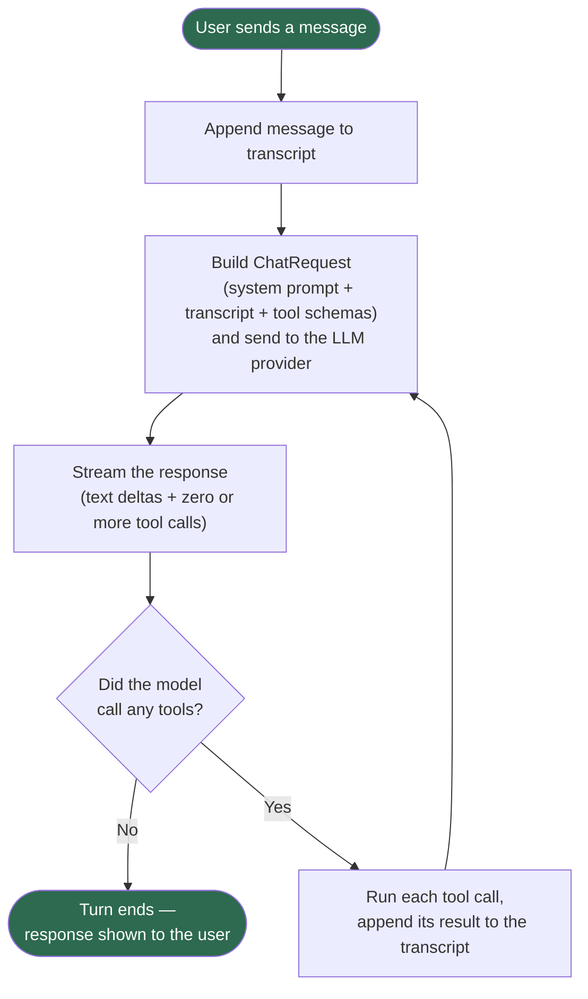
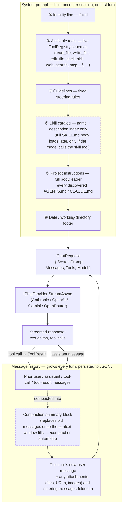

# Architecture

- **The brain** (`Litos.Agent`) — the harness: messages, tool-call state machine, transcript,
  context accounting. Knows nothing about the console, the filesystem, or any specific LLM
  vendor.
- **The environment** (`Litos.Tools`, `Litos.Providers.*`) — concrete capabilities: file I/O,
  shell execution, attachment conversion, and the LLM API calls themselves.
- **The face** (`Litos.Console`, `Litos.Gui`, `Litos.Api`) — thin UI shells. Every face drives
  the same `AgentLoop` through `Litos.Host` and implements the same tool-approval seam in
  whatever way fits its medium.

See [ReadMe_AgentDesign.md](ReadMe_AgentDesign.md) for the full design document, and
[ReadMe_Extensibility.md](ReadMe_Extensibility.md) for how to add a new provider, tool, or face.

## The agent loop

`AgentLoop.RunTurnAsync` (`src/Litos.Agent/AgentLoop.cs`) is the one loop every face drives. A
"turn" starts with one user message and keeps going — model response, tool calls, tool results,
repeat — until the model responds with no tool calls left to make.

Every round trip — request, stream, run tools — appends to the same `Transcript`, so the next
round's request always includes everything that happened before it. The loop only stops once a
model response comes back with no tool calls to run.

## How context comes together for a turn

Every turn sends one `ChatRequest` (system prompt + full message history + tool schemas) to the
provider. The system prompt itself is built once per session, not re-built per turn; the message
history grows every turn and is periodically compacted to keep it inside the model's context
window.

- **System prompt** — assembled once by `LitosSystemPromptProvider.BuildAsync` when the session's
  `AgentLoop` starts; editing a `SKILL.md` or `AGENTS.md`/`CLAUDE.md` file requires a new session
  (`/new`) to take effect, not just a saved file. Skills are *progressive disclosure* (index now,
  full body only on demand); project instructions are the opposite — eager, full-body, every turn
  — since standing rules only steer the model if they're always present.
- **Message history** — every user/assistant/tool message is appended to an in-memory `Transcript`
  and persisted to `%USERPROFILE%\.litos\sessions\{owner}\{sessionId}.jsonl` as it happens.
  Compaction (`Compactor`) runs at the start of a turn, before the system prompt is rebuilt:
  once the transcript crosses a token threshold (or the user runs `/compact`), older messages are
  summarized by a plain call to the same provider/model and replaced with one summary block —
  everything after the cut point is kept verbatim.
- **`ChatRequest`** — `ContextAccountant.BuildRequest` assembles the two into one request per
  turn: `transcript.Messages` (full history plus this turn's new user content), `ToolRegistry`'s
  current tool schemas, the model name, and the system prompt string.

## Projects

| Project | What it is |
|---|---|
| `Litos.Agent` | Provider-neutral, UI-neutral agent core |
| `Litos.Tools` | File, shell, and web-search tools |
| `Litos.Tools.Mcp` | Model Context Protocol client integration — wired up in `Litos.Api` and `Litos.Gui`; `Litos.Console` integration is pending |
| `Litos.Providers.Anthropic` / `.Gemini` / `.OpenAI` / `.OpenRouter` | LLM provider adapters |
| `Litos.Persistence` | JSONL transcript storage |
| `Litos.Host` | Shared composition root (DI, provider factory, tool wiring) for all faces |
| `Litos.Console` | Terminal UI face (Terminal.Gui v2) — work in progress |
| `Litos.Gui` | Desktop UI face (Avalonia) — **working** |
| `Litos.Api` | HTTP API + web UI host, with Docker support and a working Telegram bridge — **working**. WhatsApp/Rocket.Chat/email bridges are design docs only (no implementation yet) |
