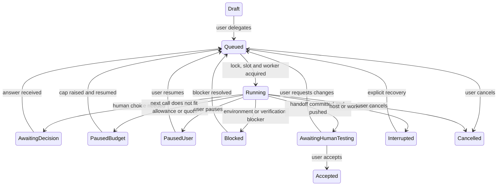

# Litos.SoftwareFactory — Version 1 Blueprint

Date: 30 September 2026
Revision: 3 — standalone multi-user host, React UI, GitHub branch handoff, model gateway, stages and board
Status: Agreed design, not yet implemented. Statements about existing Litos code were checked against branch `litos-software-factory-v1`; everything else is a target.

Revision history:

- Rev 1 (28 Sep): single-user local factory, Blazor UI, SQLite.
- Rev 2 (29 Sep): PostgreSQL factory state, approved project lessons. Shipped with `LitosSoftwareFactory_Demo.zip`.
- Rev 3 (30 Sep): decisions from the design review. The main changes from Rev 2:
  - a standalone `Litos.SoftwareFactory.Host` (Litos.Api stays untouched);
  - a React SPA;
  - trusted multi-user accounts;
  - GitHub-cloned projects with branch-push handoff;
  - per-run worker processes built on a new shared `Litos.Hosting` library;
  - a model gateway with per-call token reservation;
  - PTC on by default, with MCP, skills and web search available;
  - parallel runs across repositories;
  - optional spec stage, agent review pass, board view and flow metrics;
  - a run orchestration contract with completion tools, a context policy and a request estimator (§8.5, §8.6, §9.5);
  - delivery in four milestones, starting with a thin slice gated by a real-task evaluation (§18);
  - stack-agnostic verification profiles (commands plus standard report formats) with coverage evidence; .NET and Node/React are the first presets.

## 1. Product definition

A chat-driven software factory that trusted users reach through a web browser. A user describes a change in a thread, discusses it with Litos, then delegates it with `@factory`. The factory:

1. works on a factory-owned clone of the project's GitHub repository;
2. implements the change with meaningful unit tests;
3. builds, runs the unit tests and measures coverage of the changed lines;
4. has the diff reviewed by an agent;
5. pushes a task branch and optionally opens a draft PR;
6. hands the result back to the same thread for human application testing.

One change or feature = one thread. The factory works until one of these happens:

- it produces a reviewable result;
- it needs a human decision;
- it hits a blocker;
- it is stopped;
- it cannot continue within the task's token allowance.

Humans test the running application and decide acceptance. Passing unit tests never means the feature has passed application testing. Merging to the default branch is always a human action in GitHub.

## 2. Scope and explicit exclusions

### Included

- Multiple **trusted** users with local username/password accounts, reaching the factory by URL on a machine or network the operator controls.
- Admin-registered projects backed by GitHub repositories, cloned and managed by the factory. An optional local-folder mode is available for folders with no remote (§6.2).
- Threads, real Litos conversation before delegation, `@factory` delegation, optional spec stage, pause/resume/cancel.
- Reuse of the existing Litos engine, providers, tools, PTC kernel, MCP, skills and web search.
- Code inspection, edits, dependency restore, compilation, unit tests and changed-line coverage for projects in any language or stack whose build and tests can run from the command line on the factory machine and produce standard reports (§10).
- Agent code-review pass before handoff.
- Human decisions, durable checkpoints, progress, diffs and test evidence in-thread.
- Branch-push handoff with optional GitHub draft PR, human testing and same-thread rework.
- Board view with "whose turn" labels, task type labels and flow metrics.
- Concurrent runs on **different** repositories; never two factory runs on the same repository.
- Per-task token budgets enforced before every model call, per-user quotas.
- Durable factory state and approved project lessons in a dedicated PostgreSQL database.

### Deferred

- **Worker sandbox isolation (containers/VMs).** It is not needed while every user is trusted. It becomes mandatory before any untrusted or external user is given an account (§17).
- Single sign-on (OIDC), two-factor authentication, self-service sign-up.
- Git hosts other than GitHub.
- Parallel factory work on the same repository (a later git-worktree mode).
- Automated UI, browser, API, integration, database and end-to-end testing.
- Application startup, deployment, merging, and live database migration execution.
- Autonomous agent teams, visual workflow designers, automated triage of external issue feeds.
- Built-in presets beyond the first ones (§10.2). Any other stack works through a custom profile; more presets are added as projects need them.
- Report formats other than JUnit XML, TRX, Cobertura and LCOV. A stack whose runner cannot emit one of these needs a small converter or a new report adapter.

The factory may write migration scripts when a task needs them. Executing them against a database and verifying the resulting application behavior remain human responsibilities.

## 3. V1 decisions

| Decision | V1 choice |
| --- | --- |
| UI | React + Vite + TypeScript SPA, served by the factory host |
| Host | Standalone ASP.NET Core `Litos.SoftwareFactory.Host`, independent of Litos.Api |
| Users | Invite-only local accounts (ASP.NET Core Identity), roles Admin and Member, all trusted |
| Factory state | Dedicated PostgreSQL 18 database `litos_factory` in Docker, EF Core + Npgsql |
| Projects | Registered by an Admin from a GitHub URL; factory-owned clone per project |
| Delivery | Task branch `factory/<id>-<slug>` pushed at handoff; optional draft PR; humans merge |
| Agent execution | One `Litos.SoftwareFactory.Worker` process per run, built on shared `Litos.Hosting` |
| Model access | All model calls go through the host's model gateway; workers hold no provider keys |
| Budget | Optional per-task cap, reserved and settled per model call; per-user quota |
| Tools | read/write/edit/list/search/shell, PTC (`run_kernel_code`, on by default), skills, web search, allowlisted MCP |
| Concurrency | Parallel across repositories under a global slot cap; one writer per repository |
| Providers | Every provider Litos supports; budget precision shown per provider |
| Verification | Stack-agnostic profiles: restore, build, unit-test and coverage commands plus standard report formats. Presets for .NET, Node/React, Python, Java and Go; custom profiles for anything else |
| Completion | Factory returns `AwaitingHumanTesting`; a user marks `Accepted` |

## 4. Main user flow

1. An Admin registers a project (GitHub URL, default branch, verification profile, coverage threshold, members).
2. A Member creates a thread in that project, picks a task type (bug, feature, refactor, chore) and optionally sets a model and token budget.
3. The Member discusses the change with Litos. This is a real Litos conversation using read-only tools. It does not edit code, take a repository lock or charge the task budget.
4. Optionally, `@factory spec` produces a written specification with acceptance criteria. The user approves or edits it.
5. `@factory <request>` delegates. The host records the request, approved spec, decisions, budget, verification profile and relevant approved lessons.
6. The factory acquires the repository, creates the task branch from the default branch, posts a concise plan and starts.
7. It reads code, makes the change, and writes or updates unit tests.
8. It builds, runs the unit tests and measures changed-line coverage, with bounded repair when they fail.
9. It runs an agent review pass over the diff and addresses findings within the repair limit.
10. It commits, pushes the branch, optionally opens or updates a draft PR, and posts the handoff.
11. A tester pulls the branch and tests the application. They then either **Accept** or **Request changes** in the same thread; requesting changes adds new commits to the same branch.
12. After acceptance the factory may propose up to three reusable lessons within the remaining budget. Users can Remember, Edit or Dismiss each one.

There is no mandatory plan-approval pause. The factory asks only when a material choice cannot reasonably be inferred, an operation needs new authority, or the user asked for a spec.

### Example thread

User: `@factory Add CSV export for Orders. Administrator access only. Budget: 120,000 tokens.`

Factory: `Assigned. Project: SalesApp (github.com/acme/salesapp), branch factory/7f3a-csv-export from main. I will inspect authorization, implement export, and run the unit-test profile. Application testing will be yours.`

Factory: `Decision needed: should export include all filtered rows or only the current page? No further edits will run until you answer.`

User: `All filtered rows.`

Factory: `Ready for human testing. Branch factory/7f3a-csv-export pushed (commit 1c9e2b4), draft PR #212. Build passed. 18 unit tests passed (4 new). Changed-line coverage 91% (threshold 80%). Agent review: 1 finding fixed. Please check administrator export, non-administrator access, filters and an empty result.`

User: `@factory CSV values containing commas are incorrect. Fix this.`

The factory reopens the same task with the remaining cumulative budget and adds a commit to the same branch.

User: **Accept** (structured action). A normal chat message is never treated as acceptance.

## 5. Threads, stages and dispatch semantics

- A **TaskThread** is the durable conversation and the home of one logical task inside one project. A **TaskRun** is one execution segment; several runs may belong to a thread.
- Each thread has **one Litos session** for its whole life.
  - Chat turns run with a read-only tool set.
  - `@factory` turns continue the same session with the full tool set under the budget and repository lock.
  - A run therefore starts with everything already discussed in context.
  - Chat-turn tokens are counted against the user's quota and shown separately. They are not charged to the task budget.
- Assignment is a structured composer mention rendered as `@factory`. A leading user-authored mention may also be parsed. Quoted text, code blocks, assistant messages and tool output never trigger delegation.
- A unique message ID is the dispatch idempotency key. Double-clicks or network retries create one assignment.
- Starting a run snapshots the request, approved spec and accepted corrections into a versioned task specification.
- One active run per thread. A mention during execution becomes a follow-up instruction, not a second run.
- Steering messages enter an inbox and are incorporated at a safe tool boundary. Pause and cancel go directly to the host.
- A reply to a specific open decision resumes it when unambiguous. Other paused states need an explicit Resume or `@factory`.
- Budget exhaustion cannot be bypassed by posting `@factory` again. The cap must be raised or a separate task started.
- A thread's project is fixed. Work on a different repository needs a new thread.

### 5.1 Stage and lifecycle are separate fields

**Stage** records *what kind of work* the task is in:

`Discuss → Spec (optional) → Implement → Verify → Review → Handoff → Done`

**Lifecycle state** records *whether it is moving and who it waits for* (§7). A task can be `Implement / Running`, `Spec / AwaitingDecision`, `Handoff / AwaitingHumanTesting`, and so on. Keeping them separate lets new stages be added later without touching the state machine or schema.

### 5.2 Spec stage (optional)

`@factory spec` runs a read-mostly turn that produces a specification containing:

- summary;
- acceptance criteria, numbered;
- affected areas;
- test plan (which criteria unit tests will cover, which are manual-only);
- open questions.

The user approves it, possibly after editing, which creates a new revision. Implementation then starts from the approved revision. Acceptance criteria drive verification evidence and the handoff checklist. Small fixes may skip the stage.

### 5.3 Agent review stage

After build and tests pass, the host starts one review turn with fresh context and read-only tools. The turn receives the diff, the approved spec and the verification results. It reports findings (bugs, unmet criteria, missing tests, leftover debug code) as structured items.

- Findings marked blocking consume one of the bounded repair cycles.
- Everything else is listed in the handoff.
- The review is charged to the task budget.
- It is a single bounded pass, not an agent team.

## 6. Projects, workspaces and repository ownership

### 6.1 Default mode: factory-managed GitHub clone

- An Admin registers a project with its GitHub URL, default branch, verification profile, coverage threshold and members. The host stores a **project-scoped GitHub credential**: a GitHub App installation or a fine-grained token limited to that repository. It is encrypted at rest with ASP.NET Core Data Protection and never given to workers.
- The factory keeps one working copy per project under its data directory, for example `<FactoryData>/workspaces/<projectId>/`. Developers' own folders are never touched.
- A new run fetches, creates `factory/<shortThreadId>-<slug>` from the latest default branch, and records the baseline commit.
- **Handoff** is performed by the host, not the agent:
  1. verify the diff and evidence;
  2. commit as the factory identity with a `Co-authored-by:` trailer for the requesting user;
  3. push the branch;
  4. create or update the draft PR if the project enables it.
- Rework runs check out the existing branch and add commits. The factory never force-pushes, rewrites history, merges or pushes to the default branch.
- Because handoff leaves the working copy clean and the branch is pushed, the **repository lock is released at handoff** in this mode. Another thread may use the repository while the first awaits testing. Rework re-acquires the lock and checks out its branch.
- Conflicts between factory branches are resolved by humans at merge time, as for any two branches.

### 6.2 Optional mode: registered local folder

This is for folders with no reachable Git remote. It keeps the Rev 2 behavior:

- edits happen in place and are left uncommitted;
- work requires a clean Git working directory, or recorded before-images for non-Git folders;
- a **review hold** keeps the folder locked until acceptance, cancellation or explicit release;
- the handoff offers **Download patch**.

Only users who can reach the factory machine can test this mode.

### 6.3 Repository lock

- **Lock identity:**
  - Clone mode: the project.
  - Local-folder mode: the canonical Git common directory (`git rev-parse --git-common-dir`, real path), which covers worktrees, or the canonical folder path for non-Git folders. Parent and child folders conflict.
- **What holds the lock:**
  - Clone mode: an active run, or a run paused with uncommitted work (AwaitingDecision, PausedBudget, PausedUser, Blocked, Interrupted).
  - Local-folder mode: additionally, AwaitingHumanTesting.
- **Claiming:** a single serialized transaction that takes a PostgreSQL advisory lock, checks overlapping live leases, checks the global slot cap, and creates the lease and run. A unique index alone cannot express parent/child overlap.
- **Waiting:** a queued thread shows exactly what it waits for, for example *Waiting for SalesApp — held by "Add CSV export" (awaiting decision)*.
- **Expiry:** leases never expire silently. Recovery confirms process liveness first (§16).
- **External edits:** in local-folder mode, users may still edit files. Before handoff the host re-hashes changed files. If content changed outside the run, it invalidates the test evidence and asks the user to reconcile.

## 7. Coordinator and state machine

Persist state in PostgreSQL. Never derive task status from the agent's chat memory.



- Pause and cancel also apply to waiting states.
- **Withdrawing a change request.** After a handoff, an `@factory` message is a change request and starts a rework run. Until that run produces its own handoff, the tester can withdraw it from any state in which it is not executing (a running one is paused first): the rework run ends as `Withdrawn`, its uncommitted edits are discarded from the working copy, and the task returns to `AwaitingHumanTesting` on its last handoff. The original run cannot be withdrawn, only cancelled.
- Cancellation preserves edits, branches and evidence; it never reverts files or deletes branches.
- Acceptance never merges.
- Verification is tracked separately from lifecycle:
  - build: `NotRun / Passed / Failed / Unavailable`;
  - unit tests: `NotRun / Passed / Failed / NoTests / Unavailable`;
  - coverage: `NotMeasured / Met / BelowThreshold / Unavailable`;
  - agent review: `NotRun / Clean / FindingsFixed / FindingsOpen`;
  - human testing: `NotStarted / Passed / Failed`.

A result may be handed off with explicitly disclosed limitations, but never labeled as passing something that did not run.

### 7.1 Board and "whose turn" labels

The board groups threads into columns by stage. Every card carries exactly one turn label derived from lifecycle state:

| Label | Lifecycle states |
| --- | --- |
| Awaiting you | AwaitingDecision, AwaitingHumanTesting, PausedBudget, Blocked, Interrupted |
| Awaiting agent | Queued (with the lock/slot reason) |
| Agent working | Running |
| Paused | PausedUser |
| Done | Accepted, Cancelled |

Cards also show the task type label, project, owner, budget used/cap, branch and PR link. Filters: project, type, owner, label. "Awaiting you" is personal: it shows the items the current user must act on.

## 8. Execution loop and deterministic boundaries

**Coordinator (host) responsibilities:**

- scheduling, repository ownership, slot cap and lifecycle transitions;
- message ordering, budget accounting, quotas, timeouts and cancellation;
- git operations (fetch, branch, commit, push, PR);
- running configured verification commands and parsing structured reports;
- checkpoints, status, decision and result messages.

**Litos (worker) responsibilities:**

- understand requirements, inspect code, and choose implementation details within scope;
- modify code and write meaningful unit tests;
- diagnose failures, make bounded repairs and explain results.

Fixed orchestration decisions are not implemented as LLM conversations. The existing agent loop (`Litos.Agent/AgentLoop.cs`) is reused unchanged behind the worker. It is never copied.

**Execution sequence:**

`preflight → (spec) → inspect → plan → implement → build → unit tests + coverage → bounded repair → agent review → bounded repair → handoff`

- At most two repair cycles in total after the first verification failure or blocking review finding. Persistent failure becomes `Blocked` even if tokens remain.
- Configurable command and run wall-clock limits prevent no-progress hangs.

**Tools in factory runs:**

- `read_file`, `write_file`, `edit_file`, `list_directory`, `search_code`, `shell`;
- `run_kernel_code` (PTC, **on by default**);
- `skill`, `web_search`;
- MCP tools from servers on the central allowlist (§8.1);
- `request_decision` (new, §11).

Chat turns before delegation get the read-only subset: read, list, search, skill, web search and allowlisted MCP.

**Approvals:** routine tools keep Litos's existing auto-approval. MCP servers whose default permission is **Ask** are treated as **allowed** in factory runs, both inside kernel code (the kernel's existing rule in `Litos.Kernel/KernelSession.cs`) and on the direct tool path, so one tool behaves the same regardless of how the model called it. **Deny** is honored everywhere. The handoff lists the Ask-mode MCP tools that were actually used.

Command restrictions and the run contract are host safeguards for trusted users. They do not protect against hostile code executing under the worker's OS account (§17).

### 8.1 MCP servers (factory-wide)

MCP servers are configured **in the factory**, under Factory settings → MCP servers, not in any user's own `~/.litos/mcp.json`. For each server an Admin records:

- a name;
- a connection, either a command with arguments or a URL;
- the secret environment variables it needs, stored encrypted and never shown again;
- its permission (Full, Ask, Deny);
- whether factory runs may use it.

A **Test connection** action starts the server once and reports how many tools it offers.

There are no per-project overrides in V1: the list applies to every project. It is stored in `litos_factory`, and each run snapshots it at start (`RunCapabilitySnapshot`). Every user effectively shares the servers' credentials, which is acceptable only under the trusted-user rule.

MCP servers start fresh in each worker. The coordinator waits for the worker's "MCP ready" signal, not merely its port handshake, before the first turn. A slow server can take up to 30 seconds.

### 8.2 Skills and web search

Skills come from two places. Skills in the host account's `~/.litos/skills` and `~/.claude/skills` are **not** used, so runs never depend on whichever Windows account started the host.

- **Factory skill library.** Admins add, edit, enable and disable skills under Factory settings → Skills. Stored skills are materialized into a factory-owned skills folder that the worker reads.
- **Repository skills.** These are `.litos/skills` folders in a project's repository, written by that repository's contributors. One factory-wide policy decides how they are treated:
  - *use after an Admin approves each one* (default);
  - *always use*;
  - *never use*.

  A newly found repository skill appears as "Waiting for approval". Runs skip it, and say so, until it is approved.

The worker's skill discovery (`Litos.Tools/Skills/SkillDiscovery.cs`) needs a host-supplied list of skill roots instead of its fixed user-profile roots. This is one more `Litos.Hosting` extension point (§15.1).

**Web search** is switched on or off factory-wide, with its API key held by the host. Search queries and result URLs are written to the run log.

Each run records which MCP servers, skills and tool settings it started with. Changing settings affects only runs that start afterwards; a rework run reuses its task's snapshot.

### 8.3 Factory settings

All factory-level configuration lives in one Admin-only area. There are no per-project overrides in V1.

| Tab | Contents |
| --- | --- |
| Projects | Register GitHub projects, credential, members, verification profile, coverage threshold, draft-PR option |
| People | Users, roles, invitations |
| Providers and models | Per provider: enabled, API key status (set/replace, never displayed), strict/estimated label, and a short list of **allowed models** (§8.4); **defaults for new threads**: a default provider plus a default model chosen from that provider's allowed models (members can change both per thread); "strict-budget providers only" switch |
| MCP servers | §8.1 |
| Skills | Factory skill library and repository-skill policy and approvals (§8.2) |
| Tools | Web search on/off and key; PTC default for new threads and whether members may turn it off per thread; shell command time limit |
| Budgets and limits | Default and maximum task budget, daily and monthly per-user quotas, repair cycles per run, concurrent run slots |
| Verification presets | Edit the presets projects start from (§10.2); changes do not alter registered projects |

**How settings reach users:**

- The New thread dialog offers only enabled providers that have a key, and only models an Admin allowed.
- It rejects budgets above the maximum.
- It shows the PTC choice only when members may change it.

### 8.4 Model catalog and allowed models

Provider model lists can be very large; OpenRouter alone offers several hundred. The factory therefore separates the small set of **allowed models** from the provider's full **catalog**.

**Catalog.** The host fetches each provider's model list through the existing provider model-listing call (`ListModelsAsync`, already exposed by VsCodeHost as `/settings/models`) and caches it with its fetch time. Each entry records the model ID, context window, whether it supports tool calling, and price per million input and output tokens where the provider reports them. An Admin can refresh it at any time.

**Allowed models.** Each provider shows only its allowed models, typically a handful, one row each: context window, tool support, a *Default* marker, and *Make default* and *Remove* actions.

**Adding models.** *Add models* opens a catalog picker:

- search as you type on model ID;
- filters: tool calling only (on by default, since the factory cannot use a model without it), minimum context window, model family (the `vendor/` prefix for OpenRouter), and hide already-allowed models;
- a sortable, virtualized table (model, context, tools, price);
- multi-select with one *Allow selected* action.

**Retired models.** When a refresh no longer lists an allowed model, the model is marked *Not offered by provider*:

- it is withheld from members;
- tasks already running keep it;
- if it was the default, the default falls back to another allowed model from the same provider, then to another provider.

**Allow every model.** A per-provider switch, off by default, exposes every tool-capable catalog model to members. It warns that costs and budgets become harder to predict.

**Member picker.** The New thread model field and the Admin's default-model field are searchable pickers grouped by provider. The member picker pins the factory default and the member's three most recently used models at the top.

### 8.5 Run orchestration contract

The coordinator drives a run as a sequence of **host steps** (no model) and **agent turns**. An agent turn is one `AgentLoop.RunTurnAsync` call started by `StartTurn`. Inside a turn the model may make many tool calls. By the existing loop's rules, the turn ends when the model replies without further tool calls.

The host decides every stage transition from its own records, never from the agent's prose.

**Completion tools.** Three worker tools, added by the factory and available both directly and from kernel code, are the only way an agent turn reports a result:

| Tool | Used in | Arguments | Host reaction |
| --- | --- | --- | --- |
| `submit_work` | implement, repair and rework turns | summary; acceptance-criterion → test mapping; tests added; known limitations; manual test steps | Marks the turn complete and moves to Verify |
| `request_decision` | implement, repair and rework turns | question; why it blocks; 2–4 options; recommendation; impact | Records the decision, cancels the turn once the tool returns (the transcript is repaired on cancel), sets `AwaitingDecision` |
| `submit_review` | review turn | findings: severity (`blocking` or `minor`), file, line, text | Stores `ReviewFinding` rows and moves to Repair or Handoff |

**Sequence of one run:**

1. **Preflight (host).**
   - Fetch, then create or check out the task branch, and confirm the working copy is clean.
   - Reuse or run the baseline verification for the base commit. It is cached per commit, so pre-existing failures are known.
   - Snapshot the settings (§8.2) and retrieve lessons (§22).
   - Compose the **run brief**.
2. **Implement turn (agent).**
   - The prompt is the run brief:
     - the execution contract (§8);
     - the approved spec and its acceptance criteria;
     - recorded decisions and included lessons;
     - a summary of the verification profile;
     - the instruction to finish with `submit_work`.
   - The agent may run builds and tests itself for fast feedback, but only the host's run counts as evidence.
3. **Verify (host).**
   - Run the profile and read its reports.
   - Compute changed-line coverage.
   - Compare with the baseline: a failure that also fails on the baseline is reported as pre-existing, not as the task's failure.
4. **Repair turn (agent)**, when a new test fails or coverage is below the threshold.
   - The prompt is a **repair brief**:
     - the failing test names;
     - bounded failure excerpts taken from the reports (default 4,000 tokens in total);
     - the uncovered changed lines;
     - "repair cycle k of N".
   - The turn ends with `submit_work`, and the run returns to Verify.
5. **Review turn (agent).**
   - Runs in a **fresh session**, not the thread's session, with read-only tools.
   - Input: the diff (or, above 1,500 changed lines, the changed-file list for the agent to read), the acceptance criteria and the verification summary.
   - Blocking findings lead to one repair turn and one more Verify. The review is not repeated, which bounds its cost.
6. **Handoff (host).**
   - Commit, push, and create or update the draft PR.
   - Compose the handoff (§11) from the host's evidence plus the `submit_work` content.

**Rework** is a new run on the same branch. Its first turn is a **rework brief**:

- the tester's feedback;
- the previous handoff summary;
- the list of files changed since the base commit.

It then follows the same Verify → (Repair) → Review → Handoff sequence.

**Limits and no-progress rules.** All are configurable in Factory settings. Each one stops the run as `Blocked` with a stated reason, and the edits are kept.

- **Repair cycles:** at most N per run (default 2), shared between test failures and review findings.
  - A review that reports blocking findings when no repair cycle is left stops the run as Blocked. It is never handed off with a known blocking finding.
  - Resuming a Blocked run grants a fresh allowance of N cycles, because a person has looked at the blocker. Resuming after a pause keeps the count.
- **Turn ends without a completion tool:** one automatic nudge turn ("You stopped without calling `submit_work` or `request_decision`…"). If that also ends without one, the run is Blocked.
- **Nothing changes:** a turn that changes no files and makes no completion call.
- **Repair made no difference:** the same set of failing tests before and after a repair turn.
- **Too many questions:** at most 3 `request_decision` calls per run. Past the limit, the factory proceeds on its recommendation and records that in the handoff.
- **Tool calls:** at most 200 per turn.
- **Time:** a wall-clock limit per turn (default 45 minutes) and per run (default 3 hours).

**Prompts are versioned assets.** The briefs are template files in `Litos.SoftwareFactory.Core`:

- run brief;
- repair brief;
- rework brief;
- review brief;
- nudge.

Each run records the prompt revision it used, so evaluation results (§18) can be tied to a specific prompt revision.

**Chat and spec turns** use the same mechanism with read-only tools. A spec turn ends with a `submit_spec` tool (summary, criteria, test plan, open questions), which moves the thread to spec approval.

### 8.6 Context policy

Every turn's cost includes its whole context, so context is managed deliberately:

- **Thread session.** One session per thread carries chat, spec, implement, repair and rework turns. That continuity is what lets rework understand earlier discussion.
- **Review.** Always runs in a fresh session, for independence and a small context.
  - **Review depth is chosen by the host, without a model call** (`ReviewPlanner`, decided 2026-10-03; see ReadMe_CodeVerifyOptimisations.md). A **light review** is one look at the evidence and the diff, with no reading round the repository and no running code. A **full review** may read and run code. Any one risk signal makes it full: more than 150 changed lines outside tests or more than 8 files; paths touching auth, schema or migrations, storage or data formats, or build and dependency configuration; added code that locks, is asynchronous, writes or stores data, or runs processes or injects markup; a removed or changed public declaration; a verification that is not clean; or a submission with an acceptance criterion and no test. The thread says which review a change got and why.
  - **A review has an allowance.** A light review is asked to submit after 2 model calls and stopped after 6 tool calls (the 2 it needs, plus room for a kernel error or a rejected submission). A full review is asked after 12 calls, or once it has cost half of what this run's implementation cost (at least 40,000 tokens), and stopped after 24 tool calls. "Asked" is a steer at the next safe point, noted in the thread. A review stopped at its tool-call limit is reminded once to submit what it has, and blocked only if it still does not.
  - **The reviewer sees the agent's account**: its summary, its criterion-to-test mapping and its known limitations, labelled as claims to check, after the host's own verification result.
  - **Every model call records its phase** (Implement, Rework, Repair, Nudge, Review, LightReview), so the budget panel shows the review's cost against the implementation's.
  - **The review of a rework run covers the rework.** Its brief carries the diff since the last handoff and what the tester asked for, and says the earlier work was already reviewed. On the first real tasks a rework's review re-reviewed the whole task and cost more than the task's first implementation.
- **Calls are what cost.** A turn's cost is its context size times the number of model calls it makes, and every brief says so: read the files you need in one script, read each once, and (for review) do not repeat the factory's verification. The first real runs made 30 to 60 calls a turn.
- **Stable prefix.** The system prompt and tool list never change within a session; per-run material goes into user messages. That keeps provider prompt caches useful.
- **Compaction before large turns.** Before starting a rework or repair turn, the host checks the session's context size against **the engine's own compaction trigger** for the model's window (`CompactionSettings.ForContextWindow`: 65% of the window, capped at 250,000 tokens, which is where a million-token model lands). Past it, the host compacts first with a factory-specific instruction:
  - keep the acceptance criteria, decisions, the files changed and their purpose, and outstanding failures;
  - drop raw tool output.

  Compaction goes through the gateway and counts against the task budget, like any other call.

  The factory deliberately has no lower trigger of its own. The engine's figure comes from cost measurements: compacting a smaller context costs more in re-reading what the summary dropped than it saves, and a cut keeps the most recent part of the conversation verbatim (about 78,000 tokens for a million-token window), so a small session has nothing old enough to cut. The sessions in the first real runs were 25,000 to 45,000 tokens, and are rightly left alone.
- **Rules survive compaction.** A compaction summary keeps the request and the decisions, not the rules. So the rework and repair briefs restate the execution contract instead of pointing back at the run brief.
- **Bounded tool output.** The existing shell output truncation applies. Excerpts from verification reports are bounded by the host before they enter a brief.

## 9. Token budget and the model gateway

### 9.1 Budget contract

- The optional cap belongs to the task and spans spec, planning, coding, repair, review, summarization, compaction, lesson reflection and rework. Every model request made for the task counts, including retries that incur usage.
- Task tokens are provider-reported input plus output, including reasoning tokens where reported.
  - Input is every count the provider reports (input, cache creation and cache read), because providers report those counts separately.
  - **Input read from the provider's prompt cache counts at a discount: 10% by default** (`FACTORY_CACHED_INPUT_WEIGHT`), rounded up. Input written to the cache, and input the host has to estimate because the provider did not report it, count in full.
  - Reported totals must not be double-counted.
- This is a token allowance, not money or a context-window limit. Repeated prompt input consumes budget again on every call, at the cached weight. Tool schemas, MCP tool definitions, skill lists and retrieved lessons are part of every request's input.
  - *Why the discount (decided 2026-10-02, after the first real run):* an agent resends its whole conversation on every call. Counted in full, a small task used 993,607 tokens in 44 calls, 88% of it cache reads, so a budget measured how many calls a task took rather than how much work it did. At 10% the same run is 203,451, in line with the M1 caps.
  - A call is **reserved** on what its input is expected to be charged (§9.2): the discount is assumed in advance only for input the session's previous call shows the cache is serving, and is otherwise applied when the call settles.
- Each user also has an optional **quota** (per day or per month) covering both chat and task usage.
- The UI shows usage by provider/model and an optional estimated cost.

### 9.2 Per-call reservation

Every model call is admitted by the host before it is sent:

1. Atomically read the task's used tokens, open reservations and the user's quota, under the thread's budget-row lock.
2. Estimate the complete request input: system prompt, tool schemas and messages. Work out what that input is expected to be charged: the part the provider's cache is expected to serve counts at the cached weight (§9.1), the rest in full.
   - Input is expected from the cache only when the session's previous call was itself served from the cache and settled within the cache window (4 minutes). Then all of that call's input is expected to be cached. A first call, a provider that does not cache, or a session resumed after a pause is reserved in full.
3. The input reservation is that expected charge plus a configurable margin (default 10%) for estimator error.
4. If the input reservation plus a **minimum output** (4,096 tokens) does not fit the remaining task allowance or the user's quota, refuse **before sending**. The run moves to `PausedBudget` with changes and checkpoint preserved.
5. Otherwise send the call with the provider's output limit (`ChatRequest.MaxOutputTokens`) set to what remains after the input reservation, up to the output allowance (32,768). The reservation is the input reservation plus that output limit, so the call cannot exceed it. The output limit carries no margin: the provider enforces it.
6. Settle against reported usage (`UsageInfo` on `MessageCompleted`) and release the unused reservation.
7. If usage is unknown (timeout, cancellation, provider omitted usage), keep the reservation charged until reconciled. Never silently refund it.
   - **Reconciliation** happens when nothing can report the call's usage any more: when the run that made the call has stopped, and at host startup for calls a previous host left in flight. The call is charged the input estimate it was admitted on, in full and never more than was reserved, and the rest of its reservation is released. It is recorded as `Estimated`, distinct from `Settled`.

Example: cap 100,000; used 80,000. The next request is estimated at 15,000 input, none of it expected from the cache. Its input reservation is 15,000 + 10% = 16,500, and with the 4,096 minimum output that is 20,596. That exceeds the 20,000 remaining, so the host pauses before spending anything. With 21,000 remaining the call would be sent with an output limit of 4,500.

*Why (decided 2026-10-02, after the first real run):* reserving the whole input in full and the whole output allowance held about 55,000 tokens for calls that cost about 6,000, so a task paused with most of a call's worth of budget unused nine times over. Reserving input at its expected charge, and limiting output to what remains instead of requiring room for all of it, keeps the guarantee (a call cannot spend past the cap) without holding ten times a call's cost.

A unique request key per call prevents double-charging on repeated callbacks.

On exhaustion:

- stop dispatching model work;
- let a bounded in-flight operation finish or time out;
- preserve changes;
- post progress, last verification, used/limit and next action.

The final report is generated deterministically from saved state, with no further model call. Raising a cap changes the maximum, not the accounting history. Without a cap, cancellation, iteration and time limits still apply.

### 9.3 Model gateway

Workers never hold provider API keys. Every model request, including compaction and reflection, goes through the host:

```text
Worker process                                 Litos.SoftwareFactory.Host
  AgentLoop / Compactor                          Model gateway
    → GatewayChatProvider (IChatProvider) ─HTTP stream─►  admit + reserve (§9.2)
      (no keys)                                            → real IChatProvider via Litos.Host
    ◄── streamed AgentEvents ─────────────────────────── ← settle, write UsageEntry
```

- `GatewayChatProvider` is a small new `IChatProvider` in the worker. The agent loop already sends every call through a single `IChatProvider.StreamAsync` (`Litos.Agent/AgentLoop.cs`, `Litos.Agent/Session/Compactor.cs`), so no loop change is needed.
- The gateway is the single place for per-provider concurrency limits. HTTP 429 (`ChatProviderRateLimitedException`) becomes "wait and retry with the reservation kept", not a failed run.
- Provider keys belong to the host's own configuration (environment or secret store), not to the `~/.litos/config.json` of whichever account started it.

### 9.4 Budget precision per provider

All Litos providers are allowed. The UI labels each task's budget as **strict** or **estimated**:

| Provider | Output cap honored | Usage reported | Budget label |
| --- | --- | --- | --- |
| Anthropic | Yes (defaults to 4096 when unset) | Input, output, cache create/read | Strict |
| OpenRouter | Yes | Input, output, cached (detects inclusive vs separate reporting) | Strict |
| OpenAI | Yes | Input, output (no cache breakdown) | Strict |
| Gemini | **No — must be fixed** (`GeminiChatProvider` sets no generation config) | Prompt, candidates | Estimated until fixed |
| Local, MeshApi | Yes | Input/output only when the server reports them; otherwise 0 | Estimated; host charges its own estimate when usage is 0 |

Provider SDKs may retry internally without surfacing the usage. That is a documented accuracy limit.

### 9.5 Request estimation

Litos has no pre-send token estimator today. The only existing estimate is `CompactionPlanner.EstimatedTokensUsed`, which derives from the previous response's usage. Per-call reservation (§9.2) needs one, so the gateway estimates in three layers:

1. **Session baseline.** Start from the last settled request in the same session, using its `TotalInputTokens`: input plus cache creation plus cache read.
2. **Delta.** Add characters ÷ 4 for everything appended since: messages, tool calls and results, and images at a fixed allowance.
3. **First call of a session.** No baseline exists yet, so estimate the system prompt, tool schemas and messages at characters ÷ 4.

The gateway then multiplies by a **calibration ratio** for that provider and model. The ratio is learned from actual ÷ estimated over recent settled calls, with a floor of 1.0.

Every call logs its estimate, actual and error. The M1 evaluation (§18) must show the 95th-percentile under-estimate staying within the reservation margin (default 10%). Where it doesn't, two remedies apply:

- raise the margin for that provider;
- use the provider's own token-counting endpoint for that provider, where one exists.

## 10. Verification: build, unit tests and coverage

A build is a compilation check, not application testing. Dependency restore/install needed to compile is allowed and recorded.

The factory is **stack-agnostic**. It does not know about any language or build tool. Each project has a reviewed **verification profile**, which is just data: the commands to run and the report formats they produce. The factory runs the commands and reads the reports. Supporting a new stack means writing a profile, not changing factory code.

- Profiles use argument arrays, never concatenated shell strings.
- Repository changes to verification configuration are untrusted until an Admin accepts them. An agent cannot redefine the gate to make its own task pass.
- A multi-stack repository (for example an API and a web front end) lists several steps, each with its own working subdirectory, commands and reports.

### 10.1 Profile schema

```json
{
  "profileVersion": 2,
  "environment": { "CI": "true" },
  "steps": [
    {
      "name": "api",
      "workingDirectory": "src/api",
      "restore": { "executable": "<tool>", "arguments": ["..."], "timeoutSeconds": 600 },
      "build":   { "executable": "<tool>", "arguments": ["..."], "timeoutSeconds": 600 },
      "unitTests": [
        { "executable": "<tool>", "arguments": ["..."], "timeoutSeconds": 300,
          "testReport":     { "format": "junit", "path": "artifacts/test-results/*.xml" },
          "coverageReport": { "format": "cobertura", "path": "artifacts/coverage/*.xml" } }
      ]
    }
  ],
  "coverage": { "changedLinesThresholdPercent": 80 },
  "applicationTesting": "human",
  "databaseExecution": "disabled",
  "maximumRepairCycles": 2
}
```

- **Every command is optional except unit tests.** An interpreted stack with nothing to compile leaves `build` out, and the handoff says *Build: not applicable*.
- **Test report formats:** `junit` (JUnit XML), which most runners in most languages can emit, and `trx`. Anything else is converted to JUnit XML by a small step in the profile, or supported later by a new report adapter.
- **Coverage formats:** `cobertura` and `lcov`, which cover most coverage tools across languages.
- **Report paths** are globs relative to the step's working directory. The factory deletes stale reports before each run, so old results can never count as new evidence.

### 10.2 Presets

Presets are ready-made profiles an Admin picks when registering a project and then adjusts. They are data shipped with the factory, not special code paths. V1 ships these presets, with .NET and Node/React validated first:

| Preset | Restore | Build | Unit tests (report) | Coverage |
| --- | --- | --- | --- | --- |
| .NET | `dotnet restore` | `dotnet build -nodeReuse:false` | `dotnet test --logger trx` (TRX) | coverlet, Cobertura |
| Node / React | `npm ci` | `npm run build` | `vitest run --reporter=junit` or `jest --ci` with a JUnit reporter | `--coverage`, Cobertura or LCOV |
| Python | `pip install -r requirements.txt` | none | `pytest --junitxml=...` | `coverage xml` (Cobertura) |
| Java | `mvn -B dependency:resolve` | `mvn -B compile` | `mvn -B test` (Surefire JUnit XML) | JaCoCo converted to Cobertura |
| Go | `go mod download` | `go build ./...` | `go test` with `go-junit-report` | `gocover-cobertura` |
| Custom | any | any | any command writing JUnit XML or TRX | Cobertura or LCOV |

The factory machine must have each stack's toolchain installed. Profile validation at registration checks that the executables exist and runs the profile once against the default branch. That baseline run also records pre-existing failures, so they are not blamed on a task.

**Rules:**

- **Non-interactive, non-watch execution.** The factory always sets `CI=true`, gives commands no standard input, and requires non-watch test commands. Several test runners (Vitest and Jest, for example) otherwise start in watch mode and would hang the run until its timeout.
- **Build isolation between concurrent runs.** Profiles turn off build tools' shared background servers where a stack has them (for example MSBuild node reuse and the .NET build server). Otherwise concurrent builds of different repositories can share processes and file locks. Package caches (NuGet, npm, pip, Maven, Go modules) are safe to share.
- **Recorded side effects.** Restore steps may run the repository's own install scripts (for example npm lifecycle scripts or Python build hooks). The run log records that they ran, and they fall under the "repository-provided config is untrusted" rule.
- **Counts only from reports.** Pass/fail counts and coverage come only from the declared structured reports, never from parsing console text or the agent's own claims. A test command that exits non-zero with no report is *Failed (no report)*, never passed.
- **Changed-line coverage.** Computed by intersecting the coverage report with the baseline-relative diff. Below the project threshold, it triggers a repair cycle; persistently below, it is disclosed in the handoff.
- **Comprehensive unit tests are a requirement, shown as evidence.**
  - Each acceptance criterion is mapped to the tests that cover it or marked *manual-only*.
  - New and changed behavior must have tests.
  - Tests that merely mirror the implementation are avoided.
  - If a project has no test or coverage tooling, the factory asks via a decision card before adding it.
  - It never invents counts.
- **Explicit unit-test scope.** Configure explicit unit-test projects, packages, directories or reviewed filters. Do not run a whole solution or repository test command that also contains integration, database or UI suites.

## 11. Human decisions and handoff

**Decisions** are raised by the new `request_decision` tool. It is available both directly and from kernel code, and it ends the current turn.

- A decision card includes:
  - the question;
  - why it blocks work;
  - concrete options;
  - a recommendation where appropriate;
  - impacted files and behavior;
  - a decision ID.
- The run stops while awaiting the answer, and the answer is persisted in the task specification.
- Typical triggers:
  - an ambiguous business rule;
  - conflicting external edits (local-folder mode);
  - a dependency outside the agreed scope;
  - no test or coverage tooling;
  - a proposed destructive data operation (always manual).

**The handoff contains:**

- what changed, and which acceptance criteria it addresses;
- branch name, commit SHA, draft PR link, and the baseline-relative diff with the changed-file list;
- exact build and test commands, results, durations, new versus pre-existing tests, and changed-line coverage against the threshold;
- agent review findings, fixed and open;
- pre-existing failures, unverified behavior and known limitations;
- migration scripts, labeled `Not applied / not database-tested`;
- manual test steps with expected results and setup, derived from the acceptance criteria;
- MCP tools used from Ask-mode servers, and skills loaded;
- cumulative tokens used and remaining;
- actions: Accept, Request changes, Resume (where applicable), Open PR, View diff, View logs, Download patch.

The manual testing checklist is generated guidance, not evidence of testing. If budget is insufficient, feedback is collected but no model is invoked until the budget is adjusted.

## 12. UI structure

A React SPA with two main views.

**Board:** columns by stage, turn labels, filters and flow metrics (§12.1).

**Thread view**, in three regions:

| Region | Contents |
| --- | --- |
| Left | Projects, threads, status badges, search/filter, "Awaiting you" count |
| Center | Conversation, compact progress events, decision cards, spec, review findings, handoff, composer with `@factory` |
| Right (collapsible) | Project and branch/PR, stage and lifecycle, model, budget used/cap/remaining with strict/estimated label, changed files, build/test/coverage/review results, lessons, MCP servers and skills included in the run |

Additional areas:

- **Project lessons panel:** pending suggestions, approved lessons, sources, revisions, and Remember/Edit/Dismiss/Disable actions.
- **Factory settings (Admin only):** the tabs listed in §8.3.

**Controls by state:**

- Before delegation, the composer shows the project, branch base and budget.
- While running: Pause and Cancel.
- In a budget pause: Change budget and Resume.
- Awaiting human testing: Accept and Request changes.

Post meaningful stage changes, not every thought or tool output. Large tool output goes to log artifacts, with bounded excerpts in chat.

Live updates use Server-Sent Events carrying durable sequence numbers, so a reconnecting client replays everything after its last seen event (`Last-Event-ID`).

Testing: Vitest and React Testing Library for components and state logic. The API client is mocked at the HTTP boundary.

### 12.1 Flow metrics

Per project and overall, shown on the board:

- time spent in each stage and state;
- tokens per task (by stage and model);
- rework rounds per task;
- first-handoff acceptance rate;
- open decisions and the oldest one waiting;
- queue wait time for repository locks and slots.

Record lesson inclusion separately from evidence that a lesson helped.

## 13. Architecture

```text
Browser (React SPA)
  └─ HTTPS/cookie ─► Litos.SoftwareFactory.Host (ASP.NET Core, Windows, native)
                       ├─ Identity (local accounts, roles, project membership)
                       ├─ Factory API + SSE event stream (outbox-backed)
                       ├─ Coordinator (BackgroundService): queue, locks, slots, stages, state machine
                       ├─ Model gateway: admission, reservations, quotas, provider limits
                       ├─ Git service: clone, fetch, branch, commit, push, GitHub PR API
                       ├─ Verification runner (profile-driven) + report adapters (JUnit XML, TRX, Cobertura, LCOV)
                       ├─ Lesson service
                       ├─ Worker launcher (IWorkerLauncher: LocalProcessLauncher in V1)
                       │    └─ Litos.SoftwareFactory.Worker (one process per run, cwd = working copy)
                       │         ├─ Litos.Hosting: AgentWorker, turns, cancel, steering, PTC, MCP, skills
                       │         ├─ GatewayChatProvider → host model gateway
                       │         └─ Litos.Kernel.Host (PTC) child process
                       └─ EF Core/Npgsql ─► PostgreSQL 18 (Docker) litos_factory
                                         + factory data directory (working copies, logs, artifacts)
```

### 13.1 Projects

```text
Litos.SoftwareFactory.Web             React + Vite + TypeScript SPA (Vitest + React Testing Library)
Litos.SoftwareFactory.Host      (exe) ASP.NET Core host: API, SSE, Identity, serves the SPA build, runs the coordinator
Litos.SoftwareFactory.Core            Domain: states, stages, policies, budget, locks, lessons, board. No ASP.NET, no EF.
Litos.SoftwareFactory.Infrastructure  EF Core FactoryDbContext + migrations, git/GitHub, worker launcher, verification runners
Litos.SoftwareFactory.Worker    (exe) Per-run worker on Litos.Hosting
Litos.Hosting                         Shared hosting library extracted from Litos.VsCodeHost
```

**Dependency rules:**

- Host depends on Core and Infrastructure.
- Worker depends on Litos.Hosting, which depends on Litos.Host, Litos.Agent, Litos.Tools, Litos.Kernel and Litos.Tools.Mcp.
- Nothing references Litos.Api.
- Core has no infrastructure dependencies and is covered by fast unit tests.

**Unaffected existing projects:**

- **Litos.Api** keeps its own purpose as the standalone agent server and is not modified.
- **Litos.VsCodeHost** is refactored onto Litos.Hosting with no behavior change (§15.1).

### 13.2 Litos.Hosting and the worker

`Litos.Hosting` receives the parts of Litos.VsCodeHost that both programs need:

- `AgentWorker`: per-session turns, start/steer/cancel, PTC wiring;
- the SSE turns and cancel endpoints;
- the PTC endpoints;
- the approval relay;
- loopback startup and the port handshake;
- MCP, skill and web-search registration.

It also gains extension points for the tool set, the chat provider, the model source and the session store location.

VsCodeHost keeps its VS Code-specific endpoints: key entry, MCP management, file mentions, attachments, share_file, branch/compact/reflect, and model selection persisted to `~/.litos/config.json`.

**`Litos.SoftwareFactory.Worker` adds:**

- a per-launch secret required on every request, plus a `Host` header check;
- `GatewayChatProvider`, with no provider keys in its environment;
- PTC enabled at session start;
- the factory tool set, MCP limited to the run's allowlist snapshot, and the `request_decision` tool;
- provider/model from launch arguments, never written to `~/.litos/config.json`;
- transcripts in the factory data directory, so they do not appear in VS Code session history;
- exit when the parent host process exits;
- no database connection string in its environment.

The worker's current directory is the working copy. That matters because `ShellTool` inherits the process directory and sets none of its own.

### 13.3 Authentication and access

- **Accounts:** ASP.NET Core Identity with local username/password accounts. Admins invite users; there is no self-service sign-up.
- **Sign-in:** cookie authentication, same origin as the SPA, so no bearer tokens are stored in the browser. CSRF protection for state-changing requests, a password policy, lockout after repeated failures, and rate-limited sign-in.
- **Roles:** Admin (users, projects, credentials, profiles, allowlist, providers, limits) and Member (threads and delegation in projects they belong to, decisions, acceptance, lesson approval for those projects).
- **Authorization:** every API call checks project membership. Every action records the acting user.
- **Transport:** bind to loopback by default. When exposed on a network, terminate HTTPS at the host or a reverse proxy, with SSE buffering disabled and keep-alives enabled.
- **Secrets:** GitHub credentials and provider keys stay in the host (Data Protection or environment). They are never placed in messages, lessons, checkpoints, logs or worker environments.

## 14. Persisted records

All primary keys are UUIDs. Timestamps are `timestamptz` in UTC. Token counts and caps are `bigint`.

| Record | Important fields |
| --- | --- |
| User / Role (Identity) | Identity tables, display name, disabled flag, quota |
| Invitation | Email/username, role, token hash, expiry, inviter |
| Project | Name, GitHub owner/repo, default branch, mode (Clone/LocalFolder), PR enabled, coverage threshold, credential reference |
| ProjectMember | Project, user, role in project |
| Workspace | Project, machine, canonical path, lock identity |
| VerificationProfile | Project, revision, JSON profile, approved by/at |
| TaskThread | Project, owner, title, type label, stage, lifecycle state, spec revision, budget cap, branch, PR URL, session ID |
| Message | Thread, author user or agent, role/type, text, sequence, dispatch key, decision reference |
| Specification | Thread, revision, summary, acceptance criteria (JSONB), approved by/at |
| TaskRun | Thread, kind (Chat/Spec/Implement/Review/Reflection), status, baseline commit, head commit, worker PID and start time, checkpoint, heartbeat, stop reason |
| Decision | Run, question/options/recommendation, status, answer message, answered by |
| UsageReservation / UsageEntry | Request key, run, user, provider/model, estimate, reserved, actual input/cached/output/reasoning, status (Reserved/Settled/Unknown) |
| ToolExecution | Run, tool, start/end, exit code, artifact reference |
| Verification | Run, profile revision, kind, result, counts, changed-line coverage, command, diff hash, report and log references |
| ReviewFinding | Run, severity, file/line, text, status (Open/Fixed/Dismissed) |
| ChangeSet | Baseline, file manifest, patch reference, content hashes |
| Handoff | Run, commit SHA, branch, PR number/URL, pushed by, evidence summary |
| WorkspaceLease | Lock identity, owning thread/run, kind (Active/ReviewHold), heartbeat, recovery-required flag |
| ProviderSetting | Provider, enabled, encrypted key reference, base URL (local), allowed models, allow-every-model flag, updated by/at |
| ModelCatalogEntry | Provider, model ID, context window, tool support, input/output price, first/last seen, fetched at |
| McpServer | Name, transport (command/URL), command or URL, encrypted secret references, permission, enabled for factory, last test result, added by/at |
| Skill | Name, description, content, enabled, revision, edited by/at |
| RepositorySkill | Project, path/name, content hash, status (Waiting/Approved/Rejected), decided by/at |
| FactorySetting | Key, JSON value, updated by/at: default model, strict-only, tool switches, budgets and limits, repository-skill policy |
| VerificationPreset | Name, revision, profile JSON |
| RunCapabilitySnapshot | Run, allowed MCP servers, loaded skills, model, provider precision label |
| ProjectLesson / LessonRevision / RunLessonSnapshot | As in Rev 2 (§21–22) |
| ReflectionJob | Thread, accepted spec revision, status, usage reference, retry state |
| OutboxEvent | Thread/project, payload, sequence, created/delivered timestamps |
| AuditEvent | User, action, target, timestamp, details |

**Constraints and indexes:**

- unique `(thread_id, message_sequence)` and a unique dispatch key;
- one active run per thread;
- live lease uniqueness per lock identity, with overlap resolved in the claim transaction;
- a global slot count;
- a unique usage request key;
- unique `(lesson_id, revision)` and `(run_id, lesson_id)`;
- unique reflection job `(thread_id, accepted_spec_revision)`;
- indexes on queued eligibility, board queries (project, stage, state), undelivered outbox events and per-user usage by period;
- composite foreign keys carrying the project ID, so no source, lesson, run or thread can be attached across projects.

**Transaction rules:**

1. Persist the user message, dispatch key, spec revision and Queued state in one transaction.
2. Claim work in a short serialized transaction: advisory lock, lease check, slot check, run creation, outbox event. Never hold a transaction open while a worker, git or build command runs.
3. Commit each state transition together with its checkpoint reference and outbox event. Deliver events at least once; clients deduplicate by event ID and replay by sequence.
4. Use optimistic revision checks for user actions: acceptance, decision answers, spec and lesson edits. Stale actions return a conflict.
5. If the database is unavailable, stop new model and tool dispatch. Let running bounded commands settle, and reconcile before continuing.

## 15. Host/worker contract

**Launch:** the host starts the worker with:

- working directory = working copy;
- an environment containing only the per-launch secret, the gateway URL, and non-secret settings;
- arguments: run and session IDs, model/provider, and the capability snapshot reference.

The worker prints its port on stdout. The host captures stdout and stderr into run logs.

**Host → worker:** StartTurn (the brief, the tool-set kind, and the session: the thread session or a fresh one), Steer, Cancel, Compact, Shutdown. Answering a decision is simply a new StartTurn carrying the answer (§8.5).

**Worker → host events:** ToolStarted, ToolFinished, UsageRecorded (also known to the gateway), WorkSubmitted, DecisionRequested, SpecSubmitted, ReviewSubmitted, CheckpointSaved, TurnCompleted, Faulted, McpReady. Stage changes are decided by the host (§8.5), not reported by the worker.

- The host validates results against its own verification records. An agent saying tests passed cannot override a non-zero exit code or a missing report.
- **Pause** is implemented as cancel-then-resume: the agent loop repairs the transcript on cancel, and the next turn resumes from it.
- **Hard cancel** kills the worker's process tree, which also stops shell commands started from kernel code.

Checkpoints are persisted after meaningful edits, tool completion, decisions and stage transitions. They contain the specification, progress, modified-file hashes, last command outcome, next action and log references. They never contain credentials.

### 15.1 Engine and host changes required

These are the only changes to existing Litos code. All are opt-in or behavior-preserving.

| Change | Where | Why |
| --- | --- | --- |
| Extract `Litos.Hosting`; move VsCodeHost onto it with no behavior change (own commit/PR, verified by `Litos.VsCodeHost.Tests` + manual VS Code smoke test) | new project + `Litos.VsCodeHost` | One copy of turn/cancel/PTC hosting code |
| Add `GatewayChatProvider` | `Litos.SoftwareFactory.Worker` | Model gateway (§9.3) |
| Add completion tools `submit_work`, `request_decision`, `submit_review`, `submit_spec` | factory worker (direct and kernel-bridged) | Run orchestration contract (§8.5) |
| Pre-send request estimator with per-model calibration | model gateway in `Litos.SoftwareFactory.Host` (reusing `EstimateChars` from `Litos.Agent/Session/Compaction.cs`) | Per-call reservation (§9.5) |
| Make `MaxOutputTokens` effective in Gemini | `Litos.Providers.Gemini` | Strict budgets |
| Add reasoning-token field to `UsageInfo`, filled where providers report it | `Litos.Agent`, providers | Budget contract (§9.1) |
| Surface non-cancellation exceptions from compaction instead of losing them | worker turn handling | Currently swallowed by hosts |
| Pass the turn's cancellation token to kernel-bridged tool calls (today `CancellationToken.None`) | `Litos.Kernel/KernelSession.cs` | Graceful pause/cancel of long commands; the hard kill remains a fallback |
| Extension points for model source, session store location, tool set, MCP server list and skill roots | `Litos.Hosting`, `Litos.Tools/Skills/SkillDiscovery.cs` | Worker isolation from the shared `~/.litos/config.json` and VS Code session history |

The agent loop (`AgentLoop.RunTurnAsync`) is not modified.

## 16. Crash, pause and recovery behavior

- **Host restart:** mark runs whose worker is gone as Interrupted. Check worker liveness by PID *and* process start time, not by heartbeat alone. Workers exit when the host exits. Never blindly re-run work.
- **Worker crash:** preserve the working copy and logs. Offer Resume after checking git status against the checkpoint and open usage reservations.
- **Pause:** stop new tool/model dispatch, settle or cancel the running bounded operation, checkpoint.
- **Cancel:** terminate the worker process tree, report interrupted commands, preserve edits and branch.
- **Unknown command result:** inspect before retrying, since commands may have side effects.
- **Interrupted test run:** reported as incomplete, never as pass or fail evidence.
- **Push failure** (credential, network, protected branch): the task becomes `Blocked` with the reason. Local commits are kept, and the push is retried on Resume.
- **Durability limit:** local disk failure is a V1 limit. Factory backups (§24) are separate from repository backups.

## 17. Trust model and the sandbox tripwire

V1 assumes **every account holder is trusted**. Anyone who can delegate to the factory can cause arbitrary commands to run on the factory machine under the worker's OS account, through shell, PTC or MCP. That includes reading other projects' working copies and anything that account can reach. Text retrieved by web search can also steer the agent.

**Mitigations in V1:**

- invite-only accounts;
- project membership checks;
- a full audit trail;
- no database or GitHub credentials, and no provider keys, in worker environments;
- the MCP allowlist;
- recommended: run workers under a dedicated low-privilege Windows account with access only to the factory data directory.

**Tripwire:** before any untrusted or external user receives an account, per-run sandbox isolation becomes mandatory:

- a container or VM per run;
- restricted outbound network;
- MCP servers split into host-side and sandbox-side.

The `IWorkerLauncher` seam exists so this is a new launcher implementation, not a coordinator redesign.

## 18. Milestones

V1 is delivered in four milestones. **M1 exists to measure the riskiest assumption, that Litos can complete real tasks within a budget under this orchestration, before anything else is built on it.** Schema and interfaces are designed for the full V1 from the start (users, concurrency, stages), but features arrive milestone by milestone. The slot cap stays at 1 until M2.

### M1: thin slice and evaluation

The implementation architecture (projects, contracts, ports, schema and build order) is in [docs/software-factory/m1-architecture.md](docs/software-factory/m1-architecture.md).

**In scope:**

1. **Hosting library.** Extract `Litos.Hosting`; move VsCodeHost onto it with no behavior change. This is a separate PR, verified by `Litos.VsCodeHost.Tests` and a manual VS Code smoke test.
2. **Worker.** `Litos.SoftwareFactory.Worker` with:
   - the completion tools (§8.5);
   - PTC on;
   - the fixed default tool set, with no MCP or skills yet.
3. **Host.**
   - PostgreSQL in Docker, with EF migrations for the M1 tables: Project, TaskThread, Message, Specification, TaskRun, Decision, UsageReservation/UsageEntry, Verification, ReviewFinding, Handoff, WorkspaceLease, OutboxEvent.
   - One seeded Admin account, local sign-in only.
4. **Model gateway.** Per-call reservation, the estimator with calibration logging (§9.5), and the ledger. Providers Anthropic and OpenRouter.
5. **Orchestration.** The full §8.5 sequence: implement, verify, repair, review, handoff, decisions, rework, limits and no-progress rules.
6. **Verification.** The generic profile runner with JUnit XML, TRX and Cobertura/LCOV adapters, a baseline run, and changed-line coverage. The .NET and Node/React presets.
7. **Git and GitHub.** Clone mode, task branches, push, draft PR (§6.1).
8. **React UI**, the minimum:
   - project registration;
   - thread list and thread view (conversation, events, decision card, handoff card, budget panel);
   - `@factory` only, with no chat before delegation.

**Evaluation** (the M1 exit gate). The fixed task set, with requests, acceptance criteria and scripted decision answers, is in [docs/software-factory/evaluation/m1-task-set.md](docs/software-factory/evaluation/m1-task-set.md): 8 tasks on `filedb-sharp` and 4 on `insta-story-generator`.

- **Task set.** About 12 real, small, previously completed changes with known good outcomes:
  - 8 from this repository (.NET);
  - 4 from a React repository.

  Each gets acceptance criteria written in advance, and is replayed from the parent commit.
- **Measured per task:**
  - accepted without manual code changes (yes/no);
  - rework rounds;
  - repair cycles;
  - decisions asked, and whether each was warranted;
  - tokens used;
  - estimator error;
  - wall-clock time;
  - any mismatch between the handoff and the host's evidence.
- **Exit criteria:**
  - at least 7 of 12 tasks accepted with at most one rework;
  - zero evidence mismatches;
  - no budget overrun past the cap;
  - 95th-percentile estimator under-estimate within the margin;
  - no lock violations.
- **If the gate is missed,** iterate on the prompts, orchestration and tools, and re-run the same task set, before starting M2.
- **Results** are recorded per run, together with the prompt revision (§8.5). The task set is kept as a regression suite for later milestones.

### M2: collaboration and concurrency

- Identity with invitations, roles and project membership; per-user attribution and audit.
- Chat before `@factory` (read-only tools) and the optional spec stage.
- Board, whose-turn labels, task types.
- Concurrency across repositories (the claim transaction, slot cap raised), queueing and waiting reasons.
- SSE replay with durable sequence numbers; pause and cancel in the UI.
- Recovery: Interrupted runs, liveness checks, reconciliation (§16).

### M3: factory settings and breadth

- Factory settings (§8.3):
  - providers with the model catalog picker (§8.4);
  - MCP servers;
  - the skill library and repository-skill policy;
  - tools;
  - budgets, limits and quotas;
  - verification presets.
- All Litos providers, with strict/estimated labels. Gemini's output cap made effective.
- Python, Java and Go presets validated; local-folder mode (§6.2).
- Re-run the M1 task set, which must not regress.

### M4: lessons, operations and V1 release

- Lessons: CRUD, approval, retrieval, run snapshots; budgeted reflection jobs.
- Flow metrics (§12.1) and operational counters (§24).
- Backup and restore procedure, tested.
- The full §19 acceptance scenarios pass, and the M1 task set does not regress. That is V1.

## 19. Acceptance scenarios for the factory itself

1. A normal chat message never edits code; one explicit assignment starts exactly one run.
2. A small feature produces a pushed branch, draft PR, real unit-test and coverage evidence, then waits for human testing.
3. Two threads on the same repository never run at the same time. Threads on different repositories run in parallel up to the slot cap.
4. In clone mode, a task awaiting human testing does not block a new task on the same repository. Rework re-acquires the lock and adds commits without force-pushing.
5. A decision pauses execution, and a linked answer resumes it without losing context.
6. A small allowance refuses the next unaffordable call before sending it, and a deterministic handoff still appears.
7. Raising a cap preserves prior usage and resumes the same task.
8. A provider timeout with unknown usage cannot silently refund the allowance. A 429 waits and retries without losing the reservation.
9. A failing unit test or blocking review finding triggers bounded repair; persistent failure is reported honestly.
10. Test counts and coverage come only from structured reports. A test runner left in watch mode cannot hang a run past its timeout.
11. No integration tests, app startup, deployment, merge or database changes occur under the profile.
12. A host or worker restart recovers task state without duplicating unsafe operations, and never steals a lock from a live worker.
13. A Member cannot see or act on projects they do not belong to. Every action is attributed to its user.
14. Workers never receive provider keys, the GitHub credential or the database connection string.
15. Accept records approval without merging or deploying.
16. A pending, dismissed or disabled lesson is never retrieved, and no lesson leaks across projects.
17. Editing a lesson preserves past run snapshots.
18. Reflection cannot exceed the task budget or block acceptance. Manual lesson saving needs no model call.
19. Duplicate messages, acceptances or reflection retries create no duplicate runs or proposals.
20. Loss of the database stops new dispatch.

## 20. PostgreSQL: factory state, not the application's database

`litos_factory` holds the coordinator's records, users, conversations, decisions, usage, locks, lessons and audit trail for all projects. It is never a target application's test database, and coding tasks never receive its credentials.

EF Core with Npgsql is the persistence stack, and EF Core migrations are the single migration authority for this schema:

- relational columns for identity, ownership, lifecycle, revisions, budgets and timestamps;
- JSONB for bounded structured payloads (checkpoints, verification details, acceptance criteria);
- large logs, patches and reports stored in the factory data directory, with relative paths, sizes and hashes in the database.

### Local development

```yaml
# compose.factory-state.yml — development only; pair with a private .env file
services:
  factory-db:
    image: postgres:18
    restart: unless-stopped
    environment:
      POSTGRES_DB: litos_factory
      POSTGRES_USER: factory_admin
      POSTGRES_PASSWORD: ${FACTORY_DB_ADMIN_PASSWORD:?Set FACTORY_DB_ADMIN_PASSWORD}
    ports:
      - "127.0.0.1:5433:5432"
    volumes:
      - factory_state:/var/lib/postgresql
    healthcheck:
      test: ["CMD-SHELL", "pg_isready -U factory_admin -d litos_factory"]
      interval: 5s
      timeout: 5s
      retries: 12
volumes:
  factory_state:
```

Port 5433 avoids clashing with any existing PostgreSQL on 5432.

**Roles:**

- `factory_admin`: bootstrap only.
- a migration role: owns the schema.
- `factory_runtime`: least-privilege role used by the host at runtime.

The host reads `ConnectionStrings__FactoryState` from its private environment or secret configuration, for example `Host=127.0.0.1;Port=5433;Database=litos_factory;Username=factory_runtime;Password=<secret>`. Connection strings never reach browser code or workers. Changing the init variables does not rotate credentials in an existing volume, and removing the named volume deletes all factory state.

## 21. Lessons: the V1 self-improvement loop

Unchanged from Rev 2 except for multi-user attribution.

The factory improves by retaining reviewed, reusable guidance per project. It does not train models or rewrite its own policies.

**What makes a good lesson:**

- Suitable: business rules corrected by a human, project conventions with a source, and repeated implementation guidance.
- Avoid: secrets, raw logs, stack traces, transient failures, speculation, whole source files and one-off instructions.

**Lifecycle:** `Suggested → Approved` or `Suggested → Dismissed`. Approved lessons may be disabled, edited into a new revision, re-enabled, or superseded by an explicitly linked replacement. Pending suggestions are never execution context.

1. At acceptance, persist the accepted revision and a reflection job independently of the accepted state.
2. If useful evidence and budget exist, a reflection turn proposes zero to three lessons, each citing the human correction, decision or evidence behind it. Zero is a valid result.
3. The thread shows the rule, scope, topics, source and reason, with **Remember for project**, **Edit** and **Dismiss**.
4. A structured approval by a project Member activates exactly the reviewed revision and records the approving user. Saving an agent draft is not approval. A user-written lesson may use **Save and approve**.
5. Later delegations retrieve a bounded set of relevant approved lessons and copy their exact revisions into the run.
6. The UI shows which lessons were included and links to their sources.

The agent can only propose. It cannot approve, overwrite approved guidance, write SQL or change budgets. Exact duplicate proposals are detected by normalized text. Possible semantic duplicates or contradictions are shown to a human, never merged silently.

## 22. Lesson retrieval and context assembly

- **Retrieval.** Deterministic topic matching over approved, enabled lessons in the task's project, against the request, title and task type label. Ranked by topic overlap and component/path applicability, with stable tie-breaking. No embeddings or extra model call in V1.
- **Limits.** Defaults: at most five lessons and 1,500 input tokens, also bounded by the remaining budget. Users may select a missed lesson manually; manual selections that cannot fit are reported.

**Context order:**

1. Stable system and tool instructions.
2. The factory execution contract and approved verification profile.
3. Retrieved project lessons, marked as guidance with IDs, revisions and evidence links.
4. Task request, approved spec, decisions, and current code/tool context.

- **Prompt cache.** Keep the stable prefix unchanged, for prompt-cache usefulness.
- **Snapshots.** Take a snapshot once per run. Resume with the same snapshot. Refresh on rework or explicit request, visibly.
- **Authority.** Authority comes from host policy, not prompt order. A lesson cannot enable integration tests, database writes, deployment, merging or unlimited tokens. If a lesson and current evidence conflict materially, ask instead of guessing.
- **Audit.** `RunLessonSnapshot` records the ID, revision, copied text, retrieval reason and inclusion time.

## 23. Reflection jobs and lesson API

Reflection is a small optional turn through the same worker and model gateway, charged to the accepted task's budget.

- **States:** `Pending`, `Running`, `DeferredBudget`, `Completed`, `Failed`, `Skipped`.
- **Commit acceptance first.** Reflection failure or lack of budget never undoes acceptance or holds a repository lock.
- **Usage.** Unknown usage keeps its reservation.
- **Duplicates.** Proposals are persisted with job completion under stable identities, so retries cannot duplicate them.
- **No budget left:** “Task accepted. Lesson reflection is deferred; increase the allowance, add a lesson manually, or skip.”

| Operation | Contract |
| --- | --- |
| List project lessons | `GET /api/projects/{projectId}/lessons?status=` |
| Create human lesson | `POST /api/projects/{projectId}/lessons` |
| Approve | `POST /api/lessons/{id}/approve` (expected revision, idempotency key) |
| Edit | `POST /api/lessons/{id}/revisions` (expected revision, approval intent) |
| Dismiss / enable / disable | Explicit commands with expected revision; audited |
| Inspect run context | `GET /api/runs/{runId}/lessons` |
| Retry / skip reflection | Thread reflection action, subject to budget and job state |

Every call is authenticated and checked against project membership.

## 24. Migrations, backups and operations

**Migrations:**

- The factory schema has its own EF Core migration history. Released migrations are immutable; corrections are forward migrations.
- Upgrades run through a trusted setup command using the migration role, before dispatch starts. The host fails clearly on a schema/application version mismatch.
- A coding task can never trigger factory migrations.

**Backups:**

1. Pause dispatch and settle active commands.
2. `pg_dump` in custom format.
3. Copy the referenced artifacts plus a manifest.
4. Restart.

Store backups off the machine and test restores into a separate database and location.

**On restore:**

- mark unfinished runs Interrupted;
- reconcile locks and unknown usage;
- validate artifact hashes;
- require explicit recovery.

GitHub branches are the durable copy of handed-off code. Unpushed work in working copies is not covered by factory backups.

**Operational counters:**

- queued, running and paused tasks;
- oldest pending decision;
- unreconciled reservations;
- worker heartbeats;
- outbox backlog;
- push failures;
- reflection failures;
- per-user usage against quota;
- the flow metrics in §12.1.

## 25. UX prototype and demo ZIP

**The Rev 3 UX prototype is the reference for building the factory's UI and behavior.** It lives in [docs/software-factory/prototype/](docs/software-factory/prototype/README.md):

- a single clickable page with a guided walkthrough, covering everything in this revision;
- headless checks that must pass after each change to the page.

It is simulated end to end. Where it and this blueprint disagree, this blueprint wins, and the prototype is corrected.

`LitosSoftwareFactory_Demo.zip` is the older Rev 2 browser prototype: plain HTML/CSS/JavaScript with simulated workers, fixed per-stage token charges and `localStorage` state. It never opens a repository, calls a model or connects to a database.

It remains useful as a reference for the thread, state and lesson UX. It is not a code base for the React application.

To run it:

1. Extract the ZIP.
2. Run `py -3 serve.py` in `LitosSoftwareFactory_Demo`.
3. Open `http://127.0.0.1:8080`.

## 26. References

- Zach Lloyd, “Software Engineering Is Becoming Factory Engineering” (AI Engineer, Warp), https://www.youtube.com/watch?v=tUPPVhBBcoM. This was the source for the board, "whose turn" labels, spec stage, agent review and flow metrics. The transcript was not directly accessible; the design drew on a written summary and Warp's public board at https://build.warp.dev.
- PostgreSQL 18 SELECT and row locking: https://www.postgresql.org/docs/18/sql-select.html
- PostgreSQL SQL dump backups: https://www.postgresql.org/docs/18/backup-dump.html
- Official PostgreSQL Docker image: https://hub.docker.com/_/postgres

Validate the coordinator, schema migrations, GitHub integration and restore process against pinned dependency versions before release.
