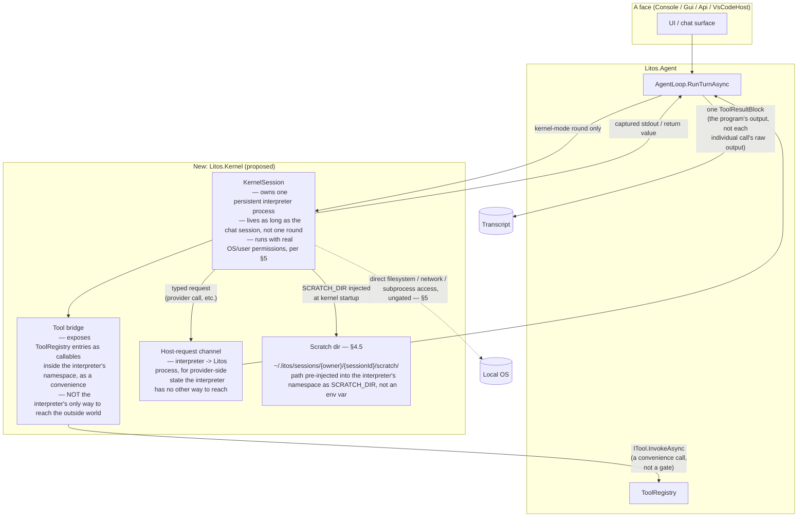
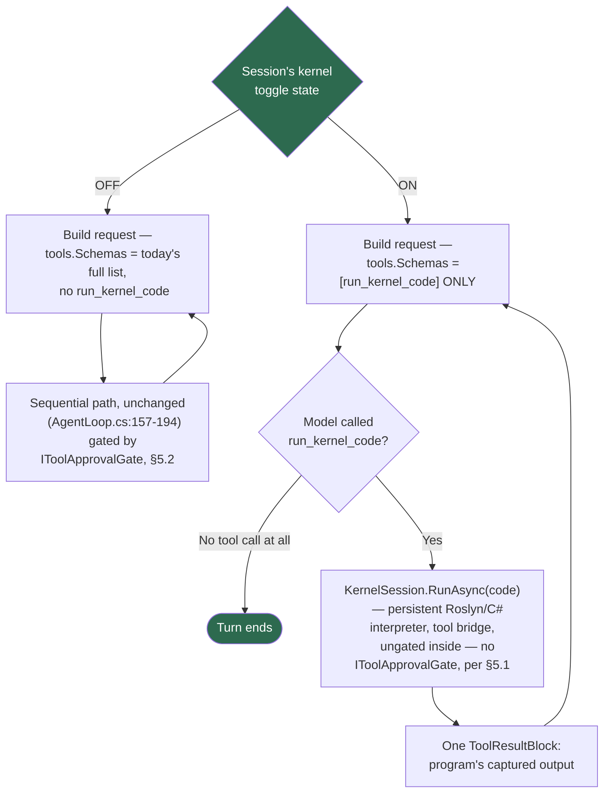
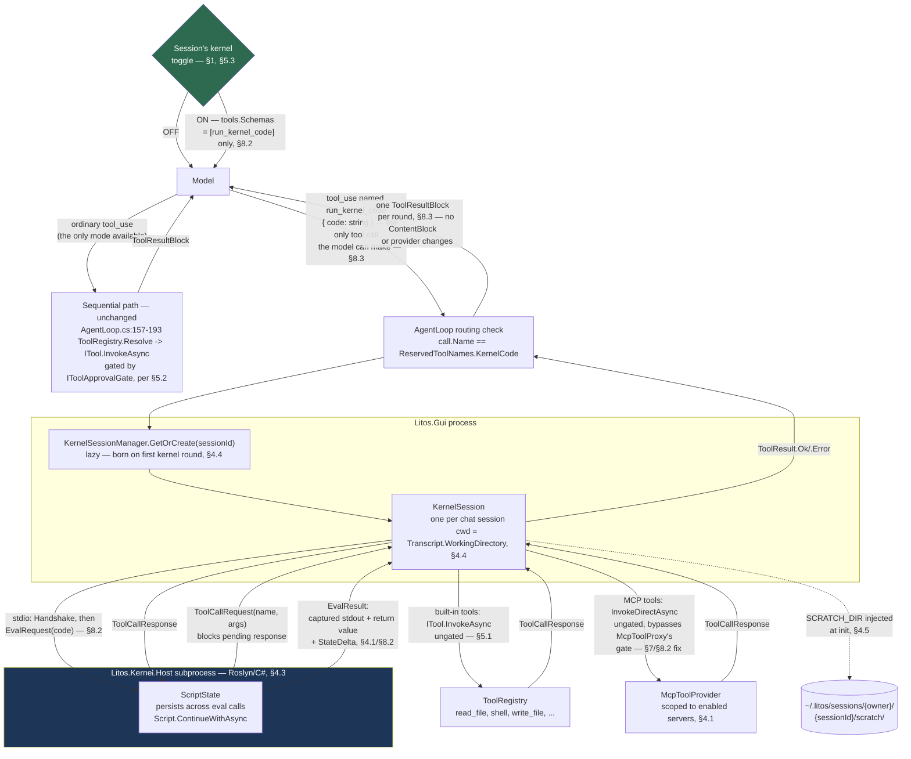

# Programmatic Tool Calling via a Persistent Kernel — Architecture

Status: **implementation in progress**, building the full §8.6 milestone sequence (0-3) for
`Litos.Gui`, cross-platform (Windows + macOS) from the start per §2's Hard requirements. See
[ReadMe_Architecture.md](ReadMe_Architecture.md) for the current agent loop this proposal extends,
and [ReadMe_AgentDesign.md](ReadMe_AgentDesign.md) for the surrounding design philosophy this
proposal must stay consistent with.

## Implementation status

Tracked here as work lands, checkbox per §8.6 milestone item. Unchecked items are still design-only.

**Milestone 0 — scaffolding, protocol, process lifecycle**
- [x] `Litos.Kernel`/`Litos.Kernel.Host`/`Litos.Kernel.Tests` projects created, added to `LitosAiAgent.slnx` (§8.1)
- [x] `KernelProtocol` — flat `System.Text.Json` records, `Handshake`/`HandshakeAck`/`InitRequest`/`InitAck`/`EvalRequest`/`EvalResult`/`ToolCallRequest`/`ToolCallResponse`, version handshake (§7, §8.2)
- [x] `Litos.Kernel.Host/Program.cs` — stdin dispatch loop, persisted `ScriptState` via `Script.ContinueWithAsync`, stdout capture/redirection so script output can't corrupt the protocol stream (§8.2)
- [x] `KernelSession` — lazy subprocess spawn, hard timeout, cross-platform tree-kill via `Process.Kill(entireProcessTree: true)` (§2 Hard requirements, §8.2)
- [x] `ReservedToolNames.KernelCode`, `AgentLoop`'s `kernelRunner` routing branch + `InvokeKernelSafelyAsync` (§8.2, §8.3)
- [x] Cross-platform parent-liveness handling: subprocess self-terminates on stdin EOF rather than relying on `Win32JobObject` alone (§2 Hard requirements)
- [x] Round-trip verified via `Litos.Kernel.Tests` (in-process `RunLoop` harness, not a real subprocess spawn yet): `1+1` returns `2`; a variable/function declared in one eval is visible/callable in the next (`ScriptState` continuation confirmed working)
- [ ] Manual end-to-end test against a *real spawned subprocess* from `Litos.Gui` — still pending Milestone 2's wiring

**Milestone 1 — tool bridge, scratch dir, `KernelState`, `StateDelta`, MCP fix**
- [x] Tool bridge — `init` message carries bridged-tool schemas, `ToolWrapperCodeGen` generates one wrapper function per tool, `ToolBridge` services `ToolCallRequest`/`ToolCallResponse` (§4.1, §8.2)
- [x] `KernelState.List()`/`Describe(name)`, `FunctionRegistry`'s `LocalFunctionStatementSyntax` syntax scan (§4.1)
- [x] `EvalResult.StateDelta` — push-not-pull function/variable diff trailer, capped per §8.2's table (§4.1, §8.2)
- [x] Output-size ceilings enforced in code (`KernelLimits`), truncation-to-scratch-artifact behavior, `IEnumerable`-not-auto-enumerated return-value serialization (§8.2)
- [x] `JsonlTranscriptStore` folder-per-session migration + legacy-fallback read path + `GetScratchDirectory` (§4.5, §8.5) — 20/20 tests passing, including new migration/fallback/dedup coverage
- [x] `McpToolProxy.InvokeDirectAsync` / `McpToolProvider.InvokeDirectAsync` — ungated MCP path for the kernel bridge, gated `InvokeAsync` now calls through it (§7/§8.2's flagged fix)
- [x] `Litos.Kernel.Tests` — 24/24 passing: eval round-trip/persistence/errors, `StateDelta` (same-call, later-call via `KernelState.List()`, redefinition-shows-latest-only, unrelated-call-stays-silent), tool-bridge round-trip (success/error/MCP-style-name-sanitization), `SCRATCH_DIR` injection, return-value serialization (null/string/list/large-enumerable-capped/unserializable-diagnostic), output-cap truncation-to-artifact, stdout-capture isolation
- [x] Nested-tool-call audit trace — `KernelSession.AppendAudit` writes `kernel_started`/`eval_start`/`eval_end`/`eval_timeout`/`eval_cancelled`/`tool_call`/`reset` records to `audit.jsonl`

**Found and fixed during Milestone 1 testing — a real deadlock, not a test artifact.** The first version
of `RunLoop`'s dispatch loop `await`ed an eval inline before reading the next protocol line. Since a
bridged tool call's `ToolCallRequest`/`ToolCallResponse` round-trips over that same stream, any script
calling a bridged tool would block the loop that was supposed to read the response unblocking it — a
guaranteed deadlock on the very first bridged tool call in production, not just in the test harness.
Fixed by running each eval as a background task so the read loop stays free to service
`ToolCallResponse`s while an eval is in flight (`RunLoop.RunEvalAsync`); a second `EvalRequest`
arriving before the first completes is now a detected, ignored protocol violation rather than a
concurrent-eval corruption risk. Caught by `ToolBridgeTests`, not by inspection — this is exactly the
kind of bug §1.1/H4's "Roslyn is reliable enough" framing does not cover, since it was a host-loop
concurrency bug, not a Roslyn compile/eval failure.

**Found and fixed via the user's own manual run — `dotnet run`'s banner output corrupted the wire
protocol.** `KernelHostLocator`'s original dev-mode fallback (no published sibling executable yet,
the normal state before Milestone 3's publish-pipeline work) launched `dotnet run --project ... -c
Release`. `dotnet run` prints MSBuild restore/build/NuGet-warning lines to its own stdout ahead of
the program's real output — e.g. `C:\GenAI\...\Litos.Kernel.csproj : warning NU1902: ...`. Since
`KernelSession` treats the subprocess's entire stdout as the protocol stream (§4.2/§8.2 — one JSON
object per line, no framing beyond newlines), that banner text was indistinguishable from a
malformed first message. Symptom observed directly in the running app: `run_kernel_code (Failed to
start kernel: 'C' is an invalid start of a value...)` — the `'C'` being the first character of the
`C:\...` warning path. **Fixed**: `KernelHostLocator` now builds the project once (output fully
redirected, never inherited by the eventual subprocess) and launches the already-built DLL via
`dotnet exec <dll>` instead, which has no banner at all. Verified directly: piping a handshake
through `dotnet run` reproduces the exact banner pollution; through `dotnet exec` against the built
DLL, the handshake round-trips cleanly. Regression-covered by `KernelHostLocatorTests` (asserts the
resolved launch shape never uses `dotnet run`). This is a second finding neither H1-H5 nor the
Milestone 1 test suite would have caught — a dev-environment-only launch-mechanism bug, invisible to
any test that drives `RunLoop` in-process rather than through a real spawned subprocess, which is
exactly why the user's own end-to-end run in the actual app was worth doing before Milestone 3.

**Found via the same manual run — `read_file`'s numbered-line output must never round-trip into
`write_file`.** After the transport fix above, the run proceeded to real work (editing a C# game to
add sound effects) and largely succeeded, but one intermediate step corrupted the target file: a
script read `Form1.cs` via `read_file` (which formats output with `cat -n`-style line-number
prefixes, purely for display), string-`Replace`d part of the text, then wrote the *entire* result
back via `write_file` — prefixes included. The build then failed with `CS1002: ; expected` /
`Invalid token` errors starting at line 1. The model diagnosed this itself, without help: it read the
file's raw bytes directly (bypassing `read_file`) and printed the first several characters' decimal
codes (`49,9,110,97,109,101,...` — `49` is `'1'`, `9` is a tab), confirming the corruption
byte-for-byte, then fixed it with a `Regex.Replace(line, @"^\d+\s+", "")` pass before rewriting and
rebuilding successfully. This was never a kernel-mode-specific bug — `read_file`'s `Description`
never warned against this misuse on *any* path — but a kernel script can chain
read-transform-write far more naturally than the sequential path (which reaches for `edit_file`'s
targeted diff instead), so it surfaced here first. **Fixed in two places**: `ReadFileTool.Description`
(`src/Litos.Tools/FileSystem/ReadFileTool.cs`, shared by every face) now explicitly warns against
passing its output into `write_file`; `KernelCodeTool.Description` carries the same warning plus a
steer toward `edit_file`, since the in-kernel description is the model's only source of tool
guidance while the toggle is ON (§8.2). Regression-covered by a `Description`-content assertion in
both `ReadFileToolTests` and `KernelCodeToolTests`.

**A second, narrower guidance gap from the same run — nested raw-string literals.** Earlier in the
same run (before the file-corruption issue above), the model's first edit attempt wrapped a
`"""..."""` raw string literal around text that itself contained an escaped interpolated string
(`$"..."`) — the two C# quoting rules stacked and Roslyn failed with `CS8997`/`CS1002`. The model
recovered on its very next script by switching to a plain verbatim string (`@"..."`) instead, with no
prompting — but that recovery was a correct first guess, not a guarantee, and nothing told it to make
that guess. Considered writing a Skill file for this, but rejected: a Skill is opt-in (the model must
recognize the situation and choose to invoke it — the same kind of judgment call that was skipped
live), while `KernelCodeTool.Description` is injected into the tool schema unconditionally on every
kernel-mode round, so it's the only mechanism that's actually guaranteed to be seen. **Fixed** by
adding the same warning there: avoid nesting `"""..."""` around text containing `$"..."`, prefer
`@"..."` for embedded C#-like snippets (`old_text`/`new_text` and similar). Regression-covered by
`KernelCodeToolTests`.

**Checkpoint — first benchmark** — not started; deferred until after Milestone 2/3 land, given the
user's explicit direction to build the full 0-3 sequence rather than pause for a benchmark gate
between milestones. Revisit before calling the feature done, per §1.1's own commitment.

**Milestone 2 — toggle, system prompt, `/kernel-reset`**
- [x] `TranscriptEntry.KernelToggle`/`Transcript.KernelModeEnabled` — per-session, persisted (via a `"kernel_toggle"` JSONL entry, latest-wins on replay), not a global preference (§5.3)
- [x] `KernelCodeTool` (`Litos.Gui`-only, not `LitosHostBuilder`) — `Description` generated dynamically from the live bridged-tool schema list every turn (§8.2)
- [x] Toggle-gated registry construction in `MainWindow.RunTurnFromTextAsync`: OFF = today's full registry via `ToolRegistryFactory.Create()`, unchanged; ON = a registry containing only `KernelCodeTool`, with the bridge given the full unfiltered registry separately (§1, §6, §8.2)
- [x] `AgentLoopFactory.Create(provider, tools, kernelRunner)` overload threading the kernel closure into `AgentLoop` without `Litos.Agent` taking a `Litos.Kernel` reference (§8.3)
- [x] `KernelSessionManager` wired into `MainWindowSession`/`Program.cs`; scratch dir resolved via `ITranscriptStore.GetScratchDirectory` (§4.5)
- [x] Status-bar toggle button (`KernelToggleButton`, 6th column, same `StatusBarLink` pattern as `ProviderButton`/`ModelButton`) with a one-time-per-process consent dialog on first ON per session (§5.3)
- [x] `/kernel-reset` slash command — added to the dispatch `switch` and `SlashCommands.All`; no-ops with a message when the toggle is OFF (§4.4, §8.6)
- [x] `/new` kills the outgoing session's `KernelSession` via `KernelSessionManager.DestroyAsync` before starting the new one, which defaults the toggle back to OFF (§4.4, §5.3)
- [x] `/compact` deliberately left untouched, with an explicit one-line comment marking the omission as intentional (§4.4)
- [x] `/resume` picks up the resumed session's persisted toggle state automatically via `Transcript.LoadAsync` (no extra code needed — `RefreshContextUsage()` already re-syncs UI state post-load)
- [x] `ITranscriptStore.GetScratchDirectory` interface addition propagated to all 5 test-project fakes; full solution + full test suite verified green (two pre-existing, unrelated failures confirmed present on the unmodified branch too)
- [x] Toggle-conditional `Guidelines` system-prompt steering text (§6, §8.8) — `LitosSystemPromptProvider.BuildAsync` detects kernel-mode ON by the registry's own shape (`tools.Schemas` is exactly one entry named `ReservedToolNames.KernelCode` — no separate toggle flag threaded through, since the registry is already rebuilt fresh from the toggle every turn per §8.2) and renders a distinct `Guidelines` section: collapse multi-step work into one script, lean on kernel-state persistence instead of re-deriving, keep output short, and a pointer to `run_kernel_code`'s own description for the full API/pitfall list. The OFF-state Guidelines (search_code steering) is untouched. `MainWindow.ShowContextBreakdownAsync`'s "View Context" modal already passes `_session.ToolRegistry` through unchanged, so it reflects whichever Guidelines variant is actually active with no extra wiring.
- [x] Manual end-to-end run inside the actual Avalonia app: toggle button, consent dialog, status-bar
  label, and the model correctly emitting `run_kernel_code` as its only tool all confirmed working
  by the user's own testing. This surfaced a real bug (below), now fixed.
- [x] Tests: `AgentLoop` kernel-call routing (routes to `kernelRunner` not `ToolRegistry.Resolve`, even when a same-named canary tool is registered; null `kernelRunner` → clean error; malformed/missing `code` argument → clean error without calling `kernelRunner`; a throwing `kernelRunner` → `ToolResult.Error`, not an unhandled exception) — 4/4 passing in `Litos.Agent.Tests`
- [x] Tests: `KernelCodeTool` — name/schema shape, canary `InvokeAsync` body, `Description` reflects the live bridged-tool list and is recomputed on read (not cached at construction) — 6/6 passing in `Litos.Gui.Tests`
- [x] Tests: `Transcript`/`TranscriptEntry` toggle persistence — defaults OFF, survives `LoadAsync` replay, latest flip wins across multiple toggles in one session — 5/5 passing in `Litos.Agent.Tests`
- [x] Tests: `LitosSystemPromptProvider`'s kernel-mode `Guidelines` — OFF-state unaffected; ON-state (registry is exactly `[run_kernel_code]`) switches Guidelines and omits the OFF-only `search_code` steering; a registry containing `run_kernel_code` *plus* another tool (not the toggle's real ON shape) correctly falls back to OFF-state Guidelines rather than claiming exclusivity that isn't true — 5/5 new tests passing in `Litos.Host.Tests`
- [x] Full-solution regression check: 1,154 tests across all 11 test projects, 1,152 passing — the only 2 failures are pre-existing and confirmed present on the unmodified branch (`Litos.Agent.Tests.AgentLoopTests.RunTurnAsync_ProviderThrows_PropagatesUncaught_UnlikeToolExceptions`, `Litos.Api.Tests.Channels.Telegram.UntrustedContentTests.Wrap_ProducesExactBoundaryMarkerFormat`), neither touches kernel-mode code

**Milestone 2 is complete.** Every §8.6 Milestone 2 item is implemented, tested, and (for the toggle
itself) confirmed working in a real run of the app. **Hybrid mode** (§1's "direct tools and
`run_kernel_code` both visible, model routes between them") remains deliberately out of scope here —
per §1's own reasoning, it was rejected twice already (no architectural signal if the model just
ignores the kernel) and is explicitly gated on the benchmark checkpoint below existing first, so
routing quality can be measured rather than assumed. Not revisited in this pass.

**Found via user report, not kernel-specific — a pre-existing startup bug, surfaced by an
unrelated corrupted `~/.litos/config.json`.** The user reported that `Litos.Gui` stopped
remembering their provider/model choice across restarts. Investigation found their config file
held test-fixture-looking values (`DefaultProvider: "fake"`, `DefaultModel: "new-default"`,
`ApiKeys: {"fake": "unused"}`) that no code path in this repo — including every test in the
solution — actually writes; the provenance was never conclusively identified, but the file's
timestamp lined up with this session's own manual `dotnet exec`/`dotnet run` debugging of the
transport-fix issue above. Independent of that provenance question, tracing `Litos.Gui/Program.cs`'s
own startup logic surfaced a real, pre-existing bug unrelated to kernel mode: when the saved
`DefaultProvider` is no longer configured, `Main` already fell back to the first available real
provider — but the saved `DefaultModel` was still passed through **unvalidated**, with no check that
it actually belonged to the newly-resolved provider. For most stale-config shapes this fails softly
(the model id nobody currently offers gets used anyway, `ContextLength` falls back to a static
table); for this exact shape it compounded into "provider and model both look wrong after restart."
**Fixed**: the provider/model startup resolution was extracted into two pure, testable functions —
`Program.ResolveStartupProvider` (unchanged behavior, just testable) and `Program.ResolveStartupModel`
(new: validates the saved model id against the resolved provider's own live model list before
trusting it, discards it and falls through to the provider's own reported default otherwise, and
correctly skips validation entirely when the model list itself is unavailable — offline/rate-limited
— so a legitimately good saved model isn't wrongly discarded for lack of data to check it against).
Regression-covered by 7 new tests in `Litos.Gui.Tests/ProgramTests.cs`, including the exact reported
shape. The user's corrupted `config.json` was deleted (it held no real API keys — those come from
environment variables per `LitosConfig.Load()`'s precedence, never written back to this file — so
nothing of value was lost) and will be rebuilt cleanly by the app on next launch.

**Milestone 3 — hardening, pre-ship** — not started. Notable: `deploy/publish-windows.ps1` and
`deploy/publish-macos.sh` publish `Litos.Gui` alone today; `Litos.Kernel.Host`'s sibling-executable
publish step (§8.6) still needs to be added to both before a self-contained build can actually run
kernel mode.

## 1. Problem statement

`AgentLoop.RunTurnAsync` (`src/Litos.Agent/AgentLoop.cs`) drives every turn as a sequence of
**rounds**: one round is one request to the model, followed by sequential execution of whatever
tool calls came back (a plain `for` loop, `AgentLoop.cs:157-194`, one `await` per call, no
parallelism). Any orchestration logic that depends on one tool's result to decide the next
call — "read file A, and if it imports X also read file B" — cannot be expressed within a round.
It costs a full extra round: a new model inference (latency) plus the entire transcript
re-sent (tokens), just to let the model see A's content before it can decide about B.

This is the pattern OpenAI's Programmatic Tool Calling (PTC) targets: instead of the model
approving one tool call at a time, the model emits a short program — call several tools, use the
results to decide what to call next, filter/aggregate before anything returns — and a runtime
executes that whole program before coming back to the model. Prime Agent
(`github.com/PrimeIntellect-ai/prime-agent`) takes this further: tool calls aren't a distinct
protocol at all, they're just function calls available inside a **persistent** Python/IPython
kernel that keeps its state across the entire session, not just one program execution.

This document sketches what a Prime-Agent-shaped version of this would look like for Litos: a
persistent scripting kernel, tools exposed to it as callable functions, wired into the existing
`AgentLoop` round/turn structure rather than replacing it. Per §5, this proposal follows Prime
Agent's own trust model rather than routing every kernel action through a per-call approval gate —
`ITool`/`ToolRegistry` are still reused as the tool surface, but `IToolApprovalGate` is not the
kernel's authorization boundary the way it is for direct tool calls.

**Final decision for `Litos.Gui`: kernel mode is a session-level toggle, and the tool surface
exposed to the model depends entirely on its state — OFF exposes today's full tool list with no
kernel involved at all; ON exposes `run_kernel_code` as the model's *only* tool, with every other
capability reachable only through the kernel's bridge (§8.7).** This document went through two
earlier framings before landing here, and both are worth recording since the reasoning that ruled
each one out still matters:

1. **Earlier still: a session-level opt-in, closer to OpenAI PTC's framing**, where "the user
   turned this on" stood in for the per-call approval this design otherwise removes (§5.1's
   original argument), but the *model* still chose per round whether to use it, alongside every
   ordinary tool call remaining directly visible.
2. **Superseded next: always on, no toggle at all**, matching Prime Agent's own posture (its
   `settings.md`/`rlm-runtime.md` describe the kernel as "created lazily on first IPython use," a
   startup-cost detail, not a user-facing on/off decision) — but *both* the kernel tool and every
   ordinary tool stayed visible to the model simultaneously, every round, with no exposure
   difference between the two. This surfaced a real risk: with nothing forcing the model toward
   the kernel and no consequence for ignoring it, adoption depended entirely on unwritten
   system-prompt wording (§6), and the model could validly skip `run_kernel_code` for an entire
   session with no way to tell from the architecture alone whether that was ever a problem.
3. **Final, current decision**: bring back a toggle (reversing step 2), but change *what the
   toggle controls* — not "is the kernel available at all" (step 1's framing, which left the
   model's per-round judgment as the only lever), but "is the kernel the model's *only* tool right
   now." This closes step 2's adoption-risk gap outright — when the toggle is ON, there is no
   judgment call left for the model to get wrong, since it has exactly one tool — while confining
   the resulting cost (subprocess overhead on every call, an ungated tool surface with no
   sequential fallback if a kernel round fails) to sessions where the user deliberately chose it,
   rather than paying that cost unconditionally the way step 2 did. It also restores the consent
   checkpoint step 2 removed: flipping the toggle ON is now the explicit, visible act of granting
   ungated kernel access (§5.3's "accept the gap" reasoning is revised accordingly — see §5.3).

**Named against the three-mode framing this space is usually discussed in (Standard / Hybrid /
Kernel-only): this document builds Kernel-only, not Hybrid, and that is a deliberate scope choice
worth stating rather than leaving implicit.** Hybrid — direct tools and `run_kernel_code` both
visible, the model routing between them by task shape, Litos recording which route was chosen so
routing quality itself becomes measurable — is a real, plausible production candidate, arguably the
better one long-term. It is not what step 3 above builds, for a concrete reason: step 2's rejected
"always on, both visible" framing *was* essentially Hybrid, and it was rejected specifically because
nothing in this design yet has a way to *measure* whether the model is routing well — "Litos records
which route was chosen" is infrastructure this document does not build. Choosing Kernel-only first
is a legitimate way to sidestep that gap rather than resolve it: it isolates the kernel path
completely, gets H1–H5 (§1.1) a first clean measurement uncontaminated by routing quality, and only
afterward is Hybrid's routing question (does the model choose well when both paths are visible?)
worth spending measurement infrastructure on. **This should not be read as Kernel-only having won on
the merits as a production mode** — per its own reasoning above, it hasn't been evaluated against
Hybrid at all, only chosen as the cheaper first experiment. Revisiting Hybrid is the natural next
step once §1.1's benchmark checkpoint exists and this document's Kernel-only results are in hand.

The engine remains Roslyn/C# scripting, out-of-process (§4.3), unaffected by this reversal.
`Litos.Console`/`Litos.Api`/`Litos.VsCodeHost` are out of scope for this decision (not addressed by
this document at all, for now) — see §2.

### 1.1 This is an experiment, not a committed architecture — stated explicitly

Everything from §3 onward reads as a design that has already been decided, because within the
scope it covers (engine, toggle shape, protocol, lifecycle) it has been. But the reason to build
any of it is not "Prime Agent does this" or "this is architecturally elegant" — it's that
collapsing multi-round orchestration into one kernel program is *hypothesized* to reduce tokens,
rounds, and latency on suitable tasks, and that hypothesis has not yet been measured against
`Litos.Gui` today. This document should be read as: **the architecture below is what gets built to
run the experiment, not the conclusion of one.**

**Hypotheses this is meant to test:**

- **H1 — Programmatic orchestration reduces context usage.** A kernel program that calls several
  tools and filters/aggregates before returning should send substantially less raw tool output back
  to the model than §3's sequential loop does for the same task, because intermediate results stay
  in kernel state/scratch (§4.6) instead of each becoming its own `ToolResultBlock`.
- **H2 — Programmatic orchestration reduces model rounds.** Loops, fan-out, filtering, joining, and
  conditional branching (§1's "read A, and if it imports X also read B") should complete in fewer
  round trips through `AgentLoop.RunTurnAsync`'s `while (true)` than the sequential path needs for
  the same task.
- **H3 — Persistence adds value beyond one-shot programmatic execution.** On tasks that reuse a
  parsed index, a search result set, or other data across multiple kernel-mode rounds within a
  session, a *persistent* kernel (this design) should outperform an otherwise-equivalent kernel that
  discarded `ScriptState` after every eval — otherwise §4.4's entire lifecycle/reset-trigger
  complexity is not earning its cost.
- **H4 — Roslyn is reliable enough for model-generated orchestration.** Supported models should
  generate short C# scripts against the bridged API (§8.2) with an acceptable compile-and-run
  success rate. §4.3 already names this as "the honest remaining risk" rather than assuming it away
  — this hypothesis is what turns that risk into a measured number instead of a guess.
- **H5 — Kernel benefit is workload-dependent, not universal.** Simple, single-tool tasks may see no
  benefit, or a regression (subprocess spawn/handshake overhead per §8.6 Milestone 0, with no
  sequential fallback once the toggle is ON per §6). Results must be reported per task shape
  (§1.1 below reuses the shape categories the toggle is meant to eventually route on, per §1's
  step-2 discussion of Hybrid), not collapsed into one average that could hide a real regression on
  the common case behind a win on the uncommon one.

**What "the experiment succeeds" means here, concretely — deferred to a follow-on document, not
resolved in this one.** This document does not attempt full acceptance-gate numbers (target token
reduction %, round reduction %, infra failure rate) or a benchmark task suite — that belongs in a
companion evaluation plan written once Milestone 1 (§8.6) exists to measure, not invented
speculatively here. What this document commits to instead: **§8.6's build sequence includes a
benchmark checkpoint after Milestone 1** (before the toggle UI, `/kernel-reset`, or hardening work
in Milestones 2–3 is built), specifically so H1/H2 get a first real measurement while the design is
still cheap to change. If that checkpoint shows no advantage over the sequential path on any task
shape, the honest outcome is revisiting this design — up to and including not shipping it — not
proceeding on schedule regardless. This is the same posture §1's own decision log already models
for architectural choices (each framing was reversed when reasoning surfaced a problem, not
defended past the point the reasoning held up); it should apply to the empirical question too, not
just the design one.

## 2. Design goals and non-goals

**Goals**
- Let the model collapse multi-round, result-dependent tool orchestration into one round.
- Keep it provider-agnostic — every `IChatProvider` (Anthropic, OpenAI, Gemini, OpenRouter,
  MeshApi, Local) must be able to drive it, since this is a Litos-native capability, not a
  pass-through to a vendor-hosted sandbox (PTC itself is OpenAI-only and out of reach for the
  other five providers Litos supports).
- Reuse `ITool`/`ToolRegistry` for the tool surface where a kernel-mode script calls a tool
  Litos already defines — same schema, same underlying implementation as a direct call.
- Ship kernel mode as a **session-level toggle** for `Litos.Gui` (§1, §5.1) — OFF exposes today's
  full tool list with the kernel absent entirely; ON exposes `run_kernel_code` as the model's only
  tool, routing every capability through the kernel's bridge. `IToolApprovalGate` remains the
  authorization boundary for the direct/sequential path when the toggle is OFF, unchanged (§5.2);
  when the toggle is ON, there is no equivalent per-call boundary at all (§5.1) — flipping the
  toggle itself is the authorization moment (§5.3).
- **Scoped to `Litos.Gui` only, for now.** `Litos.Console`, `Litos.Api`, and `Litos.VsCodeHost` are
  explicitly out of scope for this document's decisions (the kernel toggle, Roslyn/C#) — those faces may
  eventually want kernel mode, but nothing here should be read as having decided their engine
  choice, their opt-in model, or their timeline. Where earlier sections still describe multi-face
  reasoning (e.g. §4.3's original Node-vs-Python-per-face discussion), that reasoning is retained
  for its historical context but the actual decision below applies to `Litos.Gui` alone.

**Non-goals**
- Not a replacement for the existing sequential tool-calling path as a mechanism — `AgentLoop`'s
  sequential `ToolUseBlock` handling (§6) is untouched code-wise, and remains the *only* path when
  the toggle is OFF. When the toggle is ON, though, this is a deliberate, full replacement for that
  round's tool surface — not a per-round model choice between the two (§6 revised accordingly):
  the toggle decides which mode a session is in, not the model.
- Not an attempt to reproduce OpenAI's hosted, network-less, disk-less V8 sandbox. Litos runs
  locally with the user's own filesystem/shell access already exposed through `ShellTool`; a
  from-scratch hermetic sandbox is a much larger undertaking than this document scopes (see §5.4).
- **Superseded**: an earlier draft deferred the scripting language/engine choice to the
  implementation phase. For `Litos.Gui` specifically, that choice is now made — Roslyn/C# scripting,
  out-of-process (§4.3) — for the reasons in §4.3. The engine for any other face remains
  undecided and out of scope per the goals above.

**Hard requirements**
- **`Litos.Gui` must run on both Windows and macOS — this applies to every part of this design, not
  just the parts that already had a cross-platform note attached.** Concretely, this rules out any
  Windows-only mechanism as the *sole* implementation for something the kernel subsystem depends on:
  - **Subprocess tree-kill**: use `Process.Kill(entireProcessTree: true)` (already cross-platform in
    .NET) as `KernelSession`'s kill path (§8.2's hard-timeout/dispose logic), not a
    Windows-API-specific mechanism.
  - **Kill-on-parent-exit**: `Win32JobObject.AssignCurrentProcessWithKillOnClose()`
    (`src/Litos.Gui/Program.cs`) is Windows-only and must not be treated as sufficient cleanup for
    the kernel subprocess on its own. The kernel host must have a macOS-safe fallback for "the parent
    `Litos.Gui` process died unexpectedly, so this subprocess should not become an orphan" — e.g. the
    subprocess monitors its parent's liveness itself (a stdio pipe closing/EOF is a reliable,
    cross-platform signal the parent is gone, since `KernelSession` would no longer be able to write
    to a live child's stdin either) and self-terminates, rather than depending only on OS-specific
    job-object semantics. On Windows, both mechanisms may apply (belt-and-suspenders); on macOS, the
    self-termination-on-stdio-EOF path is load-bearing, not optional.
  - **Self-contained publish**: `Litos.Kernel.Host` must be published for both Windows and macOS RIDs
    (at minimum `win-x64`, `osx-x64`, `osx-arm64`, matching `Litos.VsCodeHost.csproj`'s existing
    multi-RID `PublishSingleFile` shape, §8.1/§13) — a single-RID build is not an acceptable interim
    state for this feature, since `Litos.Gui` itself ships on both platforms today.
  - **Environment/PATH resolution** (§8.2's minimized-environment subprocess launch) must resolve
    `dotnet`/runtime paths correctly on both platforms' own conventions, not assume Windows path
    semantics (`;`-separated `PATH`, `.exe` suffix) unconditionally.
  - Any milestone (§8.6) that claims to be "done" without having been exercised on both platforms is
    not actually done — cross-platform verification is part of each milestone's own acceptance, not a
    deferred Milestone-3-only concern, precisely because retrofitting a Windows-only assumption found
    late (e.g. in a kill/cleanup path) tends to be a design-shaped fix, not a small patch.

## 3. Current architecture recap (what this extends)

```
AgentLoop.RunTurnAsync                              (src/Litos.Agent/AgentLoop.cs)
  while (true):                                      — one iteration = one round
    request  = accountant.BuildRequest(transcript, tools.Schemas, model, systemPrompt)
    response = provider.StreamAsync(request)          — IChatProvider, one per vendor
    if response has no tool calls: turn ends
    for each pending tool call (sequential):
      result = tool.InvokeAsync(args, ct)              — ITool, resolved via ToolRegistry
      transcript.Append(ToolResultBlock)
    loop back to request  (transcript now includes all this round's tool results)
```

Key existing seams this proposal reuses rather than replaces:

| Seam | Type | Role |
|---|---|---|
| Tool contract | `ITool` (`src/Litos.Agent/Tools/ITool.cs`) | `Name`, `Description`, `ParameterSchema`, `InvokeAsync` |
| Tool lookup | `ToolRegistry` (`src/Litos.Agent/Tools/ToolRegistry.cs`) | name → `ITool`, schema list for the provider request |
| Authorization | `IToolApprovalGate` (`src/Litos.Tools/Shell/IToolApprovalGate.cs`) | `RequestAsync(preview) -> Approve/ApproveAlways/Deny`, per call |
| Message content | `ContentBlock` union (`src/Litos.Agent/Messages/ContentBlock.cs`) | `TextBlock`/`ToolUseBlock`/`ToolResultBlock`/... — JSON-polymorphic, persisted to JSONL |
| Provider abstraction | `IChatProvider` | `StreamAsync(ChatRequest) -> IAsyncEnumerable<AgentEvent>`, one adapter per vendor |

Note on approval gating today (relevant to §5): it is **not uniform across faces**. Native tools
(`read_file`, `shell`, etc.) go through each face's own `IToolApprovalGate` — real per-call
Approve/Deny prompts in `Litos.Console` (`ApprovalDialog`) and `Litos.Api`
(web panel / Telegram buttons), but `Litos.Gui`'s `GuiApprovalGate` auto-approves everything
unconditionally (`src/Litos.Gui/GuiApprovalGate.cs:11-15`) — a stub, not yet a real dialog. For
MCP tools specifically, only `Litos.Api` and `Litos.VsCodeHost` wrap the gate with
`McpAwareApprovalGate`, giving genuine per-tool Ask/Approve/Deny gating sourced from
`McpConfigStore`. `Litos.Gui` does not wrap it at all — MCP tool access there is only ever an
entire-server enable/disable toggle (`McpServersWindow`), with no per-tool or per-call gating
underneath it, since the outer `GuiApprovalGate` already approves everything unconditionally
regardless of what the inner gate would have decided.

## 4. Proposed component: the Kernel

A new component, sitting alongside `AgentLoop` rather than inside it, analogous to Prime Agent's
`AgentSession` + IPython kernel split.



### 4.1 What runs where

- **`AgentLoop`** stays the turn/round driver. What `AgentLoop` does per round is route based on
  *which kind of block the model actually emitted* (see §6 for the final, toggle-gated shape this
  takes) — an ordinary `ToolUseBlock` still takes the existing sequential path, a kernel-program
  block routes to `KernelSession`. Everything about request-building, transcript
  persistence, and the turn-ends-when-no-tool-calls condition is unchanged for non-kernel rounds.
- **`KernelSession`** owns one interpreter process for the *lifetime of the chat session* (not
  reset per round, not reset per turn) — this is the specific thing that makes this a "persistent
  kernel" design rather than a stateless "run one program" design like OpenAI's PTC. Variables,
  imported modules, open file handles the model's code created earlier in the session are still
  there on the next kernel-mode round.
- **The tool bridge** is a convenience, not a gate: it lets a kernel-mode script call
  `read_file(...)`/`shell(...)`/etc. using the exact same `ITool` implementations and schemas the
  direct-calling path uses, so Litos doesn't need two implementations of the same capability. Per
  §5, calling a tool this way does **not** go through `IToolApprovalGate` the way a direct
  `ToolUseBlock` call does — the script could equally reach the filesystem, network, or a
  subprocess directly, without going through the bridge or `ToolRegistry` at all, since the
  interpreter has that access natively (§5.1).
  - The bridge covers **both** built-in tools and MCP tools, but the two are scoped differently.
    All `ToolRegistry`-registered built-in tools are bridged unconditionally — the same full set
    the sequential path already sees, no smaller subset carved out for kernel mode. MCP tools are
    scoped to whatever servers are actually **enabled** for the session at the time — the existing
    whole-server enable/disable toggle (`McpServersWindow` in `Litos.Gui`) is still the gate on
    *availability*; a disabled server's tools are absent from the bridge entirely, not merely
    ungated. This mirrors Prime Agent's own MCP integration shape rather than flat function
    injection: curated servers can be exposed as typed, importable skill wrappers (e.g.
    `import linear; await linear.list_issues(...)`), and any other enabled server is reachable
    through a generic discover-then-call surface, modeled on Prime Agent's pre-imported `mcp`
    module (`docs/mcp-integrations.md` — "the tool set is defined by the server, not the skill, so
    discover before you call"). Either way, once a server is enabled and its tools are bridged,
    calling them is ungated inside the kernel exactly like a built-in tool call, per §5.
- **The host-request channel** is for the narrower set of things the interpreter has no native
  way to reach at all — not "anything risky," since risky-but-native operations (file/network/
  shell) are already directly available per §5. Its role is provider-side or host-process state
  boundary Prime Agent's architecture doc describes for its own kernel/session split.
- **Kernel state is inspectable by name, not just usable by name.** §4.6 establishes that a kernel
  variable is where reusable data should live *instead of* the transcript — but that only actually
  saves anything if the model can find out *what* already exists in that variable space without
  re-deriving or re-reading it, which today's design has no answer for: an ordinary C# local
  variable in `ScriptState` has no listing mechanism at all. `Litos.Kernel.Host/Program.cs` (§8.2)
  therefore injects one additional global alongside `SCRATCH_DIR` and the per-tool wrapper
  functions: a small `KernelState` object exposing `KernelState.List()` (returns each top-level
  variable's name, declared type, and an approximate size — `IEnumerable`s report a count where
  cheap to compute, not their full contents) and `KernelState.Describe(name)` (a one-variable detail
  view, same size/type information). This does not require the model to declare variables through a
  special API instead of plain C# assignment — `var df = ...;` still just works — `KernelState`
  only *reflects on* whatever the script's locals already are via the persisted `ScriptState`'s
  variable list, the same data Roslyn already tracks internally for continuation. The payoff: a
  script in round 7 can call `KernelState.List()` to check whether an earlier round already loaded
  what it needs before deciding to redo that work — the in-kernel equivalent of the transcript
  session-metadata row §4.6's table already describes for scratch files, extended to cover
  in-memory variables too.
  - **A locally-declared function or method persists exactly like a variable does, but is not
    listed by `ScriptState.Variables` — closed in v1 by tracking declarations separately, not by
    reflecting on Roslyn's scripting internals.** If a script defines `int Square(int x) => x * x;`
    in round 3, that definition lives in the same persisted `ScriptState` a variable would (Roslyn's
    `Script.ContinueWithAsync` carries the whole submission chain forward, functions included, per
    §4.3/§8.2) — round 8 can call `Square(5)` with no re-declaration needed. But `ScriptState.Variables`
    — the data `KernelState.List()` reflects on for variables — enumerates top-level variable slots,
    not local functions declared in a submission, so a generated function would otherwise be
    invisible to that listing even though it is fully callable.

    **Fix: `Litos.Kernel.Host` parses each submission's source for function declarations at the
    point it's received, before evaluating it — it does not try to recover this from `ScriptState`
    after the fact.** On every `EvalRequest`, before calling `Script.ContinueWithAsync`, the host
    runs `CSharpSyntaxTree.ParseText(code)` (a parse, not a compile — cheap, and Roslyn is already
    loaded in this process per §4.3) and walks the resulting tree for
    `LocalFunctionStatementSyntax` nodes, recording each one's name, parameter list, return type,
    and immediately-preceding `///` doc comment (if any) into a small dictionary `KernelSession`
    maintains alongside the subprocess — call it the *function registry*, deliberately not part of
    `ScriptState` itself. A later declaration with the same name overwrites the earlier entry (the
    model redefining `Square` should show the latest signature, not both). `KernelState.List()` is
    then extended to report **two sections**: variables (from `ScriptState.Variables`, as already
    designed) and functions (from this registry) — so "what do I already have to work with" is one
    call covering both, not a caveat the model has to remember applies only to half of it.

  - **`KernelState.List()` alone is not enough — it's pull-based, and nothing makes the model pull
    it.** Being *able* to ask "what functions exist" is not the same as the model actually asking.
    Walk the concrete sequence: round N's script defines `FindGreatest`; the registry above records
    it; but `EvalResult` (§8.2) only carries *that script's own* `Output`/`ReturnValueText` — nothing
    about the registry update rides along. Round N+1 starts a fresh model turn that sees round N's
    `ToolResultBlock` in its transcript (whatever `FindGreatest`'s own script happened to print or
    return) and nothing else; unless the model spontaneously decides to open its next script with
    `KernelState.List()`, it has no signal that `FindGreatest` exists at all, and may simply
    redefine it from scratch — functionally harmless (the redefinition overwrites the registry entry
    and the old one, per above) but silently defeats the reuse this whole mechanism exists for.

    **Fix: push, don't rely on pull.** Every `EvalResult` carries a second field,
    `StateDelta: string?` (alongside `Output`/`ReturnValueText` in `KernelProtocol`, §8.2),
    populated unconditionally by the host on every eval — not something the model has to request.
    Computed cheaply from data the host already has at that point: the function registry's diff
    (any name newly added or overwritten by this submission's syntax scan, from the mechanism just
    above) plus a shallow diff of `ScriptState.Variables` between this eval's start and end (any
    variable name that's new, or whose declared type changed). `KernelSession.RunAsync` appends this
    delta to the `ToolResult` text it hands back to `AgentLoop` — so the *same* `ToolResultBlock`
    that already carries the script's own output also carries a short, mechanical trailer, e.g.:

    ```
    [kernel state changed this round: +function FindGreatest(int a, int b) -> int]
    ```

    for a function, or `[kernel state changed this round: +variable df (DataFrame-shaped, ~40k rows)]`
    for a variable (reusing §4.6's "short summary, not raw content" framing for the *value* half of
    this, so a large variable's delta line doesn't itself become the token cost this design is
    trying to avoid). **This is the actual answer to "how does the model find out `FindGreatest`
    exists" — it's in round N+1's context automatically, because it was appended to round N's own
    `ToolResultBlock`, with no extra call and no dependence on the model thinking to check.**
    `KernelState.List()`/`Describe()` remain useful for a different case this delta doesn't cover —
    a long session where the model wants to re-orient on *everything* built so far, not just what
    changed last round — but they are now a supplementary lookup, not the only mechanism, which is
    the load-bearing fix here: automatic beats discoverable-on-request for exactly the reason
    ordinary tool results are never opt-in to see either.

    This is deliberately a source-level scan, not reflection on `ScriptState`'s compiled output: the
    submission source is already in hand (it's the `EvalRequest.Code` the host just received), a
    syntax parse is a stable, public Roslyn API unlikely to shift under a compiler version bump, and
    it sidesteps needing to reach into `Script`/`ScriptState`'s internal representation of a
    submission's emitted type — which is not a stable contract to build on. The one thing this
    approach cannot do that a full compiled-output reflection could: if a function is defined
    conditionally (inside an `if` the script's control flow didn't take this time), the syntax scan
    still records it as declared even though that particular execution didn't actually run the
    declaration. This is an acceptable, narrow inaccuracy — the registry is a discovery aid ("here's
    what's been *written*"), not a guarantee of "here's what's *definitely callable right now*";
    calling a function that was scanned but never actually reached at runtime fails with an ordinary
    Roslyn "not defined" error the model can recover from like any other compile/runtime mistake
    (§8.2's error-handling design), not a silent wrong answer.

### 4.2 Process isolation

The interpreter runs as a **separate OS process from the face**, communicating over a local
transport (stdio or a loopback socket — same category of choice `ReadMe_Extensibility.md` §10
already made for extension isolation, and for the same reason: "process boundary catches an
extension that corrupts its own heap or deadlocks its own thread pool... the host process is
unaffected"). This is a *process/failure* isolation boundary, explicitly not a *security* sandbox
by default — see §5.4 for why closing that gap further is out of scope for this document.

### 4.3 Language/runtime choice — decided for `Litos.Gui`: Roslyn/C# scripting, out-of-process

**Decision: `Litos.Gui`'s `KernelSession` runs C# via Roslyn scripting
(`Microsoft.CodeAnalysis.CSharp.Scripting`) in a separate `dotnet`-hosted subprocess, communicating
over stdio.** This section originally deferred the engine choice to implementation time; for
`Litos.Gui` specifically that deferral is over. The requirements that motivated the deferral still
apply and Roslyn/C# satisfies all of them:

- Runs as a genuinely separate process reachable from .NET (§4.2) — the subprocess is a plain
  `dotnet`-hosted host process running a Roslyn scripting loop, not an in-process
  `CSharpScript.EvaluateAsync` call inside Gui's own process. §4.3's original candidate list
  explicitly ruled out in-process embeddings "with no process boundary" — a C#-based kernel does
  not get an exemption from that requirement just because it shares a language with the host; the
  isolation argument in §4.2 (a runaway/crashing script must not take down the face) applies
  identically regardless of which language the script is written in.
- Supports persistent state across many executions within one process lifetime — Roslyn scripting
  supports exactly this shape via `Script.ContinueWith`/a persisted `ScriptState`, which is the
  direct C# analog of what a Python/Node REPL process gives you: each new snippet evaluates against
  the accumulated state (locals, `using`s) of everything run before it in that process.
- Realistically embeddable/launchable from a .NET host with **no new runtime dependency at all**
  for `Litos.Gui` specifically — this is the deciding factor over Node/Python for this face. See
  the size/maintenance comparison below.

**Why Roslyn over Node or Python for `Litos.Gui`, concretely — the trade-offs actually weighed:**

- **Bundling cost: zero for Roslyn, real for Node/Python.** `Litos.Gui` is already a .NET process;
  a Roslyn-scripting subprocess needs no additional runtime shipped, signed, notarized, or
  version-tracked beyond what Gui's own release pipeline already produces. Node or Python would
  each need a bundled per-platform runtime (~40–90 MB for Node per platform/architecture, ~100–150
  MB for Python once the standard library is included) or a required separate user install —
  either way, new build-matrix artifacts and a new patch/LTS-tracking obligation Gui's release
  process does not carry today (unlike .NET's own runtime lifecycle, which the team already tracks
  as part of shipping Gui at all).
- **Ecosystem/package-manager breadth: genuinely narrower for NuGet in this specific use case, but
  this workload doesn't need that breadth.** Node's npm and Python's PyPI both have a much richer
  long tail of small, install-and-use-immediately scripting utilities than NuGet, which is
  fundamentally project/assembly-oriented rather than built for casual mid-script package pulls;
  Python's `pandas`/`numpy`-class scientific ecosystem in particular has no strong .NET equivalent.
  But per §1/§4.3's own framing of the actual workload this kernel targets — "file/data wrangling,
  light control flow," concretely: read a tool's result, branch on it, call another tool, filter or
  aggregate the output — that workload is covered by .NET's base class library alone (JSON parsing,
  regex, `HttpClient`, file I/O, LINQ for filtering/aggregation) with no package installation
  needed at all in the common case. The scenario where this trade-off would actually bite — a
  script wanting `pandas`-equivalent statistical analysis, or a narrow npm utility with no BCL
  analog — is not the motivating use case for this design and is treated as an accepted, uncommon
  gap rather than a blocking concern.
- **Model generation fluency is the honest remaining risk.** A model is plausibly more practiced at
  writing idiomatic throwaway Python/JS scripts than idiomatic ad-hoc C# scripting (C# in most
  training data is compiled project code, not REPL-style snippets) — this is a real quality risk
  Roslyn does not avoid, and nothing in this design mitigates it beyond the system-prompt guidance
  discussed in §6.

**This decision does not extend to any other face.** `Litos.VsCode` runs inside VS Code's own
Extension Host (itself Node/Electron, `ReadMe_VsCodeExtension.md:41,70`), so a Node-based kernel
remains the natural choice there — genuinely zero extra install, using the Node binary VS Code
already ships — but that face is out of scope for this document (§2). `Litos.Console` and
`Litos.Api` are plain .NET processes like `Litos.Gui` and could plausibly reuse the same
Roslyn-based `KernelSession` if/when kernel mode is extended to them, but that is future work this
document does not decide now.

### 4.4 Lifecycle: scope, working directory, and reset triggers

**Scope: one `KernelSession` per chat session, not per turn and not global.** Litos already
anchors a session to exactly one working directory for its entire life —
`Transcript.WorkingDirectory` is set once, from the session's first `SessionHeader` entry
(`src/Litos.Agent/Session/Transcript.cs:104-105`), and read on every turn by `AgentLoop`
(`AgentLoop.cs:64-65,76`). `KernelSession` should ride this same boundary rather than invent a
new one: born lazily on a chat session's first kernel-mode round, torn down when that session
ends, never shared across two different chat sessions even if they happen to point at the same
working directory. Per-turn scratch (killed and recreated every turn) would throw away the one
thing this design exists to provide — variables and imports surviving across rounds; a kernel
shared across the whole face's lifetime (all sessions) would leak one session's state into an
unrelated project the moment two sessions are open against different working directories.

**Working directory: the kernel process should be launched *in* it, not merely told about it.**
Since the owning session's working directory never changes, `KernelSession` should set the
interpreter subprocess's own working directory (cwd) to it at launch, the same way `ShellTool`
already runs commands relative to a resolved directory rather than expecting every command to
carry a full path. This is also a safety property, not just a convenience: paired with §5.2's "no
ambient filesystem access outside the tool bridge," a script that never gets an ambient path
capability of its own has nothing to construct an out-of-project absolute path *from* — the only
paths available to it are whatever the model passed as tool arguments, evaluated through the same
tools (and the same approval gate) a direct call would use.

**Reset triggers — three distinct events, not one:**

| Trigger | Kernel behavior | Why |
|---|---|---|
| `/new` (new session) | Kill old `KernelSession` (if any), no carry-over | Matches existing precedent exactly — `WorkingDirectory` itself resets the same way on `/new`; a new session already means a new transcript and (potentially) a new working directory, so a stale kernel pointed at the old directory would be actively wrong, not just unnecessary. |
| `/compact` (transcript compaction) | **No effect on the kernel** | `Compactor.TryCompactAsync` (`src/Litos.Agent/Session/Compactor.cs:34`) rewrites the model-visible *message* transcript only — it has no relationship to kernel variables, which were never part of that transcript. Killing the kernel here would be a surprising side effect of a routine token-management operation the model didn't request and has no visibility into. |
| Explicit reset (e.g. a `/kernel-reset` command) or crash/hang recovery | Kill and lazily recreate on next kernel-mode round | A deliberate escape hatch for "the interpreter is in a bad state" (leaked file handles, an infinite loop the hard-timeout killed, corrupted in-process state) — independent of both session lifecycle and compaction, the same way `ShellTool`'s own hard-timeout-and-kill path exists independently of the turn's own cancellation token. |

This table is the concrete answer to "how do we clear the kernel out": there is no single
"clear" operation, because the three things a reset could mean (start fresh on a new task,
manage token budget, recover from a stuck interpreter) are already three separate, independent
operations elsewhere in `AgentLoop`, and the kernel should follow whichever one actually applies

**`/compact` leaving the kernel process untouched is not the same as `/compact` leaving the
model's *knowledge* of kernel state untouched — these can diverge, and it's worth tracing where.**
The table above is correct that `/compact` has no effect on `KernelSession`/`ScriptState`/the
function registry (§4.1) — none of that is message-transcript content, so `Compactor.TryCompactAsync`
has nothing to touch. But `EvalResult.StateDelta` (§4.1/§4.6's "push, don't rely on pull" fix)
*is* message-transcript content — it's a trailer appended into an ordinary `ToolResultBlock` — and
that block is exactly the kind of thing compaction is free to summarize or drop. If the round that
announced `FindGreatest`'s existence gets compacted away before the model ever acts on it, the
model loses its only *automatic* notice that `FindGreatest` exists, even though `FindGreatest`
itself is still perfectly callable in the still-alive kernel process — the capability was never
lost, only the model's push-based awareness of it. This is not a bug to fix so much as a case to
name: it's exactly the scenario `KernelState.List()`'s "supplementary re-orientation" role (§4.1)
exists for, and the honest expectation is that a model working in a long, compacted session should
lean on `KernelState.List()` more, not that `StateDelta` should somehow survive compaction when
ordinary tool results don't. §6's system-prompt guidance should mention this connection explicitly
(call `KernelState.List()` after noticing a summarized/compacted history, not just when starting a
long session) rather than leaving the two mechanisms' interaction undiscovered until it surprises
someone in practice.

**`/new` followed by `/resume` does not bring the kernel back — this is a real gap, not an
edge case to hand-wave.** Worth separating two things that sound like the same question:
**the process can restart on demand, any time; its state cannot.** The moment the model emits
another kernel-program block in the resumed session, a new `KernelSession` spins up exactly like
it would for any session's first kernel-mode round — the *capability* is never gone, never needs
re-enabling, nothing about `/new` disables kernel mode itself. What's gone is continuity: the new
interpreter starts from zero, not from wherever the pre-`/new` interpreter left off. If the model's
generated code references a variable an earlier round created, it isn't there — only what already
made it into a tool result's text (now sitting in the replayed transcript) is visible to the model
at all, the same ceiling ordinary tool calls already have.

`/resume` is not "reattach to a session that kept running in the
background": `Transcript.LoadAsync` (`Transcript.cs:99-112`) builds a brand-new `Transcript` from
scratch and replays it from the session's JSONL log — `WorkingDirectory` and `ChatMessage`s only.
There is no notion of "kernel variable state" anywhere in that log format, and no mechanism
proposed above could add one: a live interpreter's variables, open handles, and imports are
process memory, not serializable transcript content. So the honest sequence is: `/new` kills the
kernel (per the table above) → `/resume` faithfully replays the *conversation* exactly where it
left off, including every past `ToolResultBlock` the model already saw → but the next
kernel-mode round starts a fresh interpreter with none of the variables an earlier round in that
same resumed session had built up. The model sees its own prior turns in context (so it "remembers"
what it did, the same way it does today with ordinary tool calls) but a resumed kernel round
cannot reference an actual live object, open file handle, or unsaved computation from before the
`/new` — only what already made it into a tool result's text, same ceiling ordinary sequential
tool calls already have today. This is consistent with how `/new` already behaves for everything
else in the session (a fresh `Transcript`, not a suspended one), but it is worth stating
explicitly here because kernel mode is the first thing in this design where "the model has
state that isn't in the transcript" becomes possible at all — every other piece of Litos's
session state already round-trips through the JSONL log by construction, and kernel variables are
the first exception. A future revision could explore serializing a restartable checkpoint (e.g.
Python's `dill`/pickle-style state dump) if this gap proves costly in practice, but that is
speculative and explicitly out of scope for this document — the safe, honest default is "kernel
state does not survive `/new`, full stop," not a partial or best-effort revival."

**A second, narrower staleness gap: kernel variables can go stale *within* a session, not just
across `/new`.** The above covers state disappearing outright; the remaining risk is state that
*silently persists but no longer reflects reality* — a script reads `Program.cs` into a kernel
variable in round 3, and by round 7 (whether via a direct-path edit while the toggle was
momentarily OFF, or via the kernel's own ungated file-write access per §5.1) the file on disk has
changed. Nothing currently tells that round-7 script its round-3 variable is stale; it isn't a bug
Roslyn/`ScriptState` can detect, since it's a facts-about-the-world problem, not a language one.
**Minimum v1 rule, not a general dependency-tracking system**: every successful file write/edit —
through a bridged tool, a direct-path tool, or the kernel's own ungated file I/O — increments one
process-lifetime workspace-generation counter that `KernelSession` exposes to the interpreter (e.g.
alongside `SCRATCH_DIR` in the injected globals, per §4.5's existing injection channel). This does
not attempt to tag individual variables with the generation they were read at, or to invalidate
anything automatically — that precision is deferred as genuinely speculative. What it *does* enable
cheaply: the §6 system-prompt guidance can instruct the model to re-read a file-derived variable
before relying on it for final verification whenever the counter has advanced since that variable
was last populated, and a human or a future tooling pass can at least detect "this session's
generation moved since round 3" without per-variable tracking. This mirrors the same "state doesn't
survive `/new`, full stop" honesty principle above: the rule is coarse and conservative by design,
not a partial correctness guarantee dressed up as a complete one.

### 4.5 Scratch storage for files the kernel writes mid-computation

Per §5, a kernel-mode script has ambient filesystem access and will routinely want to persist
things *as it works* — a checkpoint of an expensive computation, an intermediate CSV, a cached
download — independent of whatever it ultimately reports back in a `ToolResultBlock`. Left alone,
the natural default is for these files to land wherever the interpreter's cwd points, which per
§4.4 is the session's working directory — i.e. directly inside the user's project. That pollutes
the project a script's author never explicitly chose to write into: stray checkpoint files
showing up in `git status`, in a `find`, in the user's own editor, with no natural place to
`.gitignore` them from since nothing about the project itself anticipates a kernel-scratch
convention.

**Decision: scratch storage lives under the session's existing storage root, not the project.**
`JsonlTranscriptStore` already persists one session as a single flat file,
`~/.litos/sessions/{owner}/{sessionId}.jsonl` (`src/Litos.Persistence/JsonlTranscriptStore.cs:19,24`
— `ResolveSessionPath`). This proposal promotes that to a **folder per session**:

```
~/.litos/sessions/{owner}/{sessionId}/
    transcript.jsonl        (today's file, moved in as-is, same content/format)
    scratch/                (new — where a kernel-mode script's own file writes land)
```

This keeps kernel scratch files entirely out of the user's project — never visible to `git
status`, never needs a project-level `.gitignore` entry, and is trivially cleaned up alongside the
rest of the session's data (deleting a session's folder removes its scratch files too, with no
separate cleanup step). It also composes with §4.4's existing reset-trigger table rather than
inventing a new one: since `scratch/` is keyed to the same `sessionId` a `KernelSession` already
is, "does scratch get wiped" follows the same three-way split as kernel process state — untouched
by `/compact` (a message-transcript-only operation, per the table), and a candidate for clearing
on `/new`/`/kernel-reset` the same way in-memory kernel state is, though unlike process memory
these are ordinary files, so a future revision could choose to leave them in place across a reset
if that proves more useful in practice — this document does not resolve that either way, only
that scratch files are not required to be wiped for the same reason process memory is (they're
real files, not un-serializable process state).

**How the interpreter finds this path: a pre-injected variable, not an environment variable.**
`KernelSession` already knows `sessionId` (and hence the scratch path) at construction time, so no
discovery mechanism is needed on the .NET side. The open question is only how the *interpreter
subprocess* — whose own cwd is the project directory per §4.4, not the scratch folder — learns
the path. An environment variable was an earlier candidate but is the wrong fit for a *persistent*
process meant to feel like a live REPL rather than a one-shot CLI invocation: env vars are
conventionally snapshotted at process spawn, awkward to reason about for something long-lived, and
solve a problem this design doesn't have (the value never changes for the session's life). Instead,
`KernelSession` should pre-inject a variable (e.g. `SCRATCH_DIR`, an absolute path string) directly
into the interpreter's global namespace at kernel startup, using the exact same
namespace-population channel §4.1 already proposes for exposing bridged tool functions
(`read_file`, `shell`, etc.) — this is not new plumbing, just one more thing injected alongside
those callables. A script then simply does e.g. `open(f"{SCRATCH_DIR}/checkpoint.csv", "w")` with
no discovery step of its own.

**Migration cost, stated plainly.** This is a real, scoped change to `Litos.Persistence`, not a
free addition: every existing user has flat `{sessionId}.jsonl` files under
`~/.litos/sessions/{owner}/`, and moving to a folder-per-session layout means either (a) a
one-time migration that moves each `{sessionId}.jsonl` to `{sessionId}/transcript.jsonl` the first
time `JsonlTranscriptStore` runs against the old layout, or (b) a fallback read path that checks
the legacy flat location when the new folder form isn't found, so old sessions keep resolving
without a forced migration step. Either way, `ResolveSessionPath` and every other
`JsonlTranscriptStore` method that assumes "one session = one file" needs updating — this belongs
in the implementation phase's task list (§7), not folded silently into kernel-mode work as a side
effect.

### 4.6 Persistence alone does not save tokens — the separation has to actually hold

§1's whole motivation is token/latency savings from collapsing multi-round orchestration into one
kernel program. It's worth stating the mechanism behind that saving explicitly, because it's easy
to build something that looks like this design but defeats it: **a kernel variable only avoids
resending its content if the script never also returns or prints that content.** If a script
loads a large file into a kernel variable *and* the model's script has it print the full contents
back (or the script's return value gets serialized in full into the `ToolResultBlock`, §8.4 step
11), that content still lands in the transcript exactly like a direct tool call would — the design
has then added a subprocess round-trip and gotten zero token savings for it, strictly worse than
today.

The saving comes entirely from §4.4/§4.5's existing separation between what's *kernel state* and
what's *transcript content* — this subsection just names the principle and generalizes it to one
more location the rest of the document already implies but never states as a rule:

| Where it lives | What belongs there | Why |
|---|---|---|
| Transcript (`ToolResultBlock`, resent every round) | The user's goal, conclusions the model has drawn, current plan, small/concise evidence needed to justify the next step | This is the only one of the four the model re-reads on every single round — anything here is paid for repeatedly, so it should already be the *distilled* answer, not raw material. |
| Kernel state (in-process variables, §4.4) | Parsed/loaded data, indexes, reusable functions, intermediate working values a later round's script will reference by name | Survives across rounds (until `/new`/`/kernel-reset`, §4.4's table) without ever being serialized into the transcript — this is where the actual saving comes from. |
| Scratch files (`scratch/`, §4.5) | Large raw outputs, checkpoints, anything too big or unwieldy to hold as an in-memory kernel variable across a long session | Durable across process restarts within the reset-trigger rules, still never enters the transcript — a script reads it back by path, not by the model re-quoting its contents. |
| Session metadata (the JSONL transcript itself, outside any single `ToolResultBlock`) | IDs/paths/short descriptions *of* kernel variables or scratch files — e.g. "wrote `scratch/checkpoint.csv`, 40k rows" — not the data itself | Lets the model's own future reasoning (and a human reading the transcript) know *that* something exists and roughly what it is, without paying to carry the payload. |

The practical implication for §6's system-prompt guidance (carried into §8.8's open item): the
prompt should steer the model toward writing kernel scripts that return short summaries
("loaded 40k rows into `df`", not the 40k rows), consistent with how the model is presumably
already expected to write concise tool-result-worthy output today — this isn't a new constraint
the kernel introduces, just one where getting it wrong is easier to do by accident, since the
script controls its own output shape in a way a fixed-format tool result doesn't.

## 5. Safety and the trust boundary

**Revised decision: Litos follows Prime Agent's trust model, not a per-call-gated one.** An
earlier draft of this section proposed routing every kernel-initiated action — file I/O, network,
shell, package installs — back through `IToolApprovalGate`, one prompt per call. In practice that
defeats the reason kernel mode exists at all: the value of collapsing many rounds into one program
(§1) is largely erased if the program itself can pause mid-execution on an unpredictable number of
approval dialogs — worse, in fact, than the sequential loop it replaces, since those prompts
appear at a point the user can't see coming (buried inside a running script) rather than before
each visible tool call in the normal flow. A script that touches three new packages and two files
would mean five blocking interruptions inside what was supposed to read as a single round.

So this document now adopts Prime Agent's actual position directly: **the kernel process runs
with real OS/user permissions — full filesystem, network, and subprocess access — the same
"not a security sandbox... executes model-generated code with your user permissions" posture
Prime Agent states outright.** There is no tool bridge chokepoint forcing every action through
`ITool.InvokeAsync`/`IToolApprovalGate`; a kernel-mode script can call packages, hit the network,
write files, and run subprocesses directly, the same way any locally-running script the user
wrote themselves could.

### 5.1 What this trades away — stated plainly, not glossed over

The previous draft's protections are gone, and should be named rather than left implicit:
- No per-call approval on file writes, shell commands, or network access made from inside a
  kernel-mode script — contrast with the *direct* tool-calling path, where `ShellTool` and friends
  still go through `IToolApprovalGate` exactly as they do today (§5.3 below).
- No narrow, schema-checked host-request channel gating what the interpreter can reach (§5.2 in
  the earlier draft is now moot) — the interpreter has ambient capability, full stop.
- Package installation (the question that prompted this revision) is simply one more thing this
  covers, not a special case: `npm install` from inside a kernel script is exactly as available,
  and exactly as ungated, as everything else the process can already do.

**Final decision (reversing an intermediate always-on draft): the enable-kernel-mode decision is
restored as the authorization boundary, via the session-level toggle from §1.** The paragraph above
concluded that responsibility for authorization sits at "the point where a user opts a session into
kernel mode" — modeled on how enabling an MCP server is a whole-server decision, not a
per-tool-call one. An intermediate draft of this document dropped that opt-in entirely, matching
Prime Agent's own always-on posture (its settings/runtime docs describe the kernel as created
lazily on first use, a startup-cost detail, not a user-facing on/off decision) — but doing so also
removed the one moment a `Litos.Gui` user could knowingly grant ungated kernel access, and (per §1)
left the kernel's actual *usage* dependent entirely on unwritten system-prompt persuasion rather
than anything the architecture itself guaranteed. §1 records why that framing was superseded a
second time: the toggle is back, but now controls tool-surface exclusivity (kernel-only when ON)
rather than mere availability alongside everything else.

**What this means concretely**: flipping the toggle ON *is* the authorization moment — the same
"roughly the same magnitude of trust as `ApproveAlways` for the whole session" comparison this
section originally used now has a real decision to attach to again. Once ON, everything inside a
kernel round is ungated exactly as described above (no per-call approval, no host-request-channel
gating, package installs and file/network/subprocess access all in scope) — the toggle is a
whole-session decision, not a per-round or per-call one, consistent with how enabling an MCP server
already works in this codebase (§3's recap). §5.3 covers what UI surfaces this toggle and what, if
anything, should accompany it.

### 5.2 Direct tool calls are unaffected

This trust model applies only *inside* a kernel-mode round. `AgentLoop`'s existing sequential path
(§6) — a model response containing ordinary `ToolUseBlock`s, executed one at a time through
`ToolRegistry`/`IToolApprovalGate` — is untouched by this section. `ShellTool`,
`WriteFileTool`/`EditFileTool`, and MCP tools keep exactly the approval behavior they have today
for every round that isn't a kernel-mode round. The trust boundary described here is specific to
what a script running inside `KernelSession` can do on its own, not a blanket loosening of Litos's
existing tool-approval model.

### 5.3 The `Litos.Gui` gap — resolved by the toggle, not accepted

§3's recap still applies: `Litos.Gui`'s `GuiApprovalGate` auto-approves everything, and `Litos.Gui`
has no per-tool MCP gating at all, only a whole-server toggle. Two earlier drafts of this section
went through different resolutions worth recording: the first pointed at "the decision to enable
kernel mode for a session at all" as the checkpoint; the second (an intermediate always-on draft)
removed that checkpoint entirely and this section briefly concluded `Litos.Gui` should simply
**accept** having zero consent moments anywhere in its tool-execution model. §1 records why
always-on was itself superseded — the toggle is back, so that "accept the gap" conclusion no
longer applies and is reversed here.

**Current decision: the kernel toggle itself is the consent checkpoint, and it needs to read as
one, not as an incidental settings switch.** Flipping it ON is the explicit, visible act that
grants a session ungated, kernel-only local-code-execution capability (§5.1) — this should be
surfaced as a deliberate control (e.g. a labeled toggle near `ProviderButton`/`ModelButton` in
`MainWindow.axaml.cs`, not buried in a settings submenu), consistent with how enabling an MCP
server is already a whole-server, user-initiated decision in this codebase (§3). Whether the
toggle additionally warrants a one-time confirmation the first time a user turns it on (vs. simply
flipping state immediately) is left to the implementation phase (§8) — either is consistent with
this decision, since the toggle's mere existence and visibility is the load-bearing part, not the
exact click-through ceremony.

**What this does *not* revisit**: `GuiApprovalGate`'s auto-approve-everything behavior for the
*direct* sequential path (toggle OFF) is unchanged and out of scope here, same as before — this
feature does not require fixing that pre-existing gap as a prerequisite. The difference from the
earlier "accept the gap" conclusion is narrower and specific: kernel mode, when the toggle is ON,
now has its own dedicated consent moment that does not depend on `GuiApprovalGate`'s posture at all
— it is not inherited from "Gui already trusts everything," it is a decision the user makes
explicitly by flipping the toggle, independent of how permissive the rest of Gui's tool-approval
model is or ever becomes.

**Where the toggle's value actually lives — stated explicitly, since "a visible control" says
nothing about persistence.** The toggle is **per-chat-session state, persisted in that session's own
storage, not a global app preference and not in-memory-only UI state that silently resets.**
Concretely: it is recorded in the session's `SessionHeader` (the same record that already carries
`WorkingDirectory`, per §4.4) and written to `transcript.jsonl` the same way, so it survives
`/resume` (a resumed session reopens with kernel mode in whatever state it was left, even though the
*kernel's variables* do not survive per §4.4's resume gap — the toggle setting and kernel process
state are two different things and only the latter is lost) and does not leak across sessions the
way a global setting would (opening a second, unrelated chat session does not inherit the first
session's toggle choice, matching §4.4's "never shared across two different chat sessions"
precedent exactly). `/new` starts the new session with a stated default (OFF, matching "kernel mode
is an explicit opt-in per §5.1," not carried over from whatever the previous session had it set to)
rather than silently inheriting the prior session's choice. This is the concrete answer to "is this
toggle a real per-session consent decision or does it quietly behave like an unrecorded window
preference" — it is the former, by construction, not merely by UI framing.

### 5.4 What this document is not attempting

A hermetic, OS-level sandbox (container, VM, seccomp/AppContainer-style syscall filtering) around
the interpreter process remains out of scope — this section is not proposing one; it is
explicitly choosing *not* to build one, the same choice Prime Agent made, rather than proposing a
cooperative narrow-channel alternative as the earlier draft did. If a future revision wants
stronger isolation than "runs with user permissions, gated only at the enable-kernel-mode
decision," that is a materially different design (closer to the earlier draft, or to OpenAI's own
hosted-sandbox model) and would need to be evaluated as such, not layered on top of this one.

## 6. Where this plugs into `AgentLoop`

The toggle from §1 decides which tool surface a session has **before** any round starts — this is
no longer a per-round choice the model makes between two visible options. When the toggle is OFF,
`AgentLoop` behaves exactly as it does today, full stop, no kernel awareness at all. When the
toggle is ON, `run_kernel_code` is the *only* entry in `tools.Schemas` — the sequential path
(`AgentLoop.cs:157-194`) is still the exact same code, unchanged, but the model has no ordinary
tool left to call into it with, since `ToolRegistry`'s advertised schema list has been reduced to
one entry:



This preserves the existing turn/round vocabulary from `ReadMe_Architecture.md`: a kernel-mode
round is still exactly one round (one pass through `AgentLoop`'s `while (true)`), it simply may
contain many tool invocations and control flow that would otherwise have needed several rounds to
express. There is no longer a "the model chose not to use it" outcome to worry about when the
toggle is ON — with exactly one tool available, the model either calls it or ends the turn with
plain text, the same binary choice it already faces today when only one tool happens to be
relevant.

**System-prompt implication of the toggle (ties to §7's caching note):** unlike the intermediate
always-on draft, the system prompt's tool-schema section and `Guidelines` steering text now
genuinely differ by toggle state, not just by one added entry — OFF renders today's content
unchanged; ON renders a single-tool schema list plus different steering guidance (there's no "when
to reach for it vs. an ordinary call" framing left to write, since there is no ordinary call
available — the guidance instead needs to cover how to use the kernel well, e.g. §1's "read A, and
if it imports X also read B" as an in-kernel pattern rather than a decision point). This means the
system prompt's prefix is **stable within one toggle state but changes when the toggle flips** —
a real, one-time prompt-cache invalidation at the moment of the flip, not a per-turn cost. This is
no worse than switching providers or models already is in this codebase (both already vary the
system prompt/request shape) and is fully cache-safe across sessions sharing the same toggle state.

Note the "single-tool schema list" above is doing more work than it looks like: since
`run_kernel_code`'s own parameter schema is opaque (`{ code: string }`, §8.3), the model's *entire*
knowledge of what functions/globals exist inside the kernel comes from that one tool's generated
`Description` (§8.2's "how the model learns the bridged function/global names") — there is no
separate schema section listing `read_file`/`shell`/`KernelState` the way OFF's full tool list
would. This is why §8.2 requires that description to be built from the live bridged-tool list rather
than hand-written: a static description would drift the moment a new tool or MCP server changed
what's actually bridged for a session.

Whether a given provider/model can even emit a `run_kernel_code` call the same way it emits any
other tool call is itself a per-provider question (analogous to PTC's own `allowed_callers` opt-in,
and to the existing per-provider request-shape differences already handled in
`Litos.Providers.MeshApi`, e.g. the reasoning-model/Bedrock-model request-building fixes) — left
for the implementation phase, not resolved here. Note this question is now lower-stakes than under
the always-on/per-round-choice framing: if a given provider mishandles it, the failure mode with
the toggle ON is "the model has no usable tool this session," an immediately visible and diagnosable
failure — not a silently-skipped capability the way an ignorable per-round option could be.

## 7. Resolved during the architecture phase

The items below were open questions in earlier drafts of this document. All were resolved by
running three independent implementation blueprints (minimal-change, clean-architecture,
pragmatic-balance) against the settled decisions in §1–§6, comparing their trade-offs, and
selecting an approach. §8 records the chosen architecture in full; this section only marks what
moved from open to resolved and why.

- **Kernel language/engine selection for `Litos.Gui`** — Roslyn/C# scripting, out-of-process
  (§4.3). Resolved earlier in this document, unaffected by the architecture phase or the
  toggle reversal below.
- **`Litos.Gui`'s consent gap for kernel mode's ungated local-code-execution capability** —
  resolved by the session-level toggle itself (§5.3), which superseded an intermediate always-on
  draft's "accept the gap" conclusion. Flipping the toggle ON is the consent moment.
- **Tool exposure while the toggle is ON**: kernel-only, not kernel-plus-everything-else (§1, §6).
  An intermediate draft kept every tool visible alongside `run_kernel_code` at all times and relied
  on the model's own per-round judgment (steered only by unwritten system-prompt guidance) to
  decide when to use it — this was identified as a real adoption risk (the model could validly
  ignore the kernel for an entire session with no architectural signal that anything was wrong) and
  resolved by making the toggle control tool-list exclusivity rather than mere kernel presence.
- **Kernel-call wire signal: a reserved tool name, not a new `ContentBlock` type.** All three
  independent blueprints converged on this without prompting — a genuinely new `ContentBlock` kind
  would require auditing and patching every `IChatProvider`'s message-mapping switch (confirmed
  non-exhaustive in `AnthropicChatProvider.ToAnthropicMessage` today, throws
  `NotSupportedException` at runtime rather than failing to compile) for a capability that, on the
  wire, is indistinguishable from an ordinary tool call anyway. A reserved tool name needs **zero**
  provider code changes on any of the six providers — the model already emits a standard
  `tool_use` block; `AgentLoop` alone is responsible for recognizing the reserved name and routing
  to `KernelSession` instead of `ToolRegistry.Resolve`. See §8 for the concrete mechanism.
- **Engine abstraction**: no `IKernelEngine` interface for now. Considered and rejected — real
  value if a second engine (Node) or a second face ever needs to reuse `KernelSession`'s lifecycle
  logic, but speculative today given §2's `Litos.Gui`-only, Roslyn-only scope. `KernelSession`
  talks to the Roslyn subprocess directly; revisit if a second engine becomes concrete need, not
  before.
- **Wire protocol shape**: flat, `System.Text.Json`-serialized, newline-delimited request/response
  records — no JSON-RPC library, no `[JsonPolymorphic]` envelope. One addition kept from the
  clean-architecture blueprint: a version handshake on subprocess startup (a single
  `ProtocolVersion` int exchanged before any real message), cheap insurance against a silent
  protocol mismatch as this evolves, without the larger versioned-envelope machinery.
- **A real, separate bug found during the architecture phase, independent of which approach was
  chosen**: `McpToolProxy.InvokeAsync` (`src/Litos.Tools.Mcp/McpToolProxy.cs`) calls
  `IToolApprovalGate` internally. If the kernel's tool bridge invoked MCP tools through
  `McpToolProxy` unmodified, MCP tools would stay **gated** from inside kernel-mode scripts —
  directly contradicting §5.1's "ungated inside the kernel" decision. Invisible today only because
  `Litos.Gui`'s `GuiApprovalGate` auto-approves unconditionally; a real, silent correctness bug the
  moment any face has genuine per-call gating. Fix scoped in §8.
- **Test coverage** — scoped concretely in §8's build sequence, per milestone, rather than left as
  a general obligation.
- **System-prompt wording, provider audit beyond Anthropic, mid-execution incremental visibility**
  — still genuinely open, carried forward into §8's own open-items list rather than resolved here.

## 8. Implementation blueprint

The pragmatic-balance blueprint, chosen over the minimal-change and clean-architecture
alternatives (§7), with the MCP ungated-invocation fix and the protocol version handshake folded
in from the clean-architecture blueprint. This section is the concrete plan; §4–§6 remain the
record of *why* the design looks this way.

### 8.1 New projects

```
src/Litos.Kernel/Litos.Kernel.csproj          — library: KernelSession, tool bridge, protocol types
src/Litos.Kernel.Host/Litos.Kernel.Host.csproj — exe: the Roslyn-hosted subprocess entry point
tests/Litos.Kernel.Tests/Litos.Kernel.Tests.csproj
```

`Litos.Kernel.Host` is a separate executable project rather than a `Main` embedded in
`Litos.Kernel`, mirroring `Litos.VsCodeHost`'s existing precedent in this codebase — it keeps
`Microsoft.CodeAnalysis.CSharp.Scripting`'s dependency footprint isolated to the subprocess alone
and makes the subprocess independently runnable/debuggable from the command line. `Litos.Kernel`
references `Litos.Agent` (for `ITool`/`ToolRegistry`/`ToolResult`); `Litos.Kernel.Host` references
`Litos.Kernel` only for the shared protocol record types.

### 8.2 Component design

**`Litos.Agent.Tools.ReservedToolNames`** (new, in `Litos.Agent`) — one constant,
`KernelCode = "run_kernel_code"`. Lives in `Litos.Agent` (not `Litos.Kernel`) since `AgentLoop` is
the thing switching on it and must not need a `Litos.Kernel` reference to do so — `Litos.Kernel`
depends on `Litos.Agent`, never the reverse, matching every existing dependency direction in this
codebase (`Litos.Agent` defines contracts, downstream projects implement/consume them).

**`Litos.Gui.KernelCodeTool : ITool`** (new, registered in `Litos.Gui/Program.cs` only, not in the
shared `LitosHostBuilder`, since kernel mode is `Litos.Gui`-scoped per §2 and other faces must not
silently advertise a capability that doesn't work for them) — schema-only. `Name` is
`ReservedToolNames.KernelCode`, `ParameterSchema` is `{ code: string }`, `Description` carries the
§6 steering guidance. `InvokeAsync` returns `ToolResult.Error("internal routing error")` as a
canary — `AgentLoop` must always intercept calls to this name before `ToolRegistry.Resolve` is
reached, so this body should be unreachable in practice; a test asserts that invariant directly.

**How the model learns the bridged function/global names — this must be answered explicitly, since
`{ code: string }` gives it nothing to go on.** Unlike an ordinary `ITool`, whose `ParameterSchema`
itself documents what the model needs to know to call it, `run_kernel_code`'s schema is opaque by
design (§8.3 — it's a code string, not structured arguments); nothing about a one-field schema tells
the model that `read_file(path)`, `shell(command)`, `KernelState.List()`, or `SCRATCH_DIR` exist, or
what they're named. Left unaddressed, the model would be guessing function names blind the first
time it writes a script — a real, concrete gap, not a wording nicety left to "steering guidance."
The fix is generative, not hand-written: `KernelCodeTool.Description` is **built dynamically from
the same bridged-tool list `ToolRegistryFactory` already assembles for the tool bridge** (§4.1),
not a static string — one line per bridged tool naming its bridged function signature and a
one-sentence purpose (reusing each `ITool.Description` already defined for the sequential path, so
this is a projection of existing data, not new copy to maintain), plus the fixed globals
(`SCRATCH_DIR`, `KernelState.List/Describe` per §4.1) and a compact usage example. Concretely, this
means `KernelCodeTool` cannot be a static, schema-fixed-at-registration singleton the way most
`ITool`s are — its `Description` is recomputed by `ToolRegistryFactory.Create()` on ON, from
whatever tools/MCP servers are actually bridged *for that session* (§4.1's "MCP tools scoped to
enabled servers" already makes the bridged set session-dependent, so the description was already
going to need to vary — this makes explicit that it must). This keeps the model's only source of
truth about the kernel API and the bridge's actual contents from ever drifting apart, since one is
mechanically derived from the other rather than hand-synced. The example in §6 ("read A, and if it
imports X also read B") should show these generated names being used, not placeholder ones, so the
system-prompt guidance and the tool description agree on vocabulary.

**Registry construction respects the toggle, per §1/§6 — this is where "kernel-only when ON" is
actually enforced.** `ToolRegistryFactory.Create()` (rebuilt fresh every turn, per its existing
`MainWindow.axaml.cs:372` call site) takes the session's current toggle state as an input: OFF
builds the registry exactly as today (every static tool + live `IToolSource.CurrentTools`, no
`KernelCodeTool`); ON builds a registry containing **only** `KernelCodeTool` — every other `ITool`
registration is *not* added to this turn's `ToolRegistry`, so `tools.Schemas` genuinely has one
entry, not one entry plus everything else filtered client-side. The tool bridge (§4.1, §8.2 below)
still needs the *full* tool set to resolve bridged calls from inside a script — it is handed a
separate, unfiltered `ToolRegistry` reference (or the same factory called with OFF-equivalent
scope internally) specifically for that purpose, so "hidden from the model" and "unavailable to the
bridge" are not conflated into the same registry instance.

**`Litos.Kernel.KernelProtocol`** — flat `System.Text.Json` record types, one JSON object per line
over stdio: a `Handshake`/`HandshakeAck` pair carrying a single `ProtocolVersion` int (mismatch
throws immediately, not a silent misbehavior); `EvalRequest(string Code)` /
`EvalResult(string? Output, string? ReturnValueText, bool IsError, bool Truncated, string?
ArtifactPath, string? StateDelta)`; `ToolCallRequest(string RequestId, string ToolName, JsonElement
Arguments)` / `ToolCallResponse(string RequestId, string Text, bool IsError)` for the tool-bridge
round trip. No JSON-RPC library — matches how `ContentBlock`/`TranscriptEntry` already do plain
`System.Text.Json` polymorphism/records elsewhere in this codebase, no new serialization
convention introduced. `EvalResult.StateDelta` is populated on every eval per §4.1's "push, don't
rely on pull" fix — the mechanical function/variable-diff trailer that makes new kernel state
visible to the model automatically, without a `KernelState.List()` call.

**Output size is enforced in code, not left to prompt guidance — §4.6's principle needs a backstop.**
§4.6 argues a script *should* return short summaries rather than raw data, but per the general
"prompt guidance alone is not a control" concern, an oversized result must not simply flow through
to the transcript when a script gets this wrong (or a tool bridged into the script returns
something large). `Litos.Kernel.Host/Program.cs` enforces fixed ceilings before an `EvalResult` is
ever sent back over the protocol — starting values, revisited once Milestone 1's benchmark data
(§1.1) exists rather than fixed permanently here:

| What's capped | Starting limit |
|---|---:|
| Captured `Console.Out` per eval | 64 KiB |
| `ReturnValueText` per eval | 32 KiB |
| `StateDelta` per eval | 4 KiB, or 20 changed names, whichever comes first |
| Combined model-visible `EvalResult` text | 96 KiB |
| A single `ToolCallResponse`'s `Text` | 32 KiB |
| Nested `ToolCallRequest`s per eval | 100 |

`StateDelta` gets its own, much smaller cap rather than sharing headroom with `Output`/
`ReturnValueText`: it's a mechanical list of names/signatures (§4.1), not payload the model asked
for, so a script that happens to declare an unusual number of functions or variables in one eval
(a code-gen loop, say) should never be able to make the *notification* about that eval as expensive
as the eval's actual output. Past the name/count limit, `StateDelta` reports the first 20 by
declaration order and appends "+N more — call `KernelState.List()` for the full set," steering the
model at exactly the point its own delta feed stopped being sufficient (§4.4's `/compact`
interaction note above makes the same point for a different reason: `KernelState.List()` is the
fallback whenever the automatic push channel isn't enough).

When a ceiling is hit, the host does not silently cut the string: it writes the full, untruncated
content to a file under `SCRATCH_DIR` (§4.5) — reusing the same scratch mechanism already proposed
for a script's own deliberate writes, not a second storage path — and sets `EvalResult.Truncated =
true` with `ArtifactPath` pointing at it, alongside a preview (the first slice of the capped
content) in `Output`/`ReturnValueText`. `KernelSession.RunAsync` surfaces this distinction in the
`ToolResult` text it returns (e.g. "output truncated at 64 KiB, full content at
`scratch/eval-0f3a.txt`") so truncation is visible to the model and to a human reading the
transcript, never silent. The same applies to a `ToolCallResponse` a bridged tool produces mid-eval
— e.g. a bridged `read_file` call against a very large file — so a single nested call cannot blow
the budget the eval-level cap is meant to enforce.

**Return-value serialization semantics — what `ReturnValueText` actually contains.** A script's
final expression value (Roslyn's own `ScriptState.ReturnValue`) is not passed through a bare
`.ToString()` — for most non-primitive types that produces the unhelpful CLR default
(`"System.Collections.Generic.List\`1[...]"` and similar), which is worse than no value at all. The
host instead: for a `null`, `string`, or numeric/boolean primitive, uses the value directly; for
anything else, attempts `System.Text.Json` serialization capped at the `ReturnValueText` ceiling
above (matching the "prefer structured JSON over prose strings" preference this design already
leans on for tool results generally); if serialization fails (a type `System.Text.Json` can't
handle, e.g. an open `Stream`, a `Process`, or a `Task`) the host returns a short diagnostic
("value of type `System.IO.FileStream` is not serializable — assign it to a named variable to keep
it in kernel state instead of returning it") rather than either crashing the eval or falling back to
a useless `.ToString()`. **An `IEnumerable` is never auto-enumerated to completion** — a lazy or
unbounded sequence as the final expression is serialized only up to a fixed element cap (e.g. the
first 100 elements) with a note that it was truncated, since eagerly draining an arbitrary
`IEnumerable` inside the size-limited return path above is exactly the kind of accidental
foot-gun §4.6 already warns a careless script can trigger.

**`Litos.Kernel.KernelSession`** — one instance per chat session (§4.4).
- Constructor: `(string sessionId, string workingDirectory, string scratchDirectory, ToolRegistry tools)`.
- Subprocess is **not** started in the constructor — spawned lazily on the first `RunAsync` call
  (§4.4 "born lazily on first kernel-mode round"), via `ProcessStartInfo` with
  `WorkingDirectory = workingDirectory` (§4.4), redirected stdio, `CreateNoWindow = true` — the
  same shape `ShellTool` already uses (`src/Litos.Tools/Shell/ShellTool.cs`).
- **`ProcessStartInfo.EnvironmentVariables` is explicitly minimized, not inherited wholesale.**
  `ShellTool`'s own subprocess is a deliberate stand-in for "a command the user could have typed
  themselves," so inheriting the full parent environment there is the right default. A kernel
  subprocess is different: it runs *model-generated* code (§5, ungated), so the least-surprise
  default flips — start from an empty/near-empty environment and add back only what the Roslyn host
  itself needs to run (`PATH`, `DOTNET_ROOT`-equivalent variables, `TEMP`/`TMP`), rather than
  whatever happens to be set in the Gui process's own environment. **Provider API keys and other
  secrets Litos itself holds (`ANTHROPIC_API_KEY` and similar, wherever `Litos.Gui`'s process
  currently keeps them) are never copied into the subprocess's environment** — nothing in the
  bridged-tool or host-request design (§4.1) requires the interpreter to see them directly, so the
  default is exclusion, not inclusion-unless-proven-necessary.
- On spawn: performs the `Handshake`/`HandshakeAck` exchange, then sends one `init` message
  carrying `scratchDirectory` and the bridged-tool schema list, so the subprocess can pre-inject
  `SCRATCH_DIR` and generate per-tool wrapper functions into the Roslyn globals (§4.1, §4.5) before
  any `EvalRequest` is sent.
- `Task<ToolResult> RunAsync(string code, CancellationToken ct)` — sends `EvalRequest`, then
  services any `ToolCallRequest` messages the subprocess emits by calling
  `tools.Resolve(name).InvokeAsync(args, ct)` (the same `ITool` instance the sequential path would
  use, per §4.1 — no `IToolApprovalGate` call anywhere in this path, per §5.1) and replying with
  `ToolCallResponse`, until the matching `EvalResult` arrives. Wrapped in a hard timeout mirroring
  `ShellTool._hardTimeout` (default ~5 min, overridable), tree-killing the process on timeout or
  cancellation and marking the session dead so the *next* call transparently respawns rather than
  writing to a closed stdin.
- **MCP tool calls from inside `RunAsync`'s tool-call servicing must not go through
  `McpToolProxy.InvokeAsync` unmodified** — per §7's flagged bug, that path calls
  `IToolApprovalGate` internally, which would silently re-gate MCP tools from inside a supposedly
  ungated kernel. Fix: `Litos.Tools.Mcp.McpToolProvider` gains a small `InvokeDirectAsync(serverName,
  toolName, args, ct)` method that talks to `McpServerConnection.CallToolAsync` directly, with
  `McpToolProxy.InvokeAsync` refactored to call through the same method before adding its own gate
  check — one invocation path, two callers (gated for the direct/sequential path, ungated for
  `KernelSession`'s tool-call servicing), no duplicated protocol-translation logic.
- **Every nested tool call is written to a durable audit trace, separate from the transcript.**
  §4.6/§8.2's whole point is keeping nested-call detail *out* of the model-visible transcript — but
  "not resent to the model" must not mean "not recorded anywhere." If the only trace of a
  kernel-mode script's activity is whatever text happened to survive into the final `ToolResultBlock`,
  a script that (for example) wrote three files and ran a shell command leaves no record of *which*
  files or *what* command once the round completes — a real regression from the sequential path,
  where every tool call is already an individually persisted transcript entry. `KernelSession.RunAsync`
  appends one line to a per-session audit log (`scratch/../audit.jsonl`, alongside but distinct from
  `transcript.jsonl` — not inside the scratch folder itself, since audit records are metadata about
  the session, not scratch content a script owns per §4.5) for: kernel creation/reset/termination,
  each eval's start/end and outcome (including truncation, §8.2 above), the generated code or a
  content-addressed reference to it, each nested tool call's name/arguments/duration/status/result
  size, and any process-tree kill. This log is written unconditionally (not user-visible UI, no
  round-trip cost to the model) and exists purely for debugging and for the benchmark measurement
  §1.1 depends on — none of H1–H5 can be measured (e.g. "raw tool-result bytes processed" vs. "bytes
  shown to the model") without exactly this data existing somewhere.
- `Task ResetAsync(CancellationToken ct)` — kills the subprocess and clears lazy-start state, so
  the next `RunAsync` respawns fresh. Backs `/kernel-reset` and crash/hang recovery (§4.4 table).
- `ValueTask DisposeAsync()` — kills the subprocess if running. Called by `/new`, never by
  `/compact` (§4.4 table — deliberately absent, with a one-line comment at the `/compact` handler
  making that omission visibly intentional rather than something a future reader wonders was
  forgotten).

**`Litos.Kernel.KernelSessionManager`** — owns the `chatSessionId -> KernelSession` map (modeled as
a dictionary keyed by session id, not a single nullable field, even though `Litos.Gui` only ever
has one active chat session per window today — costs nothing and matches §4.4's "never shared
across two different chat sessions" precisely). `GetOrCreate`, `ResetAsync`, `DestroyAsync`. No
method reacts to `/compact` at all.

**`Litos.Kernel.Host/Program.cs`** — the subprocess entry point. Reads `KernelProtocol` messages
from stdin in a loop. On `init`, builds a `ScriptOptions` with the BCL imports the workload
actually needs (`System`, `System.IO`, `System.Linq`, `System.Text.Json`, `System.Net.Http` — per
§4.3's "file/data wrangling, light control flow" scope) and a globals object exposing `SCRATCH_DIR`
plus one generated wrapper function per bridged tool name (a thin `Task<string>
{toolName}(string argsJson)` that sends a `ToolCallRequest` and blocks on the matching
`ToolCallResponse` — this is what lets synchronous-looking script code like `var text =
read_file("a.txt");` actually be backed by a round trip to the host process). On `eval`, runs the
code against the persisted `ScriptState` via `Script.ContinueWith`/`ContinueWithAsync` (Roslyn's
mechanism for exactly the "accumulated state across many executions" requirement in §4.3) —
**the script's own stdout must be redirected to a captured buffer, not left pointed at the
subprocess's real stdout**, since that stream is reserved for the protocol; a script's ordinary
`Console.WriteLine` writing directly to real stdout would corrupt the next protocol message with
raw text, producing a confusing deserialization failure far from its actual cause. This is a
specific, easy-to-miss correctness detail worth a dedicated test (§8.3).

### 8.3 Routing in `AgentLoop`

`AgentLoop`'s sequential `for` loop (`AgentLoop.cs:157-193`) gains one branch, no new outer
structure:

```csharp
for (var i = 0; i < pendingToolCalls.Count; i++)
{
    var call = pendingToolCalls[i];
    var result = call.Name == ReservedToolNames.KernelCode
        ? await InvokeKernelSafelyAsync(call.Args, ct)   // mirrors InvokeToolSafelyAsync's try/catch shape
        : await InvokeToolSafelyAsync(call.Name, call.Args, ct);
    yield return new ToolCallResult(call.CallId, call.Name, result);
    // unchanged from here — same ToolResultBlock append/persist/steering-check
}
```

`InvokeKernelSafelyAsync` itself does one small thing `InvokeToolSafelyAsync` doesn't need to:
`call.Args` arrives as the raw `{ "code": "..." }` argument payload (a `JsonElement`, same shape
`InvokeToolSafelyAsync` already receives for every other tool), so before calling `kernelRunner` —
which takes a bare `string`, not a `JsonElement` — it pulls `code` out via
`call.Args.GetProperty("code").GetString()`, the same one-line extraction `KernelCodeTool`'s own
(unreachable, per §8.2) `InvokeAsync` would otherwise have needed to do. A missing or non-string
`code` property is treated as a malformed call and produces `ToolResult.Error(...)` without ever
reaching `kernelRunner`, mirroring how `InvokeToolSafelyAsync` already handles a tool receiving
arguments that don't match its schema.

`AgentLoop` needs a `KernelSession?` reference to route to (nullable — a face without kernel mode,
or a turn before the first kernel-mode round, has none). To avoid `Litos.Agent` taking a
`ProjectReference` on `Litos.Kernel` (which would invert the existing dependency direction), this
is threaded through as a small delegate — `Func<string, Task<ToolResult>>? kernelRunner`, taking the
already-extracted code string, not the raw `JsonElement` — an optional constructor parameter on
`AgentLoop`, alongside the existing `compactor`/`streamIdleTimeout` optional parameters
(`AgentLoop.cs:12-19` already has this exact pattern). `AgentLoopFactory.Create` gains a matching
optional parameter; `Litos.Gui`'s per-turn `_session.LoopFactory.Create(...)` call
(`MainWindow.axaml.cs:373`) supplies a closure capturing the current `KernelSession` from
`KernelSessionManager.GetOrCreate(...)`.

This means: **zero changes to `ContentBlock`, zero changes to any `IChatProvider`, zero changes to
`JsonlTranscriptStore`'s message-persistence path.** A kernel round produces exactly one ordinary
`ToolResultBlock`, indistinguishable in the persisted JSONL from any other tool call — the entire
payoff of the reserved-tool-name decision made concrete.

The kernel tool's schema reaches the model exactly like any other tool's: `KernelCodeTool` is
registered as an ordinary `ITool` (in `Litos.Gui/Program.cs`, per §8.2), so it flows through
`ToolRegistry.Schemas` → `ContextAccountant.BuildRequest` → `ChatRequest.Tools` →
`AnthropicChatProvider.ToAnthropicTool` with no provider-side code path added at all.

### 8.4 Data flow — one kernel-mode round, end to end

1. `MainWindow.SubmitAsync` → `RunTurnFromTextAsync` → `_session.Loop.RunTurnAsync(...)` — no
   change to how a turn is kicked off.
2. `AgentLoop` builds the request; `tools.Schemas` reflects this session's toggle state (§8.2) —
   ON means `run_kernel_code` is the only entry, OFF means it is entirely absent. The system prompt
   varies by toggle state too (§6's caching note — stable within one state, one-time cache
   invalidation on flip).
3. With the toggle ON, the model's only option to accomplish anything beyond plain text is to emit
   an ordinary `tool_use` block named `run_kernel_code` with `{ "code": "..." }`.
   `AnthropicChatProvider` parses this exactly like any other tool call — **zero Anthropic code
   changes**.
4. `AgentLoop`'s round loop collects it into `pendingToolCalls` unchanged.
5. The sequential loop reaches this call, matches `call.Name == ReservedToolNames.KernelCode`,
   calls `kernelRunner(code)` instead of `InvokeToolSafelyAsync`.
6. The closure resolves (lazily creating, if needed) this chat session's `KernelSession` via
   `KernelSessionManager`, and calls `KernelSession.RunAsync(code, ct)`.
7. First call for this session: `KernelSession` spawns `Litos.Kernel.Host` with
   `cwd = workingDirectory`, performs the version handshake, sends `init` with the tool bridge's
   schema list and the scratch path.
8. The subprocess evaluates `code` against its persisted `ScriptState`. A bridged-tool call inside
   the script (e.g. `read_file(...)`) sends a `ToolCallRequest` back over stdio and blocks; the
   host process's `RunAsync` loop resolves and invokes the real `ITool` (MCP tools going through
   the new ungated `InvokeDirectAsync` path, §8.2), replies with `ToolCallResponse`.
9. The subprocess finishes. Before replying, it diffs this eval's syntax-scanned function
   declarations and `ScriptState.Variables` against their pre-eval state (§4.1) and sends one
   `EvalResult` carrying both the script's own captured stdout/return value **and** the resulting
   `StateDelta` (§4.1/§8.2 — e.g. "+function FindGreatest(int a, int b) -> int"), never just the
   former.
10. `KernelSession.RunAsync` concatenates the script's own output with the `StateDelta` trailer into
    one string and returns `ToolResult.Ok(...)`/`ToolResult.Error(...)` — same type the sequential
    path already produces, `StateDelta` folded in rather than carried as a separate field past this
    point.
11. `AgentLoop` yields `ToolCallResult`, appends `ChatMessage.ToolResult(call.CallId, result)`,
    persists via `store.AppendAsync` — an ordinary `ToolResultBlock`, delta trailer included.
    `MainWindow`'s existing `ToolCallResult` handling renders it as a normal tool-call row,
    `run_kernel_code` shown as the tool name — cosmetic, not required for correctness, a friendlier
    label is a deferred nicety.
12. Loop continues; the model sees the program's output *and* what changed in kernel state on the
    next request, in the same `ToolResultBlock` — this is what lets round N+1 know `FindGreatest`
    exists without a separate `KernelState.List()` call (§4.1).

### 8.5 `Litos.Persistence` folder-per-session migration (§4.5, prerequisite)

`src/Litos.Persistence/JsonlTranscriptStore.cs`:
- `ResolveSessionPath` splits into a read path (checks the new `{sessionId}/transcript.jsonl`
  form first, falls back to the legacy flat `{sessionId}.jsonl` if absent) and a write path (always
  targets the new form). `AppendAsync` performs a one-time `File.Move` of a found legacy file into
  the new folder shape before appending — a session migrates itself the next time anyone writes to
  it, no separate migration command, no batch first-run scan, no partial-migration recovery story
  needed. A session never touched again simply stays in its legacy flat form forever, which the
  read-fallback still serves correctly.
- `ListSessionsAsync` enumerates both shapes (`*.jsonl` directly under the owner directory, and
  `*/transcript.jsonl` one level down) and de-duplicates by session id.
- `BranchAsync`'s source read uses the fallback-aware read path; its new-session write always
  targets the new folder form regardless of the source's shape.
- New method `GetScratchDirectory(SessionOwner owner, string sessionId)` — added to
  `ITranscriptStore` (a small, necessary interface change, since `Litos.Gui` only holds
  `ITranscriptStore` via DI, not the concrete `JsonlTranscriptStore`) — returns
  `{root}/{owner}/{sessionId}/scratch`, composing with the store's existing `_rootDirectory`
  convention rather than introducing a second, potentially-divergent path scheme.

### 8.6 Build sequence — shippable milestones

**Milestone 0 — prove the riskiest unknowns, no tool bridge yet.**
`Litos.Kernel`/`Litos.Kernel.Host` scaffolding; `KernelProtocol` with just `Handshake`/`eval`
messages; `Litos.Kernel.Host/Program.cs` with a stdin loop and persisted `ScriptState`, no tool
bridge, no `SCRATCH_DIR`; `KernelSession` process spawn + hard timeout + tree-kill;
`ReservedToolNames`/`KernelCodeTool` stub; `AgentLoop`'s `kernelRunner` routing branch; minimal
`Litos.Gui` wiring (`KernelSessionManager`, `/new` teardown) with a temp folder standing in for
scratch. Manual test: `1+1` via kernel mode round-trips; a later round sees a variable set by an
earlier one. `tests/Litos.Kernel.Tests`: lazy start, state persists across two `RunAsync` calls,
`ResetAsync` clears state, a `while(true){}` script hits the hard timeout and is tree-killed.

This milestone alone validates the two highest-risk unknowns: whether a `dotnet`-hosted subprocess
can be spawned and reliably communicate over stdio from Avalonia's UI-thread context without
deadlocking or leaking zombie processes (no existing precedent for this in the codebase — `ShellTool`
is request/response-per-call, never long-lived), and whether Roslyn's `ScriptState` continuation
actually gives the persistent-REPL semantics this whole design depends on.

**Milestone 1 — tool bridge, scratch dir, `KernelState`, `StateDelta`, MCP fix.**
`init` protocol message carrying tool schemas + scratch path; Roslyn host generates per-tool
wrapper functions; `KernelState.List/Describe` reflecting on `ScriptState.Variables` (§4.1) plus the
per-submission syntax-scan function registry (§4.1's `LocalFunctionStatementSyntax` walk, run before
every `EvalRequest`); `EvalResult.StateDelta` populated on every eval from that same scan plus a
before/after `ScriptState.Variables` diff (§4.1/§8.2's "push, don't rely on pull" fix);
`JsonlTranscriptStore` folder-per-session migration + `GetScratchDirectory`;
`McpToolProvider.InvokeDirectAsync` + `McpToolProxy` refactor (§8.2's flagged fix). Tests: tool-bridge
round-trip with a fake `ITool`; a test defining a function in one `RunAsync` call and confirming
**that same call's `EvalResult.StateDelta`** already names it (the primary, automatic path — not
deferred to a later `KernelState.List()` call); a separate test confirming `KernelState.List()`
*also* reports it in a later, unrelated call (the supplementary re-orientation path); `StateDelta`
correctly reporting only the net new/changed names when a script both reads an existing variable
and declares one new function in the same eval (no false positives on unchanged state);
`KernelState.List()`/`StateDelta` correctly reporting a redefinition's latest signature, not both,
when the same function name is declared twice across separate evals; folder-per-session +
legacy-fallback coverage for all four `ITranscriptStore` methods; a test confirming the ungated MCP
path never calls `IToolApprovalGate` while the direct/sequential path still does; a test confirming
a script's `Console.WriteLine` mid-eval does not corrupt the next protocol message (§8.2's
stdout-capture detail).

**Checkpoint — first benchmark, before Milestone 2.** Everything H1/H2 (§1.1) need to be measured
at all already exists after Milestone 1: a working kernel round-trip with a real tool bridge, and
the audit trace (§8.2) to count nested calls and bytes. Per §1.1's commitment, this is where that
first measurement happens — **before** building the toggle UI, `/kernel-reset`, or any hardening
work, so a negative result is cheap to act on. Minimum scope: hand-drive a handful of tasks spanning
§1.1's task-shape categories (a single-file read, a multi-file conditional read, a fan-out over
several files) through both the existing sequential path and a kernel-mode round using a
temporary/manual toggle stand-in (Milestone 2 hasn't built the real UI yet), and compare
uncached-input-token count and model-round count for each, per task shape rather than averaged
(§1.1's H5). **Do not proceed to Milestone 2 on schedule if this shows no advantage on any measured
task shape** — the honest next step at that point is revisiting this design (which task shapes, if
any, justify the added complexity; whether Hybrid's routing question, deferred in §1's toggle-vs-Hybrid
note, should be reopened instead), not building the remaining milestones on the assumption the
hypothesis already held.

**Milestone 2 — the toggle itself, system prompt, real steering, `/kernel-reset`.**
The session-level kernel toggle UI (§5.3 — a visible control, not buried in a settings submenu)
and the toggle-aware `ToolRegistryFactory.Create()` path from §8.2 (OFF = today's registry, ON =
`KernelCodeTool` only); toggle-conditional `Guidelines` steering text (§6, wording still to be
drafted, now two variants — none needed for OFF, in-kernel usage guidance for ON); `/kernel-reset`
slash command wired into `TryHandleSlashCommandAsync` and `SlashCommands.All` (available only when
the toggle is ON — a no-op or clear error otherwise). Manual end-to-end test: with the toggle ON, a
multi-step prompt ("read file A, and if it imports X also read file B") collapses into one round
in the transcript; with the toggle OFF, behavior is indistinguishable from `Litos.Gui` today.
Tests: `AgentLoop` routing (a fake provider emitting `run_kernel_code` routes to `kernelRunner`,
not `ToolRegistry.Resolve`; a null `kernelRunner` produces a clean `ToolResult.Error`, not a
`NullReferenceException`); `ToolRegistryFactory` produces the correct schema list for each toggle
state; `/new` disposes the kernel session and does not reset the toggle itself (a session's toggle
choice is independent of `/new`'s transcript/kernel-state reset, unless decided otherwise);
`/kernel-reset` resets the kernel session.

**Milestone 3 — hardening, pre-ship.**
Deployment: `Litos.Kernel.Host`'s published path resolution for `Litos.Gui`'s self-contained
single-file publish (a `ProjectReference` alone won't bundle a second executable into a
single-file publish output — needs its own publish step alongside `Litos.Gui.exe`, resolved via
`AppContext.BaseDirectory` + a fixed relative filename at runtime, with a clear startup error if
missing). Process-leak audit on crash/force-quit paths — reuse `Win32JobObject`'s existing
kill-on-close job-object assignment (already used for MCP server subprocesses,
`src/Litos.Gui/Program.cs`) so kernel subprocesses are covered by the same mechanism with no new
code. Optional: friendlier `run_kernel_code` label in `ToolCallRow`.

### 8.7 Realistic picture of the decided implementation

The diagram below is the concrete shape of §8.1–§8.4 as decided — not the general Prime Agent
picture (§1), which shows Python/`ipython` as the model's *only* tool and includes subagent
spawning that this document does not propose. Two differences from that general picture are
deliberate and worth stating up front: **Litos's two paths are mutually exclusive per session, not
a per-round model choice** — the session-level toggle (§1, §6) decides which tool surface exists at
all *before* any round starts, closer to Prime Agent's own kernel-only shape than an earlier draft
of this document was — and **there is no subagent box**; nothing in this document proposes
kernel-spawned subagents.



Reading it against §8.4's numbered steps: the toggle decides which branch exists for the entire
session, not which one a given round picks (§6) — a session with the toggle OFF never sees
`run_kernel_code` at all, and a session with it ON has no ordinary tool left to fall back to; the
kernel branch, when reachable, is intercepted by name before `ToolRegistry.Resolve` is ever reached
(§8.3); the subprocess is spawned lazily and reused for the rest of the chat session, not
per-round (§4.4); every bridged call — built-in or MCP — returns through the same
`KernelSession`/`ScriptState` boundary and comes back to the model as a single reduced
`ToolResultBlock`, matching the "reduced result" idea in the general picture but scoped to what
this document actually decided.

### 8.8 Still open, carried forward from §7

- **Exact wording of the system-prompt `Guidelines` addition** (§6) — per the toggle-gated design,
  there is no "toward vs. away from the kernel" choice left to steer when the toggle is ON (it is
  the model's only tool), so this is now in-kernel usage guidance instead: how to structure a
  script for multi-step, result-dependent orchestration (§1's "read A, and if it imports X also
  read B" pattern), not whether to use one — plus §4.6's return-short-summaries-not-raw-data
  guidance, since that's the one place the model's own script-writing choices can silently defeat
  this design's token savings, and a short mention that `EvalResult`'s state-change trailer
  (§4.1/§8.2's `StateDelta`) already reports new/changed functions and variables automatically each
  round — the model does not need to announce its own definitions or proactively call
  `KernelState.List()` for that to work, only for the separate case of re-orienting on everything
  built across a long session when the running delta trail is no longer enough context. Drafted in
  Milestone 2, not before.
- **Provider audit beyond Anthropic** — per §8.3, the reserved-tool-name approach needs zero
  provider changes for Anthropic; OpenAI/Gemini/OpenRouter/MeshApi/Local are out of scope per §2's
  `Litos.Gui`-only framing (Anthropic is Gui's default/primary provider) but should be spot-checked
  before any of those providers is used with kernel mode enabled.
- **Mid-execution incremental visibility** — v1 is request/response only, matching `ShellTool`'s
  own today (no incremental output either); the UI shows nothing until a kernel round finishes.
  `KernelProtocol`'s `ToolCallRequest` messages are already observed one at a time inside
  `KernelSession.RunAsync` (§8.2 step 8), so a future revision could surface each as a new
  `AgentEvent` (e.g. `KernelToolCallObserved`) without a protocol change — deferred, not designed
  away.
- **`ScriptState` unbounded memory growth** across a very long session (every variable/import from
  every prior kernel round stays alive in the subprocess) — no mitigation planned for v1, `/kernel-reset`
  is the accepted escape hatch; worth a code comment marking this a known, accepted limitation.

**Resolved in a later review pass, evaluated against `Guidelines_PTCPersistentKernelReview.md`:**
experimental hypotheses/acceptance-gate framing (§1.1), explicit Kernel-only-vs-Hybrid positioning
(§1), hard output-size enforcement and return-value serialization semantics (§8.2), a nested-tool-call
audit trace separate from the transcript (§8.2), subprocess environment minimization (§8.2), kernel
state discoverability via `KernelState.List/Describe` (§4.1), the toggle's persistence/storage
location (§5.3), a within-session stale-state/workspace-generation rule (§4.4), and a benchmark
checkpoint inserted into the build sequence before Milestone 2 (§8.6). What that review left as
future work rather than resolving now: a full benchmark task suite and numeric acceptance-gate
targets (§1.1 defers these to a companion evaluation-plan document once Milestone 1 exists to
measure), and session-branching's artifact-copy semantics (§4.5/§16 of that Guidelines document —
narrow enough to leave with `BranchAsync`'s existing scope).
