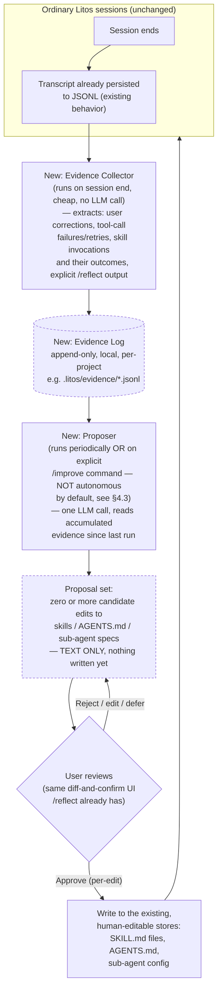

# Self-Improving Agent — Architecture (Future Work)

Status: **speculative design, not implemented, not scheduled.** Written to capture an idea worth
recording, not a proposal to build now. Nothing here should be started without revisiting this
document first, since the concrete risks in §5 are unresolved by design.

## 1. Origin: Continual Harness

This document sketches a Litos-shaped take on "Continual Harness" (Karten et al., "Continual
Harness: Online Adaptation for Self-Improving Foundation Agents," arXiv:2605.09998), one of the
core techniques Prime Agent (`github.com/PrimeIntellect-ai/prime-agent`) builds on. The paper's
core idea: instead of a human periodically reviewing an agent's performance and hand-tuning its
prompt/tools/memory, a second model role — the *Refiner* — periodically pauses the acting agent,
reads its recent trajectory for failure patterns, and edits the agent's own system prompt,
sub-agent definitions, skills, and memory in place. No episode reset, no human in the loop, over
the course of a single long-running task (their experiments: agents playing Pokémon for tens of
thousands of steps).

Mechanically, per the paper: refinement fires on a **fixed step schedule** (every `F` steps after
a warm-up `W`), not on failure events. Each pass edits four things — prompt (rewritten against
recent failures), sub-agents (created/edited/deleted based on which ones earn their keep), skills
(codified from successful sequences, repaired when they throw), memory (facts added/updated/
demoted). There is **no A/B testing or rollback mechanism** — the paper's actual safety net is
softer: edits stay narrow in practice (a small working set of components absorbs almost all
activity; unused ones just go unused rather than actively hurting anything), and failure
signatures from earlier in the run stay visible to every later refinement pass, so quality
compounds rather than being locked in by one bad edit. The paper also found a **capability floor**
— weaker models couldn't make good use of this at all.

## 2. What already exists in Litos that this extends

This is not a green-field idea for Litos — two existing pieces already occupy adjacent ground, and
this design should be read as "what changes if a Litos-native self-editing loop is layered on top
of both of these," not as a replacement for either.

**Skills** (`src/Litos.Tools/Skills/` — `SkillDiscovery`, `SkillTool`, `SkillMetadata`,
`SkillFrontmatter`) — plain `SKILL.md` files (YAML frontmatter with `name`/`description`, then a
free-text body), discovered from `.litos/skills/` walking up from the working directory (project-
level, closer directories win on name collision), `~/.litos/skills/` and `~/.claude/skills/`
(user-global, `.litos` wins on collision), presented to the model as a name+description catalog
(progressive disclosure — full body loads only when `skill` tool is called with a name). No
runtime mutation today: every skill is authored by a human, on disk, read-only from the agent's
point of view.

**Reflective memory** (`ReadMe_ReflectiveMemory.md`, implemented — `ReflectDialog`/`ReflectWindow`
across `Litos.Console`/`Litos.Gui`) — a **user-triggered** `/reflect` command that distills a
session's transcript into a project-level `AGENTS.md` (fixed sections: Conventions, Decisions,
Corrections, User preferences, Open threads), via one focused LLM call, with an explicit
**diff-and-confirm step before writing** — the design doc states this plainly: *"An agent that
silently rewrites a file the user didn't ask it to touch... will feel invasive. Showing a diff and
asking for a quick confirm keeps it collaborative."*

**The tension this document has to resolve, up front:** Continual Harness is autonomous, scheduled,
and unreviewed by design — that's the entire point of the paper (removing the human from the
loop). `/reflect`'s design doc stakes out the opposite position deliberately, for reasons specific
to a coding agent rather than a game-playing one (§20-29 of that doc: extra latency/cost on every
task, risk of polluting a shared, git-committed file with noise, no natural checkpoint for review).
This document does not propose overriding that decision — see §4.

## 3. Why a coding agent's self-improvement problem differs from Continual Harness's

The paper's setting (a single long-running Pokémon episode, tens of thousands of steps, one
continuous trajectory, success measurable in-episode via game state) does not map cleanly onto
Litos:

- **No single long-running episode.** A Litos session is a sequence of discrete *turns*
  (`ReadMe_Architecture.md`), often short, frequently interrupted by `/new`, `/compact`, or the
  user simply closing the app. There is no multi-thousand-step trajectory to observe failure
  patterns within — the natural unit of "did this work" is closer to one turn or one session, not
  a continuous stream.
- **No cheap, structural success signal.** Continual Harness can measure "path-cost" and
  "milestone progress" directly from game state, every step, for free. A coding agent's equivalent
  — "was this diff actually correct," "did this refactor actually work" — has no equally cheap
  structural signal; the closest proxies (tests passing, the user not immediately correcting the
  agent, a PR getting merged) are sparser, noisier, and in some cases only available long after the
  session that produced the edit has ended.
- **Shared, version-controlled artifacts, not a private game state.** A `SKILL.md` or `AGENTS.md`
  edit is potentially visible to a whole team if committed to git — unlike a Pokémon agent's
  internal harness, which has an audience of exactly one (the researchers watching metrics). A bad
  autonomous edit here isn't just a wasted step, it's a diff a teammate might pull.
- **Correction signal already exists and is high-quality: the user.** Continual Harness had to
  build its own failure-signature detector because it has no human watching. Litos already has an
  extremely strong, free failure signal a coding agent gets that a Pokémon agent doesn't: **the
  user's own corrections mid-session** ("no, don't do that," "use X instead of Y") — exactly the
  kind of signal `/reflect`'s existing design already extracts (its "Corrections" section, per
  `ReadMe_ReflectiveMemory.md` §3). Any self-improvement design for Litos should treat this as the
  primary signal, not reinvent trajectory-mining from scratch the way the paper had to.

## 4. Proposed shape: evidence-gated, not autonomous

Given §3, this document proposes departing from Continual Harness's core premise (fully autonomous,
scheduled, unreviewed) rather than importing it wholesale. The suggested architecture keeps the
same four-component surface (prompt-adjacent guidance, sub-agent definitions, skills, memory) but
replaces "a Refiner edits on a fixed schedule with no review" with a narrower, two-stage pipeline:
an autonomous **proposal** stage (safe, because it writes nothing), and a gated **write** stage
that reuses `/reflect`'s existing diff-and-confirm trust mechanism rather than replacing it.

### 4.1 Evidence Collector — the part that's safe to run autonomously

Unlike the paper's Refiner (which both *detects* failures and *edits* the harness in the same
pass), this design splits detection from editing, and only the detection half runs unattended.
The Collector is deliberately not an LLM call — it's a cheap, structural pass over a session's
already-persisted transcript (`ReadMe_Architecture.md`'s existing JSONL store) that extracts:
- **User corrections** — the same signal `/reflect`'s "Corrections" section already targets; a
  message where the user pushed back on or redirected something the agent just did.
- **Tool-call failures and retries** — a tool returning `ToolResult.Error` followed by the model
  retrying with different arguments is a candidate "this needs a skill/guidance fix" signal, the
  direct analogue of the paper's "tool-call failures" failure signature.
- **Skill invocations and their apparent outcome** — did calling a given skill correlate with the
  turn subsequently succeeding or with more corrections following it.
- **Explicit signal**: any session where the user ran `/reflect` (existing feature) already
  produced a curated, human-reviewed distillation — that output is the highest-quality evidence
  available and should be weighted accordingly, not re-derived from scratch.

This can run automatically at session end with no user-visible cost, because **it only writes to
a private, append-only evidence log** (`§4` diagram, dashed box) — never to anything the model
reads back into a future prompt, never to anything git-tracked, nothing a teammate would ever see.
This is the load-bearing safety property of the whole design: autonomy is fine exactly up to the
point where something becomes visible to a future session or another person; past that point,
§4.2 takes over.

### 4.2 Proposer + review — where `/reflect`'s trust model is reused, not replaced

The Proposer is the one LLM call in this pipeline, and it produces **candidate text, not a write**.
It reads whatever's accumulated in the evidence log since it last ran and drafts specific,
attributed proposals — "add this to `AGENTS.md`'s Corrections section, evidenced by 3 similar
corrections across 2 sessions this week" or "this skill's SKILL.md should mention X, evidenced by
2 sessions where the model needed this and one where a tool call failed for lack of it." Every
proposal should cite the evidence that produced it, the same way `/reflect`'s own dated entries
already do — an edit with no traceable evidence behind it should not be proposable at all.

Review is **the existing `/reflect` diff-and-confirm UI**, extended to also show skill-file and
sub-agent-spec diffs alongside `AGENTS.md` diffs, not a new review surface. Nothing this design
proposes should require building a second trust mechanism when `ReadMe_ReflectiveMemory.md`
already designed and shipped one for exactly this kind of "agent wants to write durable,
human-visible state" situation. Per-proposal approval (not one bulk "approve all") matters here
more than it does for a single `/reflect` pass, since a proposal batch could span multiple skills
and `AGENTS.md` sections with different confidence levels.

### 4.3 Trigger: user-invoked by default, matching `/reflect`'s own reasoning

`ReadMe_ReflectiveMemory.md` §2 already argued against automatic triggering for a coding agent —
extra latency/cost on every task, risk of noise, no natural review checkpoint — and nothing about
adding sub-agent/skill proposals into the mix changes that reasoning; if anything it strengthens
it, since a wrong skill edit has a larger blast radius than a wrong `AGENTS.md` bullet (it changes
what the model *does*, not just what it *knows*). Proposed default: an explicit `/improve` command
(evidence log → Proposer → review), directly analogous to `/reflect`, run whenever the user
chooses — after finishing a feature, after a session with several corrections, etc. A "you have
N pieces of unreviewed evidence, run /improve?" nudge (mirroring the "suggest reflect" v2 idea
already noted in `ReadMe_ReflectiveMemory.md` §2) is reasonable; a fixed-schedule autonomous
Proposer run, Continual-Harness-style, is not recommended as a default — it could be offered later
as an explicit opt-in for a user who has built up enough trust in their own proposal-acceptance
rate to want it, but should not ship as the initial design.

## 5. Risks specific to a coding agent (why this stays speculative)

These are the reasons this document is future work, not a build proposal:

- **Skill edits change behavior, not just knowledge.** An `AGENTS.md` bullet is inert until the
  model reads and applies it; a `SKILL.md` edit can directly change what commands get run, what
  files get touched, or what a sub-agent is instructed to do. A bad autonomous skill edit has a
  materially larger blast radius than a bad memory note, and the paper's own safety net ("bad
  edits just go unused") is a weaker guarantee here — an actively-used skill that gets subtly
  worse doesn't sit unused, it keeps firing and keeps being wrong until someone notices.
- **No cheap in-session success signal (§3).** The paper's Refiner can tell within the same episode
  whether an edit helped (path-cost dropped). A coding agent's Proposer, working after the fact
  from an evidence log, cannot verify a proposed skill change actually improves anything before
  the user approves it — evidence of a past failure is not proof a proposed fix addresses it
  correctly. Review must therefore substitute for the in-loop verification Continual Harness had
  and this design does not.
- **Shared, committed artifacts.** Per §3, a `SKILL.md`/`AGENTS.md` change can land in git and
  reach teammates who never ran `/improve` themselves and never saw the evidence behind it. The
  review step (§4.2) is necessary but not sufficient for a team setting — a follow-up question
  this document leaves open is whether team-shared skill/memory files need a different (e.g.
  PR-review-gated) path than personal, user-global ones.
- **Capability floor, same as the paper found.** A weaker or cheaper model used for the Proposer
  role could plausibly generate confidently-wrong "evidence-backed" proposals — citing real
  evidence but drawing the wrong conclusion from it. Which model tier is trustworthy enough for
  this role is an open, testable question, not something to assume away.
- **Evidence log privacy/growth.** `.litos/evidence/*.jsonl` (§4.1) would accumulate indefinitely
  without a retention policy, and — even though it's never fed to a future prompt directly per
  §4.1's safety property — it necessarily contains excerpts of past corrections and failures,
  which is itself data worth being deliberate about (local-only vs. syncable, retention window,
  whether it should be git-ignored by default).

## 6. Explicitly out of scope for this document

- The "online process-reward co-learning loop" from the paper (fine-tuning actual model weights
  from relabeled rollouts) has no Litos analogue proposed here at all — Litos is a multi-provider
  client, not a model trainer; nothing in this design touches model weights, only the
  prompt/skill/memory surface Litos already controls.
- No concrete schema for the evidence log, no chosen model/provider for the Proposer role, no UI
  mockup for the extended review surface — these are implementation-phase decisions, deliberately
  left open since this document's purpose is to record the idea and its shape, not to greenlight
  building it.
