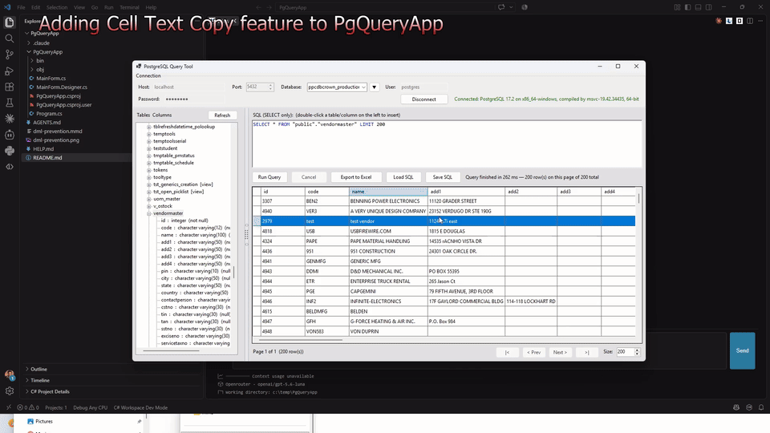

# Litos for VS Code

Your open-source AI coding agent inside VS Code.

Litos understands your codebase, edits files, runs commands, fixes errors, and completes
multi-step development tasks without making you leave your editor.

No Docker, database, or Litos account required.

## What Litos can do

- Understand and work across your open workspace
- Read, create, and modify files
- Run builds, tests, scripts, and shell commands
- Work through multi-step development tasks
- Use Claude, GPT, Gemini, OpenRouter, or local models
- Connect to user-registered MCP servers
- Attach files and paste images into a session
- Maintain multiple independent chat sessions
- Resume sessions across Litos clients
- Reflect session learnings into `AGENTS.md` through a reviewable diff

## Cloud or local models

Use cloud models from Anthropic, OpenAI, Gemini, and OpenRouter — or connect Litos to local
models running through Ollama, LM Studio, and compatible endpoints.

## Getting started

1. Install **Litos** from the Visual Studio Marketplace.
2. Open the Litos icon in the VS Code activity bar.
3. Run `/keys`. For a cloud provider, add an API key (Anthropic, OpenAI, Gemini, or OpenRouter).
   For a local model, set the local server URL instead (e.g. `http://localhost:1234/v1` for LM
   Studio) — most local servers don't need a key. Everything you enter here is stored once and
   shared with any other Litos client on your machine (CLI, desktop app) — you won't need to
   enter it twice.
4. Run `/provider` to choose a cloud provider or local endpoint, then `/model` to pick a model.
5. Open a project and describe the change you want.

No Docker, database, or Litos account is required for the VS Code extension.

## Slash commands

Type `/` in the chat box to see the full list. These match the commands in the Litos desktop app,
so a session works the same way in either client.

| Command | What it does |
| --- | --- |
| `/keys` | Add or update your API key for a model provider |
| `/provider` | Switch chat provider (Anthropic, OpenAI, Gemini, OpenRouter, or a local endpoint) |
| `/model` | Switch model within the current provider |
| `/new` | Start a new session |
| `/resume` | Resume a previous session |
| `/skills` | List available skills |
| `/skill` | Load a skill by name |
| `/attach` | Attach a file |
| `/branch` | Branch a new session from an earlier message |
| `/compact` | Compact the conversation now to free up context |
| `/reflect` | Distill this session into `AGENTS.md`, opened in a reviewable diff |
| `/mcp` | Manage MCP servers |

## MCP support

Connect, manage, and use Model Context Protocol servers from a dedicated panel. Litos's
built-in coding tools are fixed, minimal, and auto-approved; MCP servers you register are the
integrations you choose to enable or disable.

## Sessions are shared across Litos clients

Litos stores your conversation history locally under `~/.litos/sessions`, the same place used
by the Litos CLI and desktop app. A session started in one client can be resumed from another.

## Supported operating systems

**First-class support:** Windows and macOS, including Intel and Apple Silicon Macs. Linux
support is planned but is not currently available.

## Local by design

The bundled Litos process listens only on `127.0.0.1`. It is not exposed to other computers on
your network. Your prompts and relevant code are sent only to the model provider or local
endpoint you configure.

Sessions are stored locally under `~/.litos/sessions`.

## Pricing

Litos is free and open source. Bring your own provider API key, or use a compatible model
running locally on your machine. Cloud-provider usage charges may apply.

## See Litos in action

- [Building a WinForms 15-puzzle game](https://www.youtube.com/watch?v=em8w0SwgT5Q)
- [Adding features to an existing PostgreSQL application](https://www.youtube.com/watch?v=j-Gx-7LZaso)
- [Driving Litos through Telegram](https://www.youtube.com/watch?v=S2Sn_kwCRjE)

## Feedback

Found a bug or have a feature request? Open an issue on the
[project repository](https://github.com/nitinmms/LitosAiCodingAgent).

## License

Free and open source under the Apache 2.0 license. See
[LICENSE.txt](https://github.com/nitinmms/LitosAiCodingAgent/blob/main/src/Litos.VsCode/LICENSE.txt).
